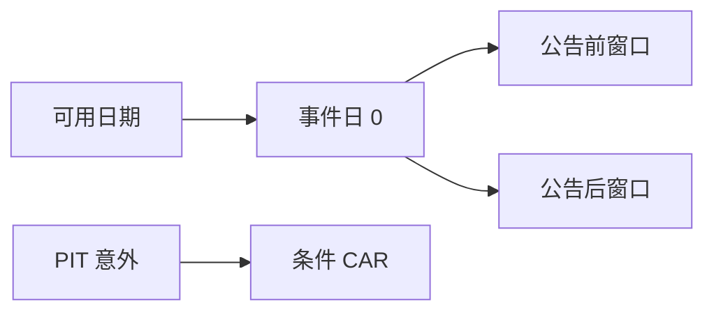

# 财报公告窗口

事件日是可用日期那一天，不是报告期结束日；窗口回报要声明含不含公告前漂移、盘后归属哪一根 K 线。

<footer>—— 据 Beaver, The Accounting Review, 1968；MacKinlay, Journal of Economic Literature, 1997 事件研究整理</footer>

上一课[盈余意外](/quant/earnings-surprise)交出了干净的 SUE。要把它连到回报，必须定义窗口。可用日期课已经给出事件日候选；本课把日历收成可回测的公告窗口，并指出哪些做法会把 PEAD 做成前视。不重估 SUE，也不把停牌涨跌停的可成交性提前写完——那是制度课。

## 问题

Beaver 显示盈余公告日附近成交与波动上升；事件研究把超额回报累加在事件时间而非日历时间。缺口是操作定义：$t=0$ 取哪一天、盘后公告算 0 还是 +1、窗口是 $[-1,+1]$ 还是 $[0,+1]$、基准是市场还是行业。用 period_end 当 $t=0$，窗口里全是尚未披露的日子，累积的是假事件。用 restated 后的「更正公告日」当历史事件日，会把后来的更正当成当时市场已经交易的信息。

### 公告窗口不是持有期 alpha

$[-1,+1]$ 的超额回报衡量的是事件附近的价格发现，含买卖价差与跳空，容量极差。PEAD 策略谈的是公告后数周到数季的漂移，窗口更长、换手定义不同。把短窗口当可交易 alpha 而不扣成本、不处理涨跌停，是把研究设计当成策略。本课先把研究窗口钉死；可交易摩擦交给后面制度课。

MacKinlay 强调正常回报模型与窗口长度要预先声明。用同一数据挑出「最显著的窗口」再报告，是数据挖掘，不是事件研究。

## 方法

事件日 $0$ = 该公司该期的可用日期对应的交易日（盘后规则写死）。估计窗与事件窗分离，避免用事件本身估计 beta。正常回报用市场模型或 Fama–French 因子；行业事件扎堆时（财报季）市场模型会把行业冲击算进 alpha，行业调整更稳。累积超额回报 $CAR$ 在预先声明的 $[t_1,t_2]$ 上求和。条件研究按 SUE 分组，组内公司必须在当时宇宙且当时可交易。

同一天多家公告是聚类：标准误要按日期聚类，不能把每家公司当独立实验。这与后课因子检验的聚类是同一逻辑，本课只在事件层提出。

窗口与正常回报预先锁定，禁止搜索最显著区间。可交易版本必须换第一可成交价并扣资金，与研究 CAR 分列。同业对照用形成日行业，不用今日 GICS。

## 机制

短窗口捕捉的是信息进入价格的瞬时部分；长窗口捕捉延迟部分。若短窗口已经把意外吃完，PEAD 不存在；若短窗口因涨跌停没走完，延迟会看起来更大——这是制度约束，不是额外 alpha。回测必须用当时是否停牌、是否一字板，不能用后来复权连续价序列假装当时成交了。本课点出这个问题，细节交给[停牌与涨跌停对回测](/quant/halt-limit-backtest)。

财报季里事件扎堆，市场因子在事件日也异常。用事件日来估 beta，会把系统性波动洗进残差，CAR 被压扁或放大，取决于你怎么估。

预先锁定窗口与正常回报模型，禁止在同一数据上搜索最显著的 $[t_1,t_2]$。估计窗与事件窗分离，财报季按日聚类标准误。盘后公告的 $t=0$ 与可用日期课同一规则。报告 CAR 时注明是否可成交、是否扣资金；本课可以停在研究窗口，但不得把研究窗口直接标成策略收益。同业对照组用形成日行业与当时市值，不用今日 GICS。

## 边界

不写完整事件研究教科书，不估计非参数检验的所有变体。分析师修正事件与盈余公告事件要分开标日，不要把研报日当成财报日。后课行业分类会改变「正常回报」的对照组。后课默认：$t=0$ 是可用日期交易日；窗口与正常回报模型预先锁定；SUE 分组在 PIT 宇宙上进行。

后课行业分类会改变对照组；制度课会砍掉板上不可成交的 CAR。本课先把研究设计钉死：事件日、窗口、正常回报、聚类。若你同时报告可交易版本，必须改用第一可成交价并扣资金，那是事件策略课的对象，不要在本课用收盘 CAR 冒充。

后课默认 $t=0$ 是可用日期交易日，窗口与正常回报预先锁定，SUE 分组在当时宇宙上进行。

## 小结

- 事件日是可用日期，不是财年截止日。
- 短窗口是价格发现，不是自动可交易 alpha。
- 盘后归属、估计窗、基准模型必须预先声明。
- 同日聚类与财报季行业冲击会扭曲标准误与 CAR。
- 涨跌停使窗口回报不可成交，制度课再收。
- 出处：Beaver (1968)；MacKinlay (1997)；Fama–French 作为正常回报模型的用法。
