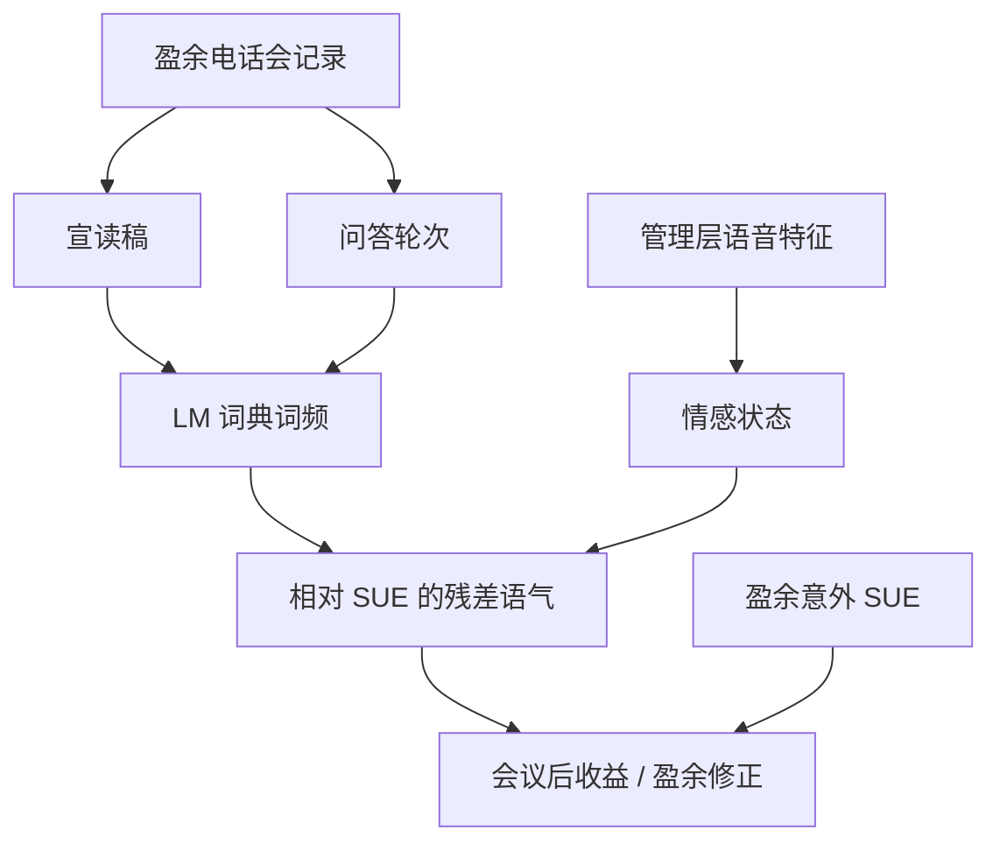

# 电话会语气 NLP

    
盈余电话会里管理层的用词与语音，含有超出当季数字本身的信息；把语气写成可复制的文本特征之前，必须先处理词典领域、问答轮次与时间戳，否则测到的是披露事件而不是语气。

    <footer>—— Mayew and Venkatachalam, The Power of Voice, Journal of Finance, 2012；Price, Doran, Peterson and Bliss, Journal of Banking &amp; Finance, 2012</footer>

上市公司在季报后召开盈余电话会：先宣读准备好的稿，再接受分析师提问。Price、Doran、Peterson 与 Bliss 证明，电话会文本的语气对随后收益有增量解释力，超出盈余意外本身。Mayew 与 Venkatachalam 进一步用语音情感分析管理层的情感状态，并把它与未来业绩联系起来。这与 [舆情文本](/quant/news-nlp-alpha) 同属公司披露的语言层，但语料更窄、结构更强：同一事件、可切分的准备稿与问答、可识别的发言人。Loughran 与 McDonald 的金融词典在这里仍然是测量的起点——通用情感词表会把「liability」一类词误判——Huang、Teoh 与 Zhang 则提醒「语气管理」：用词可以比基本面更积极，语气本身可能是操纵而不是信号。本篇写电话会语气作为量化特征：测什么、相对 [SUE](/quant/pead-sue) 的增量、以及问答轮次为何往往比宣读稿更有信息。

## 问题

盈余数字已经进入价格的一条通道是 [PEAD](/quant/pead-sue)：未预期盈余之后的漂移。电话会若还有增量，必须来自数字未写明的条件信息：展望的确定性、问答中的回避、语音里的紧张，或分析师问题的敌意。Li 对管理层讨论与分析（MD&amp;A）中前瞻语句的信息含量、Larcker 与 Zakolyukina 对电话会中欺骗性讨论的检测，都把「怎么说」从「说了什么数字」里分开。问题是测量。把整篇记录送进一个情感分数，会把宣读稿的公关语言与问答的即兴语言平均掉；用哈佛通用词表会把金融术语当成负面；用电话会当日的收益当标签训练监督模型，会把市场对数字的反应吸进词权，再在样本外当成「语气 alpha」。

时间戳同样关键。电话会通常在公告之后数小时内召开，价格在稿件与问答之间连续动。用全天收益回归会把公告跳与电话会信息混在一起。Price 等人的设计关心的是电话会文本相对盈余数字的增量；复制时必须把收益窗口对准会议结束之后，或至少把公告窗口分开报告。

### 词典语气、语音与监督词权

词典法：用 Loughran–McDonald 的正向、负向、不确定、弱模态等词表，在电话会文本上计词频，按文档长度标准化，得到净语气（正向减负向）或负面占比。优点是可审计、可跨年比较；缺点是无视否定、讽刺与领域新词。Price 等在电话会上展示了文本语气的增量。语音法：Mayew–Venkatachalam 用认知心理学与商业的情感计算工具，从管理层语音提取积极/消极情感状态，发现其与未来业绩相关，且分析师问题可以调节管理层的情感表达。监督法：用随后收益或意外作为标签学习词权，拟合强，但 Gentzkow、Kelly、Taddy 所总结的「文本即数据」警告仍然适用——词权不稳定、难解释、易吸入同期新闻。分层仍然正确：先词典与轮次结构，再把残差交给监督模型。

净语气 = 正向词减负向词，在电话会里经常接近公关稿的上限。真正有截面差异的往往是负面词与不确定词，或问答相对宣读稿的语气落差。只报一个「情感分」而不报分项与结构，无法与机制对照。

## 方法

切分。至少切成：准备好的管理层发言、分析师问题、管理层回答。特征可以是各段的 LM 负面占比、不确定词占比，以及「回答减宣读」的差分。差分捕捉的是即兴相对稿件的恶化或改善，Huang–Teoh–Zhang 的语气管理更常出现在可控的稿件里，问答是压力测试。发言人级：CEO 与 CFO 分开，Mayew 等的语音研究正是对人而不是对「公司平均声波」。分析师轮次：问题长度、是否追问、负面词，可作为信息需求的代理，而不是当作公司语气。

回归。截面上，控制 SUE、市值、账面市值、行业、上日收益与分析师修订，再看电话会特征对会议后窗口收益或未来盈余修正的系数。这与 Tetlock 等在新闻上的公司级设定平行，只是事件对齐到会议。重叠与换手：季频特征、持有到下一次会议，换手低于日频舆情，但仍集中在公告附近的价差扩大期，成本要按有效价差扣。监督模型必须按时间切分，不能把未来的电话会词汇分布用于过去的 IDF。

### 语气管理、欺骗与「说得太好」

Huang、Teoh、Zhang 定义语气管理为异常积极的用词，超出同期基本面所能解释的部分，并发现它与较差的未来业绩及相关的市场反应连在一起——语气可以是粉饰。Larcker 与 Zakolyukina 用语言线索（犹豫、极端正向、股东参考方式等）检测电话会中可能的欺骗性讨论，并对照后续的财务重述。对量化信号，这意味着：原始净正向不一定是利好；相对基本面回归后的残差正向，可能是风险。实务上应同时报告：原始 LM 分、相对 SUE 与会计变量的残差语气、问答减宣读的落差。三者同向时解释才稳；残差正向而 SUE 弱，更接近管理文献而不是动量。

## 机制

信息通道。管理层拥有尚未完全写入应计数字的内部信息，电话会的展望与措辞是廉价披露；市场对数字的即时反应不充分时，语气可以预测随后的修正与收益，这与 PEAD 的有限注意叙事相容。Price 等提供的是文本增量的证据；Mayew–Venkatachalam 提供的是语音情感与未来业绩的证据，机制更靠近「状态」而不是「用词策略」。

代理与粉饰。管理层有动机在稿件里偏正向（职业生涯、期权、分析师关系）。问答中分析师若施加压力，粉饰成本上升，真实状态更容易漏出来——这是为何结构切分重要。语气管理文献预测：异常正向之后是较差基本面，短期价格可能仍然被带动，随后反转。把电话会正向当持续多头信号，会在粉饰样本里符号接反。

语音与文本不是替代品。文本抓用词选择，语音抓难以完全控制的副语言。二者可以同向（真的乐观）或背离（稿件积极、声音紧张）。公开可复制研究仍以文本为主，因为语音数据的获取、说话人分离与工具许可更难；不能把 Mayew–Venkatachalam 的结论无条件接到某一种商业 API 的输出上而不做校验。

### 分析师覆盖、语言与样本

电话会语气的截面主要存在于有会议记录、有足够分析师轮次的公司。小公司可能没有电话会，或记录不完整，因子会自动偏向大盘与高覆盖——必须对市值、覆盖中性，否则语气只是规模的代理。跨境样本还有语言与翻译：LM 词典为英文学 10-K 构建，直接用在翻译稿上会引入系统偏差。中文会议记录需要领域词表，不能假设英文负面词的译文仍是负面。这与舆情篇的跨语言警告相同，电话会因为高度公式化，翻译偏差可能更大而不是更小。

用大语言模型给每篇电话会打一个「情绪分」，若提示词含有事后新闻或未隔离的数字，分数会泄漏。要当量化特征，必须锁住模型版本、只输入会议文本、并报告相对 LM 词典的增量；否则无法区分模型记忆与语气测量。

## 边界与工程取舍

电话会不是随机样本：管理层可以选择是否召开、邀请谁提问、事后修订记录。存活与选择使「有会议」本身含信息。记录供应商的时间戳可能是入库时间而不是开说时间。语音特征对采样率、 overlapping 说话人与线路质量敏感，生产级复制成本高于词频。监督词权一旦用全市场收益训练，很难解释为公司特异信息。

与新闻舆情的分工：电话会是低频、高结构、与会计日历锁定的事件特征；新闻是高频、多源、需去重。二者不应加总成一个「文本因子」而不报告相关。增量检验的最低标准是：在控制 SUE 与公告窗收益之后，会议后窗口是否还有斜率。没有这条，所谓语气 alpha 只是盈余公告的另一个名字。出处上，文本增量以 Price 等（2012）与 LM 词典（2011）为测量基础，语音以 Mayew–Venkatachalam（2012）为准，粉饰与欺骗以 Huang–Teoh–Zhang（2014）与 Larcker–Zakolyukina（2012）为准。

把问答中的「下次再披露」当成负面语气，测到的可能是信息延迟而不是情感。应把不确定词、前瞻句与明确的业绩指引分开，否则词典分数会把合法的谨慎陈述写成利空。

## 小结

- 电话会语气是相对盈余数字的增量披露，测量须切分宣读与问答，并用金融领域词典。
- Price 等证明文本语气的收益增量；Mayew–Venkatachalam 证明语音情感与未来业绩相关。
- 异常正向可能是语气管理而非利好；应报告相对 SUE 的残差语气，而不是单一情感分。
- 收益窗口要对准会议之后，并控制公告跳，否则因子只是 PEAD 的重包装。
- 出处：Mayew and Venkatachalam, *Journal of Finance*, 2012；Price, Doran, Peterson and Bliss, *JBF*, 2012；Loughran and McDonald, *Journal of Finance*, 2011；Huang, Teoh and Zhang, *The Accounting Review*, 2014；Larcker and Zakolyukina, *JAR*, 2012。
