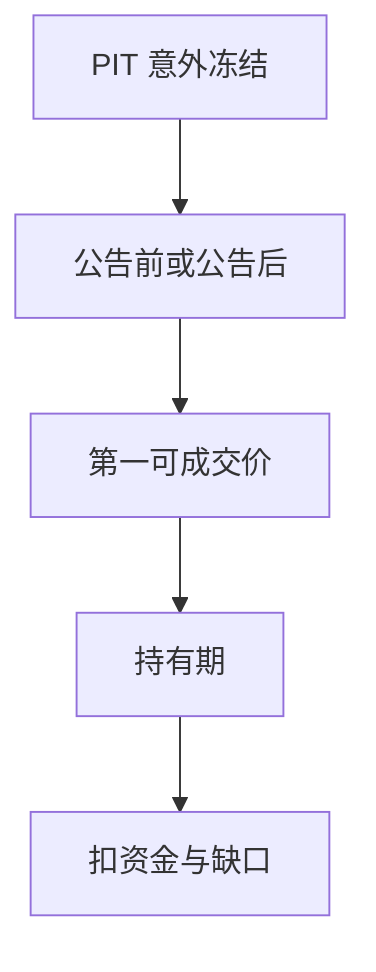

# 业绩公告作为事件

同一份财报，财务课把它当成 PIT 字段更新；本课把它当成必须过资金与可成交约束的事件。窗口超额收益在扣费与涨跌停之前，还不是策略。

<footer>—— 据 Beaver, 1968；Bernard and Thomas, Journal of Accounting Research, 1989 对 PEAD 整理</footer>

上一课[资金成本作为 alpha 底](/quant/funding-cost-floor)收束了杠杆与账单。本课打开「日历与规则」：对象换回[财报公告窗口](/quant/earnings-announcement-window)里的事件，但问题改成**可交易性**。不重估 SUE，不重写 CAR 公式。缺口是把事件从研究设计推进到受保证金、借券、跳空约束的仓位。

## 问题

Bernard–Thomas 描述公告后漂移：意外的符号在随后数周仍与回报同向。财务课已经要求事件日 = 可用日期、SUE 为 PIT。制度课要问：你能否在 $t=0$ 或 $t=+1$ 按信号开仓？盘后公告的第一可成交价可能已经跳空，维持线与涨跌停可能让你买不到或空不出。纸面 PEAD 用收盘到收盘的连续价，把跳空算进收益，却假设你在跳空前已经持仓——除非你在公告前就按预期交易，那是另一策略，含更大的借券与方向风险。

资金底在事件上更苛刻：短持有、高换手，借券费按日，但缺口一项可以吃掉整个窗口 CAR。

### 事件策略不是因子的日频化

价值因子在六月形成、持有一年；事件策略在公告日形成、持有数日到数季。形成日宇宙、可借性、结算占用都要按事件时钟重算，不能借用年频 HML 的六月规则。把 PEAD 写成「每天用最新 SUE 排序」而不处理重叠持有与重复计费，账单会错。

财务课的公告窗口可以报告 $[-1,+1]$ CAR。本课若声称可交易，至少要从第一可成交时点起算，并扣资金账单。

## 方法

信号：公告前冻结的 SUE 或修正，方向决定多空。执行：声明是公告前布局还是公告后追。公告后追以第一可成交价成交，走缺口课，不使用公告前收盘。持有期预先锁定，提前因召回、涨跌停、强平退出则按实际价。同一证券重叠事件（预告、正式、修正）要去重，不能把三次 CAR 加总当三次独立 alpha。

空头腿过可借检查与当时费率。小市值负意外最容易 special，纸面空头 PEAD 衰减最大。

研究 CAR 与可交易窗口分列，跳空差标成不可得的价格发现。公告前布局与公告后追不得合成一条净值。空头过可借，重叠预告与正式公告去重。

## 机制

漂移若来自缓慢反应，可交易部分是第一可成交价之后的那段；跳空本身往往不可得，除非你承担了公告前风险。把跳空算进策略，是把不可得的价格发现记成 alpha——与用 restated 盈余算 SUE 同类，只是泄漏从会计数字换成了价格路径。资金与停牌让可实施集合偏向大盘、易借、未涨跌停的名字，于是可交易 PEAD 的截面不是研究 CAR 的截面。

后课并购与指数事件复用同一套：信号冻结、第一可成交、账单。不要每个事件另发明一套成交假设。

声明开仓时钟：公告前收盘布局，或公告后第一可成交。后者不得使用公告前收盘价。持有期锁定，重叠预告与正式公告去重。空头过可借与费率。报告两列 CAR：研究窗口（可含跳空）与可交易窗口（第一可成交起、扣账单）。把两列差标成「不可得的价格发现」，避免把跳空写成 PEAD 技能。

## 边界

不估计 PEAD 是否仍然存在，不写高频抢跑。停牌与涨跌停的系统规则见后课；并购、指数是另外的事件日历。后课默认：称事件策略必声明开仓时点与资金账单；只报 CAR 的标为研究窗口。

后课并购、指数复用同一开仓时钟与账单模板。本课 PEAD 若只报研究 CAR，须标明未扣资金、含跳空。可交易版本从第一可成交起算。公告前布局是另一种策略，含方向风险与借券，不得与公告后追混成一条净值。

后课默认称事件策略必声明开仓时点与资金账单；只报 CAR 的，标为研究窗口而非可交易 alpha。

财报季扎堆使保证金占用、借券需求与跳空同时上升，资金底在窗口里变厚。可交易 PEAD 必须用事件当周的占用与费率来扣账单，而不是用淡季均值去扣事件周。

## 小结

- 财务课给出 PIT 事件日与 SUE；本课问能否成交、扣多少费。
- 跳空进 CAR 不等于跳空可交易。
- 公告前布局与公告后追是两种风险，不能混报。
- 事件时钟要重算可借与占用，不能借用年频因子规则。
- 可实施截面偏向易融资名字，纸面空头衰减最大。
- 出处：Beaver (1968)；Bernard and Thomas (1989)；前序资金课。
