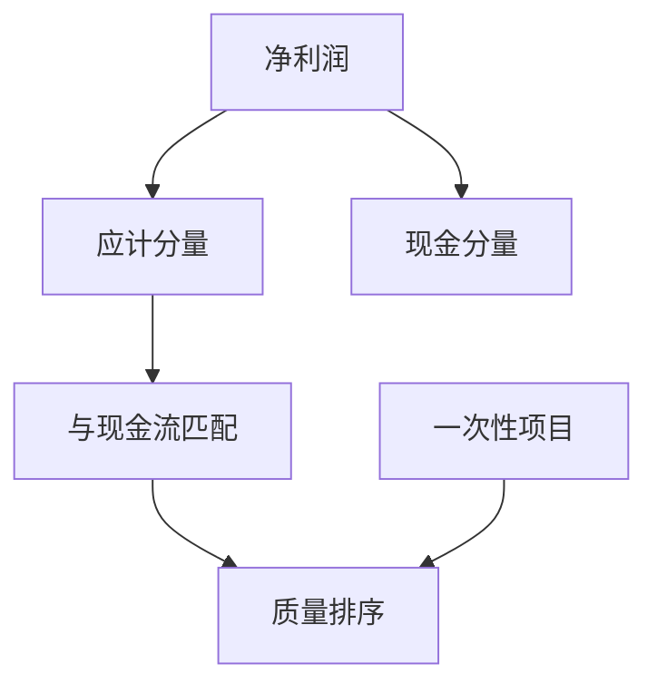

# 盈利质量

利润的数字可以相同，持续进入现金的能力可以差很远；质量问的是盈余里有多少会在后续期间反转。

<footer>—— 据 Dechow and Dichev, The Accounting Review, 2002；Penman and Zhang, The Accounting Review, 2002 整理</footer>

上一课[幸存者与退市](/quant/survivorship-delist)把失败公司留在宇宙里。现在可以问利润本身好不好。上一课[应计与现金流](/quant/accrual-vs-cash)已经拆开应计分量；本课把「质量」从单一应计排序扩成：哪些盈余更可持续、哪些更像一次性或估计噪声。不重做 PIT，也不把商誉减值提前讲完。

## 问题

低应计只是质量的一个代理。同一应计水平下，营运资本应计与长期应计的反转速度不同；同一净利润下，经常性经营利润与处置收益的持续性不同。Dechow–Dichev 把应计质量写成营运资本应计对过去、当期、未来现金流的拟合残差：残差大，应计更像估计误差。Penman–Zhang 从稳健会计出发，指出隐藏储备会压低当期利润、抬高后续利润，使「高质量」与「保守」缠在一起。

缺口是：在已有应计定义上，给后课一个**可排序的质量对象**，而不是审计意见百科。

### 质量不是扣非后利润的别名

扣除非经常项目得到的「经常性利润」仍可以全是应计。质量问的是确认过程与现金实现的匹配，不是科目是否带「营业外」标签。把质量做成扣非，后面的因子会忽略折旧政策、收入确认与坏账估计——这些才是应计里持续或反转的来源。

Jones 与修正 Jones 模型把应计拆成「正常」与「可操纵」；回测里它们噪声大、对成长公司偏差明显。本课把它们当对照，不当前提。

## 方法

后课可用的质量信号，优先用已有字段组合，而不是先估一个操纵模型。常用三层：（1）应计总量或营运资本应计，Sloan 口径；（2）应计与现金流的匹配残差，Dechow–Dichev 口径；（3）一次性项目、中断经营、会计变更的指示变量，用来降权而非单独开一个「质量因子」。缩放仍用期初资产或平均资产，与应计课一致。

计算必须走 PIT 与当时宇宙：用重述后变「干净」的利润来定义历史质量，是前视；丢掉退市公司再比质量，是幸存者。质量因子的空头往往集中在即将变差的公司，样本规则比模型选择更致命。

未来现金流项若直接取已实现 OCF，Dechow–Dichev 会前视。用公告前已有的过去与当期匹配，或用当时现金流预期替代「未来」。年报质量按可用日期更新，不按日历年冻整年。

## 机制

投资者若对盈余总量反应，对低持续性分量反应不足，则低质量公司随后回报偏低。机制不必假设欺诈：估计误差、增长带来的营运资本、稳健会计的储备释放，都会改变后续实现。因子管道里，质量常与价值、盈利共线——便宜可能是因为利润不可持续。后课账面与无形资产会把「便宜」再拆一刀；本课先保证利润侧不是总量。

质量信号换手往往高于价值：应计反转快。回测要按可用日期重算，不能把年报质量冻结到下一份年报之前的每一个交易日还当新信息。

把一次性项目做成 0/1 降权，比估一套可操纵应计更稳。Dechow–Dichev 残差需要未来现金流，直接用未来 OCF 会前视；实务上用已实现的过去与当期匹配，或把「未来」项改成当时分析师对现金流的预期。质量信号至少按季随可用日期更新，不要把年报质量冻到下一个年报之前的每一个再平衡日还当新信息。与价值共线时，先报告行业内相关，再决定是否正交。

## 边界

不写审计准则，不估计完整盈余管理模型。商誉减值、递延税、股份支付会扭曲利润，分别交给后面几课。分析师预期与惊喜是再后面的信息事件，不是质量定义。后课默认：讨论盈利先问持续性与现金匹配，再问多少。

后课默认：讨论盈利先问应计匹配与一次性降权，再问水平高低。Jones 类操纵模型只作对照，不作主干信号。质量与价值的相关在行业内报告；若你正交，要声明是对行业内残差正交还是对全样本账面市值正交，两者改的截面不同。

质量管道换手高于价值：应计反转快，必须按可用日期重算，不能把一份年报质量冻到下一份年报之前的每一个再平衡日。

## 小结

- 应计是质量的入口，不是质量的全部。
- Dechow–Dichev：应计与现金流匹配越差，质量越低。
- 扣非不等于质量；一次性项目只是降权标签。
- 质量排序必须在 PIT 与含退市的宇宙上做。
- 质量与价值共线，后面拆账面时还要用到。
- 出处：Dechow and Dichev (2002)；Penman and Zhang (2002)；Sloan (1996)。
