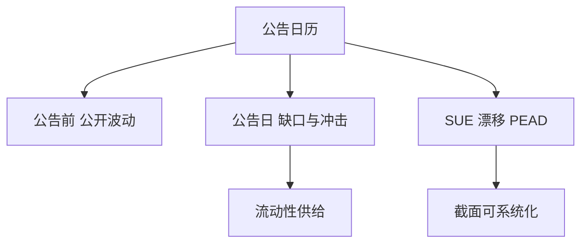

# 财报期策略

盈余公告把信息塞进一个狭窄窗口：漂移、公告溢价与交易量冲击叠在同一张日历上，却不是同一个可交易对象。

<footer>—— 漂移见 Bernard and Thomas；公告溢价与成交见 Frazzini and Lamont, Journal of Financial Economics, 2007 前后文献</footer>

[上一课](/quant/seasonality-anomalies)的时钟是市场日历。财报期的缺口是**公司事件在季报季挤成一簇**：预告、公告、电话会、指引。主干 [PEAD](/quant/pead-sue)、[事件研究](/quant/event-study) 已写识别与时间戳。[事件驱动全景](/quant/event-driven-overview) 把 PEAD 标成漂移桶。本课给策略地图：公告前、公告瞬间、公告后如何分仓，避免把三种 P&L 收成一个「财报因子」。

## 问题

Ball–Brown 以来，未预期盈余（SUE）后的漂移被反复测量。Bernard–Thomas 指出市场对序列相关的盈余反应不足。另一条线是公告日本身的溢价与成交：即使 SUE 接近零，暴露在公告上也可能有平均收益，并伴随冲击成本。问题是三套风险：(1) 公告前借券与信息泄漏边界；(2) 公告瞬间买卖价差与缺口；(3) 公告后 PEAD 的换手与衰减。回测若用公告日收盘价当成交，高估与事件研究课是同一错误。

与季节性：财报季与日历月相关，但不等于「四月效应」。应用公司自己的公告日对齐，而不是用月度虚拟变量。

### 不要在公告前假装有公开边缘

公开策略从公告时间戳之后开始。预告与分析师修订可以做成事件，但仍是公开信息。把未公开的仓位数据或窃听当「财报策略」不在本课范围。

拥挤的 PEAD 会把漂移前移到公告后第一小时。信号若仍用日频 SUE 隔日开盘买，吃到的是残渣加冲击。

## 方法

分桶：公告前波动事件（仅公开日历）、公告日流动性供给、SUE/PEAD 截面、指引修正。每桶单独冲击模型。组合：单名跳跃限额；季报周的总 Gamma 与借券。对照：行业中性后的 PEAD 是否还在。容量按可借与公告日深度，不按全市场股票数。

## 机制

公告把私人信息压缩释放。定价可以在方向上对、在速度上慢（漂移），也可以在风险上要求补偿（公告溢价）。灵活资本与做市商库存决定窗口有多短。财报期把许多名字的时钟对齐，相关升，事件驱动课里「平静期夏普」的警告在这里同样适用。

## 边界

内幕与重大非公开信息是法律边界。电话会语言学、另类数据若用，必须可复现与合规。不要把分析师「偷偷提前」的故事写进回测。

## 小结

- 财报策略按公告前、公告日、公告后分桶，不是一个因子。
- 时间戳与冲击决定 PEAD 是否还在。
- 季报周相关升高，分散被高估。
- 出处：Bernard and Thomas；Frazzini and Lamont 对公告溢价与成交的讨论；识别见事件研究课。
