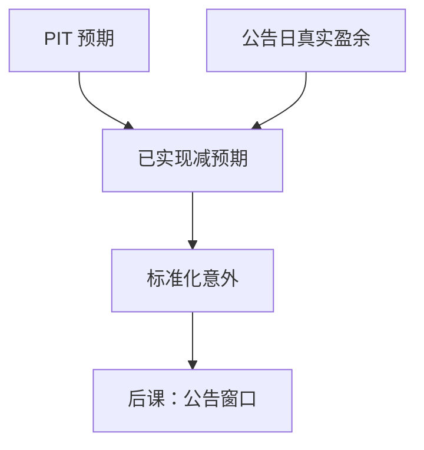

# 盈余意外

意外是已实现盈余减去当时信息集里的预期；用事后才知道的共识或用错误口径的 EPS，意外就不再是事件，而是数据泄漏。

<footer>—— 据 Ball and Brown, Journal of Accounting Research, 1968；Livnat and Mendenhall, Journal of Accounting Research, 2006 整理</footer>

上一课[分析师预期与修正](/quant/analyst-revision)给出了 as-of 共识。本课把真实盈余接上去，定义意外。真实盈余来自[三张表怎么连](/quant/three-statements-link)的利润表，但必须与共识同一口径，并服从[财报滞后与可用日期](/quant/filing-lag-available-date)。不重讲共识构造，也不把窗口超额收益提前做成事件研究全文。

## 问题

Ball and Brown 把盈余变化与回报联系起来；后来的标准化意外盈余（SUE）把「变化」换成相对预期的差。预期可以是分析师共识，也可以是时间序列模型（季节随机游走）。Livnat–Mendenhall 表明两种意外并非同一排序：分析师意外与季节差分意外相关有限，后续漂移不同。缺口是锁死减数：在公告日可用的那一个预期，而不是样本期内最好看的那一个。

口径冲突是第二层缺口。共识常是摊薄后经营 EPS；报表公布的是 GAAP 净利润。用 GAAP 减经营共识，意外里全是一次性项目与稀释差，不是「市场没料到的经营」。

### 意外不是盈利水平

高盈利可以零意外，低盈利可以大正意外。质量与盈利因子交易水平或持续性；意外交易**相对于当时预期的差**。把 PEAD 做成「买盈利高的」，是回到上一课程的盈利因子，不是本课。

标准化常用股价或预期的标准差。除数接近零时（微利、共识接近零）SUE 爆炸，必须截尾，否则排序被分母劫持。

## 方法

$SUE_t = (X_t - \mathbb{E}[X_t\mid \mathcal F_{t-}]) / s_t$。$X_t$ 与 $\mathbb{E}$ 必须同为摊薄 EPS 或同为净利润；$\mathcal F_{t-}$ 是公告前信息集，共识取上一课的 PIT 切片，时间序列预期只用公告前已实现的季报。$s_t$ 用历史意外波动或价格。可用日期：真实 $X_t$ 在公告日才进入，不能用后来 restated 的 EPS 去减当时共识。

季节随机游走 $\mathbb{E}[X_t]=X_{t-4}$ 不需要分析师库，但小公司覆盖不足时更常用；它不是 PIT 的替代，历史 $X_{t-4}$ 仍要当时可用版本。

## 机制

正意外带来正的公告回报，并常伴随事后漂移（PEAD）。机制解释有延迟反应与风险补偿两派，本课不裁决。回测要先保证意外本身干净：restated EPS、错误财期、盘后公告记错交易日，都会制造假漂移。后课窗口研究把意外当条件变量；本课只交付这个变量。与应计的关系：高应计公司更容易出现负的后续意外，质量与惊喜会共线，组合时要声明是否正交。

分析师惊喜与财报质量课的「一次性项目」重叠。若共识已排除某项而 GAAP 未排除，意外会系统性等于该项。先对齐口径，再谈 alpha。

真实 EPS 取公告日当日版本，与共识的摊薄/扣非/是否含一次性同一行对齐。标准化除数用公告前股价或过去八季意外的标准差，并对 SUE 分位前截尾。没有分析师覆盖的公司改用 $X_t-X_{t-4}$，但 $X_{t-4}$ 仍是当时可用版本。不要把公告后才修订的共识插回减数——那会把惊喜压向零，制造「市场早已知道」的假象。

## 边界

不估计完整 PEAD 策略，不写高频「抢跑」。窗口如何定义、隔夜如何归属，下一课[财报公告窗口](/quant/earnings-announcement-window)。后课默认：意外 = 公告日真实值 − 公告前 PIT 预期，口径已锁，极端值已截尾。

后课窗口把 SUE 当条件分组变量，不再改它的定义。本课锁死：减数是公告前 PIT 预期，被减数是公告日真实值，除数在公告前已知，极端值已截尾。分析师 SUE 与季节 SUE 若都算，当作两个信号，不要平均成一个还称为「意外」。

## 小结

- 意外是相对当时预期的差，不是盈利水平。
- 分析师 SUE 与季节差分 SUE 不是同一信号。
- 真实值与预期必须同口径，且真实值走公告日 PIT。
- 标准化除数过小要截尾。
- 后课窗口把本课的意外当条件。
- 出处：Ball and Brown (1968)；Livnat and Mendenhall (2006)；IBES 与季节随机游走惯例。
