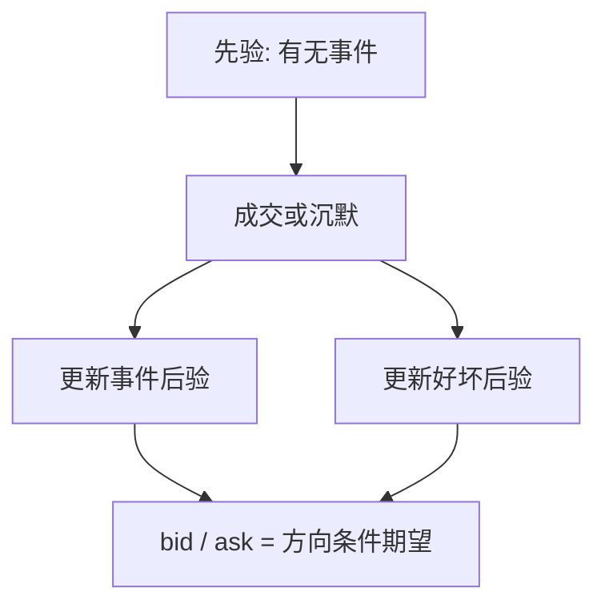

# Easley–O’Hara 事件不确定

做市商不仅不知道消息是好是坏，往往也不知道今天究竟有没有私有信息事件。没有事件时，买卖都是噪声；有事件时，方向才携带关于价值的证据。

<footer>—— Easley and O'Hara, Time and the Process of Security Price Adjustment, Journal of Finance, 1992</footer>

[Back](/quant/back-continuous-insider)与多期 Kyle 都假定知情者**已经持有**一条关于 $V$ 的信息，不确定只在数值与何时写入价格。缺口是第二层不确定：公众连「今天是否发生了信息事件」都不知道。Easley 与 O'Hara（1992）把事件发生与否写进学习；方向序列因此有时有信号、有时全是噪声。本课不重做[PIN](/quant/pin) 的日度泊松极大似然——那是 1996 年 EKOP 的估计装置。这里只补理论：事件不确定如何改变报价调整的时间形态。

## 问题

Glosten-Milgrom 的标准二叉树里，每期都以固定概率碰到知情者。若某些日子根本没有私有信息，知情到达率为零，买卖方向不应移动信念。做市商事先分不清「无事件的热闹噪声日」与「有事件但尚未暴露的日子」。于是学习必须在两个假设之间分配后验：$\alpha$ 为事件发生概率，事件内再分好坏消息。问题是：成交的时间模式——不只是最近一笔的方向——如何同时更新「有没有事件」与「若有，是哪一种」。

事件不确定还会产生**无交易也是信号**。若有知情者，他们会积极交易；长时间没有成交，更像没有事件，报价应朝无条件期望收拢、价差收窄。这与「没成交所以什么也没学到」相反。

### 与 PIN 估计课的分工

[PIN](/quant/pin) 把 $\alpha,\mu,\varepsilon$ 收成日度 $(B,S)$ 计数的似然，输出一个概率数字。本课停留在序贯信念：每一笔（以及每一段沉默）如何改写事件后验。不要在这里重写 EKOP 似然，也不要把 PIN 高读成连续 Kyle 的 $\lambda$ 大。

Easley–O'Hara（1987）处理的是交易规模也携带信息；1992 年这篇的关键新增是时间与事件不确定。规模与事件是两层，不要合成「EO 模型」一个黑箱。

## 方法

一个可计算的树：每个交易日开始，以概率 $\alpha$ 发生事件；发生则价值取高或低。知情者只在有事件时按方向交易；非知情者无论有无事件都可能因流动性买卖，也可能不来。做市商的状态是后验 $(\pi_{\mathrm{no}},\pi_{\mathrm{up}},\pi_{\mathrm{down}})$。一笔主动买提高「有好消息」的权重，也提高「有事件」的权重；一笔卖对称。一段无交易提高「无事件」的权重。

买卖报价仍是下一笔方向条件下的价值期望，与 Glosten-Milgrom 同构，但条件概率现在对三个体制求和。价差在「事件后验高、好坏尚未分清」时最宽；在「几乎肯定无事件」或「几乎肯定已经是某一边」时变窄。

### 调整速度不是常数

有事件且知情交易密集时，方向很快分开好坏，价格跳到位。无事件时，同样密集的噪声买卖会暂时把后验往有事件推，随后若方向来回抵消，事件后验再退回来——价格出现一段随后被纠正的漂移。时间本身成为状态：开盘后前几笔的信息含量，依赖于先验 $\alpha$，而不是一个全日常数。

## 机制

事件不确定把「噪声」从一种人改写成一种**日子**。无事件日里所有人都是非知情的，订单流的不平衡是纯粹的流动性；做市商若把这类不平衡当成 Kyle 式信号，会过度移动价格。有事件日里不平衡才是证据。市场质量在两类日子之间切换：同样的买卖比，在高 $\alpha$ 股票上更像信息，在低 $\alpha$ 股票上更像噪声。这与低频股 PIN 识别的经济动机相接，但机制在逐笔后验里已经完成。

无交易的信号价值依赖知情者是否必须交易。若知情者可以等待，沉默的解释变弱。1992 年模型对到达过程的规定，决定了「时间」有多强的信息含量。

## 边界

事件在日初一次抽签、日内不再新抽，是强假设。真实公告可以在盘中到达，事件强度随日历变化。知情者人数与强度若内生，沉默的含义改变。连续时间滤波（Back）假定信息已存在；本课的不确定是离散体制。两者不要塞进同一个状态方程。

估计层用日度计数是压缩，会丢掉「无交易时段」的日内路径。要用本课机制做经验，需要标记交易时钟上的沉默，而不仅是全日 $B$ 与 $S$。

把开盘宽价差只解释成隔夜库存，会漏掉事件不确定：隔夜可能积累了「有没有新闻」的先验，开盘前几笔同时在解这两层。

## 小结

- Easley–O'Hara（1992）在好坏消息之外加入「有无信息事件」；学习对象是体制后验。
- 无交易可以是无事件的证据，报价向无条件期望收拢。
- 价差在事件未决时最宽，在无事件或已分清时变窄。
- PIN 是这一结构的日度估计，本课不重写似然。
- 出处：Easley and O'Hara, *Journal of Finance*, 1992；规模信息见同作者 1987 年 *Journal of Finance*；估计见 EKOP, *Journal of Finance*, 1996。
