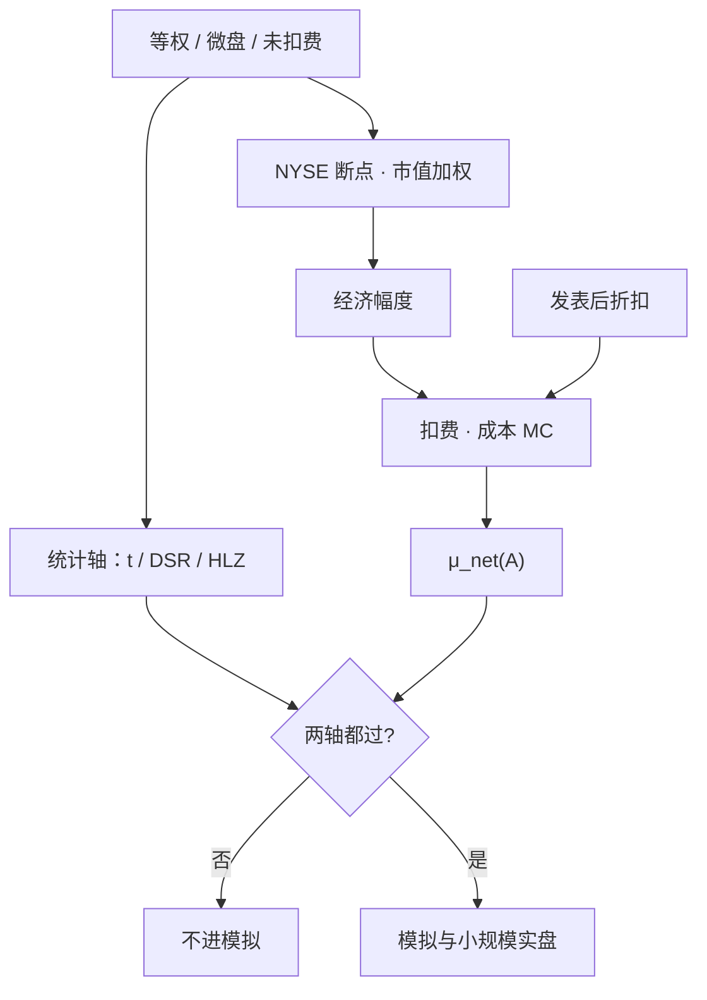

# 经济显著性 vs 统计显著性

    
即便复制成功的异常，其经济幅度也往往远小于原文所报；市场比先前文献承认的更有效。

    <footer>—— Hou, Xue and Zhang, Replicating Anomalies, Review of Financial Studies, 2020</footer>

Harvey、Liu 与 Zhu 把发现的门槛从 $|t|\gt 2$ 抬到大约 3，管的是假阳性。[多重检验](/quant/multiple-testing-factors) 与[紧缩夏普](/quant/deflated-sharpe) 沿着同一条统计轴加严。经济显著性问的是另一条轴：这个效应以可交易的美元计有多大，扣完成本、换到市值加权、避开微盘之后还剩多少。t 可以很高——长样本、高换手、等权微盘都能制造显著——而投资者无法以有意义的规模捕获。Hou–Xue–Zhang 复制 452 个异常：65% 过不了 $|t|\ge 1.96$ 的单次门槛，多重检验门槛 2.78 时失败率 82%，交易摩擦类失败约 96%；即便活下来的，幅度也小于原文。McLean–Pontiff 的发表后剩余收益，同样要过成本与容量，才能叫经济显著。两条轴都通过，才进入[实盘漂移监测](/quant/live-drift-monitor)的名单；只通过统计轴，是论文，不是产品。

## 问题

统计显著性回答：在原假设「没有效应」下，看到这么大的样本均值有多稀有。经济显著性回答：效应的量级是否大到覆盖摩擦、支撑容量、并在可投资宇宙里仍然存在。二者可以分离。长样本里每月 10 个基点的等权溢价可以 t 很大，但市值加权后消失——Hou–Xue–Zhang 把这件事写成复制标准：NYSE 断点、市值加权、控制微盘。反过来，短样本里一个大的事件溢价可以经济上诱人但 t 不够，这时缺的是证据，不是美元。

资产定价文献长期用 t 当发现的货币。期刊喜欢显著，等权与微盘提供显著，于是报告的异常被推向不可交易的角落。McLean–Pontiff 看到样本外与发表后收益下降，部分是偏差，部分是交易；下降之后剩下的那截，仍要用美元与深度去度量。把「发表后仍显著」直接读成「还能做」，漏了幅度已经可能低于有效价差。

### 微盘与等权是统计显著性的免费杠杆

美国市场上，微盘占名字的多数、占市值的少数。等权多空把检验的有效样本推向最贵、最浅的名字；NYSE 断点把分位切在可交易的一侧，市值加权把检验推向有容量的一侧。Hou–Xue–Zhang 表明：手续一换，多数异常的 t 掉到 2 以下；摩擦变量尤其如此，因为它们度量的就是不可交易性。Harvey–Liu–Zhu 的 t>3 在等权微盘上仍然可能被刷出来，所以统计门槛不能替代加权手续。复制成功的定义应同时声明：宇宙、加权、断点、持有期、以及是否扣费。

A 股的「统计显著」同样会被次新、ST、涨跌停不可买的名字抬高。经济显著必须在可买可卖、涨跌停外、借券可获得的子集上重算。把不可交易日的收益记进 t，是把停牌当 alpha。

## 方法

最低限度的报告应并排四列：等权未扣费 t 与月均收益；市值加权未扣费；市值加权扣费；在目标规模 $A$ 下的 $\mu_{\mathrm{net}}(A)$。Hou–Xue–Zhang 的单次门槛 1.96 与多重门槛 2.78（约对应他们校准的 5%）写在前两列；后两列用保本成本与[费用 MC](/quant/cost-mc-sensitivity) 的 $\mathrm{P}(\mu_{\mathrm{net}}\gt 0)$。McLean–Pontiff 的发表后窗口单独成行：同一四列，看幅度而不是只看是否仍异于零。

经济幅度的单位要统一成投资者能理解的量：每单位跟踪误差的超额、每单位换手的超额、以及在声明参与率下可部署的名义。Grinold 的 IR 分解里，IC 高但广度来自不可重复的日频噪声，经济上不是广度。Lo（2002）对夏普抽样误差的警告在这里同样适用：短实盘路径的高夏普没有经济解释力。

与风险模型对齐。若加权后的溢价被 q-因子或五因子吃掉，见 [Hou–Xue–Zhang q-因子](/quant/q-factor-hxz)，它更接近风险补偿而不是可耗尽的错误定价。经济显著仍可能成立——投资者可以持有该风险——但叙事要从「发现了 alpha」改成「承担了哪一种系统性暴露」。错误定价叙事必须在风险调整后、成本后、容量内同时成立。

### 把「显著」写成决策规则而不是星号

研究准入：统计轴用 HLZ 或紧缩夏普，经济轴用加权后月均收益相对有效价差与冲击预测的倍数。两边都过，才进模拟。模拟准入：在声明的 $A$ 与 $p_{\max}$ 下 $\mu_{\mathrm{net}}$ 的 MC 左尾过零。实盘准入：小规模成交回报验证冲击，而不是用更长的 t 去代替。Arnott、Harvey 与 Markowitz 的回测协议强调时间顺序；经济显著性是协议里「值得按该顺序去试」的门槛，不是试完之后贴上的标签。

t=3 且月均 5bp、换手 40% 的日频信号，统计上像发现，经济上往往是噪声交易。t=2.2 且月均 40bp、换手 8%、市值加权仍在的季度信号，统计上不够 HLZ，经济上更值得用更多样本去确认。门槛是向量，不是标量。

## 机制

t 统计量 $t=\hat\mu/(\hat\sigma/\sqrt{n})$ 对 $n$ 敏感，对 $\hat\mu$ 的美元意义不敏感。高频再平衡把 $n$ 做大，也把换手做大；分子若来自价差的错误计量，t 会漂亮地指向一个不能交易的方向。经济显著性把分子换成扣费后、把分母换成可部署风险，相当于用投资者的约束重写检验。Hou–Xue–Zhang 的加权与微盘控制，是把检验的测度从「名字的计数测度」换成「市值测度」。McLean–Pontiff 的发表后下降，是把测度再换成「套利资本进入之后的测度」。每一次换测度，许多星号消失。

拥挤改变经济显著性的速度。统计显著的公开信号吸引资金，幅度被交易掉，见[拥挤 alpha 衰减](/quant/crowded-alpha-decay)。剩余若只存在于最贵的名字上，统计上可能仍异于零（因为那些名字波动大、t 仍可观），经济上容量已经耗尽。因此经济显著必须带规模：$\mu_{\mathrm{net}}(A)$ 而不是 $\mu_{\mathrm{net}}(0)$。

### 复制失败不等于效应为零

Hou–Xue–Zhang 拒绝的是「按他们的手续仍显著」，不是「原文的等权回测算错了」。原文可能在当时的宇宙与加权下确实有 t。经济问题是：那个 t 对应的投资计划今天是否可执行。反过来，复制成功且幅度仍可观的异常，仍要过成本 MC 与拥挤代理。统计与经济两轴是过滤，不是存在性的形而上学。

## 边界与工程取舍

多重检验门槛随尝试次数变，经济门槛随身份变：做市账户与养老金的 $c$ 不同，$A$ 不同。不要用机构短fall 去给零售策略签发经济显著，也不要用学术价差去宣判机构策略不可做。样本起止会同时改变 t 与幅度；预指定窗口，避免为了 t 或为了美元去挑区间。

不要用「我们报告了经济幅度」当借口回避多重检验：大的点估计可以是一次幸运。也不要用 t>3 当借口回避加权：微盘上等权的 t=4 仍然没有容量。LLM 挖掘把尝试次数再抬一个数量级，统计轴必须更严；同时生成器偏好文献里已经拥挤的模板，经济轴必须看相关与容量，见 [Alpha-GPT](/quant/alpha-gpt-mining) 与 [Hubble](/quant/hubble-alpha-agent)。

出处：Hou, Xue and Zhang, *Replicating Anomalies*, *RFS*, 2020；McLean and Pontiff, *JF*, 2016；Harvey, Liu and Zhu, *RFS*, 2016；Novy-Marx and Velikov, *RFS*, 2016。回测协议见 Arnott, Harvey and Markowitz, *JFDS*, 2019。夏普抽样误差见 Lo, *FAJ*, 2002。

## 小结

- 统计显著回答稀有，经济显著回答可交易的美元、加权宇宙与容量；星号不能代替幅度。
- Hou–Xue–Zhang：可交易加权下多数异常复制失败，活下来的幅度也更小；摩擦类尤其不是 alpha。
- McLean–Pontiff 的发表后剩余收益必须再过成本与 $\mu_{\mathrm{net}}(A)$，才能叫经济显著。
- 准入规则应是向量：HLZ/DSR 与加权扣费后的左尾过零同时成立。
- 微盘等权把 t 当免费杠杆；换测度之后许多发现消失。
- 出处：Hou–Xue–Zhang, *RFS*, 2020；McLean–Pontiff, *JF*, 2016；Harvey–Liu–Zhu, *RFS*, 2016；Novy-Marx–Velikov, *RFS*, 2016。
