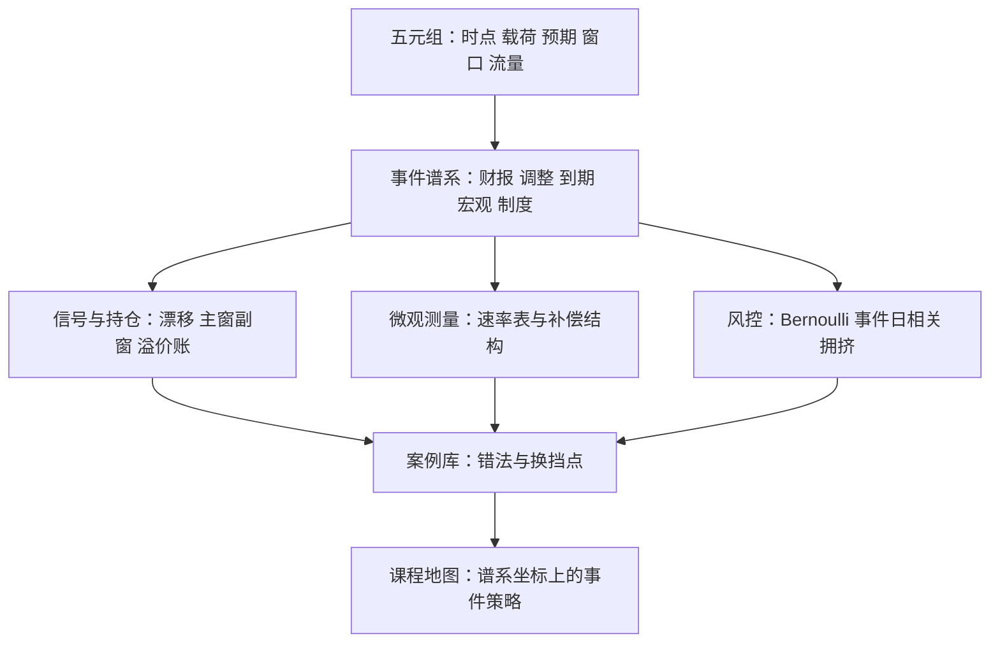

# 事件策略案例与收束

事件驱动的研究对象是「已知何时、未知何事」的日程本身；收束时把每类事件放回谱系坐标，比记住任何一个效应更重要。

<footer>—— 据 MacKinlay, Journal of Economic Literature, 1997；Harris, Trading and Exchanges, 2003 整理</footer>

[上一课](/quant/ed-event-risk-crowding)把三层风险写成限额；本课程到此收束。收束用五个案例回看主线：每个案例都是五元组的一次应用——实际时点、载荷、预期、窗口、流量——放回谱系坐标（时点确定性 × 载荷可预测性），再接上各自的风控换挡点。案例之后给课程地图。

## 问题

回看本课程的谱系坐标：财报事件的时点基本确定、载荷未知；指数调整与期权到期把载荷的可预测性一路推高——前者的流量由规则给出，后者由公开持仓算出；宏观发布把时点的确定性推到秒、把载荷的不确定性推回最大；制度事件连时点都不完全确定，却以参与集合的变化给研究提供天然对照。五个案例按这条轴走一遍，看五元组在每一格怎么变。

## 方法

方法是五个案例共用同一张作业单：先填五元组——实际时点、载荷、预期、窗口、流量；再在谱系坐标（时点确定性 × 载荷可预测性）上定位；然后写明风控换挡点与一条最常犯的错法。作业单的价值在可比：五类事件的差异全部显形在同一组格子里，而不是散落在各自的叙事里。

MacKinlay 1997 的事件研究综述把「窗口设计」列为决定统计功效的第一变量：窗太短漏掉漂移、窗太长稀释信号。五元组的窗口一栏正是这件事的工程化。

### 案例 1：财报漂移

第 1 课与第 6 课的组合。$T$ 用实际时戳、分盘前盘后换轨；载荷与预期差由 [SUE](/quant/pead-sue) 标准化，语气增量用[电话会语气](/quant/earnings-call-tone)在事件簇内合并；窗口是公告后主窗加下一季副窗；流量账单独记公告溢价。风控换挡点：预告不混表、第四季反号前离场、扎堆日限额。错法：用日历格当 $T$，漂移首段全部漏掉。

### 案例 2：指数调整

第 2 课。双时点结构：宣布窗吸收预期，生效窗由 [收盘竞价不平衡](/quant/close-auction-imbalance) 的机制承接冲击；流量 $\Delta w$ 乘以跟踪规模可事先推算。风控换挡点：宣布窗防名单错判，生效窗防执行。错法：把回吐与留存用同一个哑变量去估。

### 案例 3：期权到期

第 3 课。载荷是净 gamma 剖面：正 gamma 尾盘 pin 住，负 gamma 放大；窗口三段，到期次日把体制账结清。风控换挡点：剖面符号逐日重测，0DTE 让窗口变密。错法：「大 OI 行权价必被钉住」。

### 案例 4：宏观发布

第 4 课。秒级时点、实时口径数据、标准化意外；三段窗口（事前撤退、发布跳、恢复）各记各的账。风控换挡点：修订值禁入事件表，事前窗成本单列。错法：用修订后 GDP 回测公告反应。

### 案例 5：制度变化

第 5 课。时间线三段、四条通道、适用范围给对照；产出两张表——速率系数表给研究、约束变化表给风控。方法协议见[事件研究的微观版本](/quant/obd-eventstudy-micro)。错法：只用生效日做窗口，漏掉过渡期行为。

## 机制

课程的主线机制可以压成三句。第一句：**事件化把「日程」变成研究对象**——日历公开是双刃，它让 alpha 可研究（五元组），也让它可复制（拥挤）；溢价随资本周期起伏，这是事件策略的宏观宿命。第二句：**谱系坐标决定方法的迁移边界**——载荷可预测的事件走流量与执行的账，载荷不可预测的事件走预期差与统计的账；跨格搬运窗口与对照设计，是这一族策略最常见的研究错误。第三句：**微观测量是策略参数的来源**——价格发现速度、流动性补偿结构、对冲流符号，从速率表读执行与风控参数，不从收益平均值里猜。三句合起来：事件策略的工程化不是找一个效应，而是把五元组、谱系坐标、速率表与三层风控装进同一张事件表，让每一次事件从登记到退出走同一条管线。

## 边界

收束之后明确不覆盖的部分：纯公告文本的信息提取（语言层见[电话会语气](/quant/earnings-call-tone)与文本因子一课的展开）、波动率产品的对冲细节、以及各市场制度参数的逐项对照；事件策略的执行层（参与率、母单调度）属于执行课程的账。合规边界全课程一致：事件库只装公开时点与公开信息，预告、传闻与内幕不进表——这条线在本课程的每一课都是同一条。

## 小结

- 五个案例走完谱系坐标：载荷可预测性从规则流量、公开持仓到完全未知，方法随之换挡。
- 五元组是贯穿工具；错法集中在时点错配、窗口混账与跨格搬运协议。
- 三句主线：日程是研究对象、谱系坐标定方法边界、微观速率表是参数来源。
- 风控三层配三类限额：左尾情景、事件日暴露集中度、拥挤三只表。
- 本课程到此收束：从财报事件化到拥挤风控，事件表是全部结论的落点。
- 出处：Bernard and Thomas, *JAR*, 1989/1990；Chen, Noronha and Singal, *JF*, 2004；Ni, Pearson, Poteshman and Whitefoot, *JFE*, 2005；Fleming and Remolona, *JF*, 1999；MacKinlay, *JEL*, 1997；其余口径见各课。
