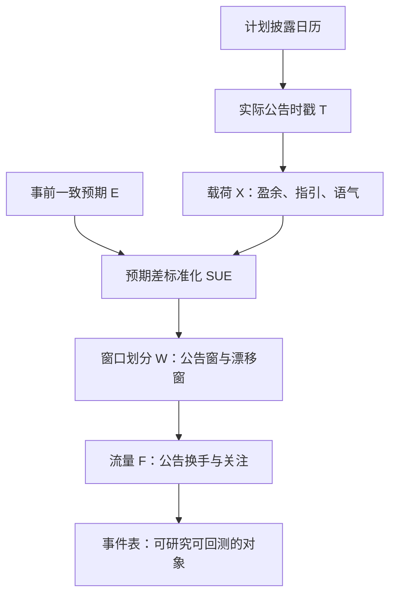
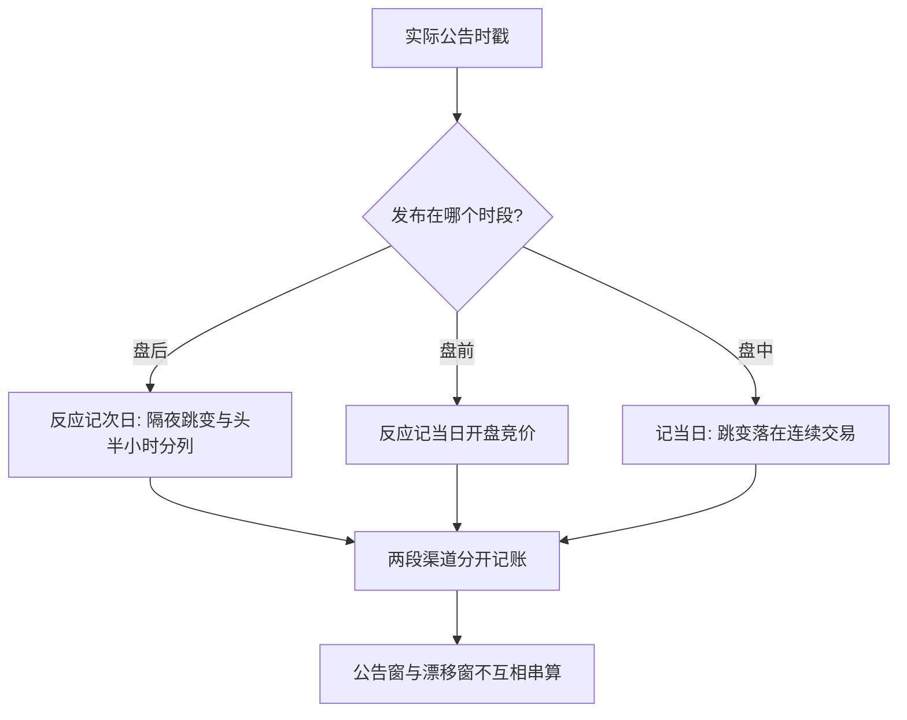

# 财报事件的事件化

市场对盈余新闻的反应集中在公告发生的那几分钟；研究它之前，先要回答一个看似平凡的问题——公告到底发生在什么时候。

<footer>—— 据 Ball and Brown, Journal of Accounting Research, 1968；Patell and Wolfson, Journal of Accounting Research, 1984 整理</footer>

[上一课](/quant/ft-case-map)把已公告并购的公开价差写成完成风险的保险费：完成时收息，失败时左尾成簇。本课起进入事件驱动策略，这一族策略共享同一个日程结构：**时点提前可知，内容只在事件发生那一刻揭晓**。第一课处理最密集的日程事件——财报。所谓事件化，是把一次披露收成可研究、可交易的对象：实际时点、载荷、预期、窗口与必然到场的流量。后面几课把同一模板套到指数调整、期权到期、宏观发布与制度变化上，第 6 课再把[盈余漂移](/quant/pead-sue)从因子改写成事件策略。

## 问题

财报事件的难点不是「有没有事件」，而是事件对象的定义处处可以错。其一，**日历日期不是事件时点**。财报在盘后、盘前或盘中发布：盘后公告的反应记在次日开盘与头半小时，若用「公告日收盘到次日收盘」定义窗口，就把隔夜跳变与连续交易两个渠道搅在了一起。其二，**披露延迟本身是信息**。把计划披露日当实际披露日，会静悄悄丢掉「迟迟不发」的样本，而这批样本往往偏坏消息。其三，**载荷不是信号，预期差才是**。每股盈余 1.02 元没有含义，相对预期的差及其历史定价尺度，才是跨公司可比的量。

直觉类比：EPS 1.02 元本身没有含义，就像考试得 85 分——是惊喜还是失望，取决于大家本来预期你考多少。事件研究要的不是分数本身，而是「实际减预期」再除以这类惊喜平常的波动幅度，才谈得上跨公司比大小。

### 五元组

事件化写成五元组 $(T, X, E, W, F)$：实际公告时点 $T$（时间戳，不是日历格）；载荷 $X$（盈余、指引、语气，口径见 [SUE](/quant/pead-sue) 与[电话会语气 NLP](/quant/earnings-call-tone)）；事前预期 $E$；反应窗口 $W$（公告窗与漂移窗）；必然流量 $F$（可预测的公告换手）。本课钉住最容易写错的 $T$ 与 $W$，漂移留给第 6 课。

Givoly 与 Palmon（1982）：坏消息系统性倾向更晚披露；Chambers 与 Penman（1984）发现报告延迟与公告后异常收益负相关。「迟到」要作为维度进事件库，不当缺失值丢弃。

## 方法

**时点以实际时间戳为准。** 事件表的主键用实际披露日，不是计划披露日。盘后与盘前公告分列，窗口自动换轨：盘后事件的 $T$ 落在次日开盘，盘前落在当日开盘。不这么做会错在哪：跨渠道平均会把隔夜流动性稀薄、开盘竞价机制（A 股见[涨跌停与集合竞价](/quant/cn-limit-auction)）的形状误当成「公告效应」。

数字实例：某公司周二 20:30（盘后）发布财报，事件反应记在周三的开盘竞价与头半小时，隔夜跳变单独一列；若误把周二整天当事件日，周二收盘前的正常波动会混进公告反应，把「效应」估得又宽又脏。

**预期差标准化。** $\mathrm{SUE}=(X-\mathbb{E}[X])/\sigma_{X-\mathbb{E}[X]}$，分母用同一公司历史意外的滚动波动估计。不做标准化，巨额意外与嘈杂意外不可比，横截面排序被市值与波动污染。

**窗口按事件设计，不按日历设计。** 公告窗短到只含即时反应；漂移窗在公告窗之后起算，中间留出测量间隔。同日扎堆的多公告要么分组、要么按事件时间对齐，不能当独立样本共享市场因子。

## 机制

事件化必须严格，机制在于**价格发现的时钟由事件驱动**。盈余信息的定价集中在公告前后极短的窗口内完成，随后的漂移是另一段机制。窗口错位，两段机制互相串门：把漂移算进公告反应，会高估即时效率；把公告跳算进漂移，会高估可交易收益。流量 $F$ 是第三重：公告制造关注度与换手，流动性提供者按事件风险加宽价差——波动溢价留给持有者，成本留给成交者。

延迟的机制同样经济：管理层对披露时点有选择余地，坏消息被拖到截止日前或周五盘后，好消息倾向提前。延迟因此携带私有信息的符号，事件库要保留这个维度，区分「按计划推迟」与「无预警迟到」。

常见误区：把「披露延迟」当数据缺失直接删掉。坏消息系统性倾向迟到，删掉迟到的样本会悄悄抬高事件库的平均质量，回测里的「准时样本」于是比真实市场看起来更干净、更好——偏差就藏在这一删之间。

## 边界

本课不写业绩预告与指引修订的事件化——那是另一族事件，时点更不规则，不与正式公告混表。重述、审计意见变化、停牌复牌也不套用五元组：窗口与预期差的定义都要改。无盘后交易或竞价制度不同的市场，反应渠道不同，跨市场复用要重新校准。事件库只装公开时点与公开信息；用计划日期之前的价异倒推「谁提前知道了」，是合规的悬崖。

## 小结

- 事件化把一次披露收成五元组：实际时点、载荷、预期、窗口、流量；日历日期不是事件时点。
- 盘后与盘前公告的反应落在开盘机制里，窗口按渠道换轨。
- 预期差经历史波动标准化才可横截面比较；载荷本身不是信号。
- 披露延迟携带管理层信息符号，要作为维度保留，不当缺失值丢弃。
- 定价集中在公告窗、漂移在事后窗，不可互相串算。
- 出处：Ball and Brown, *Journal of Accounting Research*, 1968；Patell and Wolfson, *JAR*, 1984；Givoly and Palmon, 1982；Chambers and Penman, *Journal of Accounting Research*, 1984。
