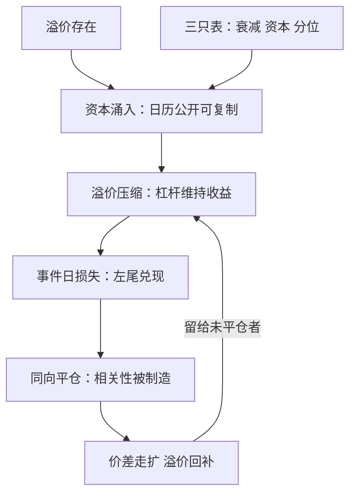

# 事件风险与拥挤

可预测的日历吸引资本，资本压缩溢价，溢价消失的日子风险照旧在场；拥挤把事件策略的尾部连成一片。

<footer>—— 据 Shleifer and Vishny, Journal of Finance, 1997；Khandani and Lo, Journal of Portfolio Management, 2011 整理</footer>

[上一课](/quant/ed-eventstudy-micro-app)把微观痕迹测成速率表；本课进入风控。事件策略的风险分三层：单事件的二值性、事件间的相关、拥挤。原型在[并购套利](/quant/merger-arbitrage)里已经给过：完成收息，失败左尾成簇，且失败在市场下跌时更密。本课把原型推广到全谱系，三层各写成限额与监测。

## 问题

**第一层：单事件是 Bernoulli。** 一次并购、一次审核、一次细则落地，结果二值或近二值，收益分布由少数坏结果主导。按日历日算夏普，会把二值风险摊薄成看似平滑的日息；仓位若按「平均完成率」设定，左尾一到就穿透。**第二层：事件之间相关。** 同一宏观状态下失败成簇（并购失败与市场 beta 的非线性），同一窗口内事件扎堆（财报季、生效日、政策窗），持仓共享同一条日历——相关性不来自共同因子暴露，而来自共同的事件日。**第三层：拥挤。** 日历公开使 alpha 可复制，复制不需要模型只要时间表；资本涌入压缩溢价（并购价差随资本进入变窄），溢价变薄使杠杆被用来维持收益，杠杆又使平仓在事件日同向发生。

Khandani 与 Lo（2011）复盘 2007 年 8 月：互不知名的多数量化策略在几日内同向巨亏——没有共同基本面，只有共同风格与共同杠杆，平仓本身制造了相关性。事件日就是「被迫同向」的预定时刻。

## 方法

**单事件按左尾设仓。** 每类事件先写「坏结果」清单与其价值路径：并购写失败价值与市场状态的相关，调仓写名单错判与流动性消失，宏观写方向错误的跳变。仓位由坏结果情景决定，不由期望收益决定；同时存在 $n$ 笔未决事件时，左尾按「坏结果同时发生 $k$ 个」的分布算，不做独立近似——它们共享状态变量。

**日历的组合视角。** 把持仓的事件日投影到一条时间线：财报扎堆周、生效日、发布周的暴露集中度单独限额；同窗不同事件的同向暴露（都在赌波动回落）按事件 beta 加总。这是事件策略独有的风控维度：因子看静态暴露，事件看时间线上的暴露序列。

**拥挤的三只表。** 监测宣布效应的时序衰减（宣布窗收益逐年变薄）、同类资本的规模代理（容量、专户数、价差分位）、溢价相对自身历史的分位。三只表同向恶化即降杠杆，而不是等事件日来教育。

## 机制

正反馈环写在图里：溢价吸引资本，资本压缩溢价，压缩后用杠杆补收益，事件日损失触发同向减仓，减仓把价差重新走扩——回补由没平仓的人赚，平仓的人承担最深的一段。Shleifer 与 Vishny（1997）把这写成套利的边界：管理他人资本者，在价差最走扩时恰逢赎回与保证金，被迫在最坏时刻退出——事件策略的退出时刻由日历预定，边界更紧。Stein（2009）补上另一面：老练投资者彼此知晓对方存在，进出决策互相内生化——拥挤不是事故，是均衡性质。

含义落在退出规则上：止损必须定义在**信息**上——完成概率的恶化、规则文本的变化、载荷与预期的结构性偏离——而不是 $|z|\gt 2\sigma$ 这类价格统计量。价格走扩可能是坏消息，也可能是拥挤的同向平仓；前者认赔，后者或是加仓机会，区分的唯一线索是信息面有没有变。

## 边界

拥挤不可直接观测，三只表都是代理，且在结构变化处失灵——资本进入方式改变时，旧分位失效。溢价压缩不等于消失：把「有拥挤」当成「清空日历暴露」，是把风控做成择时。尾部对冲成本要计入事件收益：长期买保护的组合，账面与不对冲的同类不可比。压力日的相关性跳变，用平静期相关性做风险平价，会在最需要分散的日子发现分散不见了——事件组合的风险模型要用事件日样本估，而事件日样本恰恰最少。

## 小结

- 三层风险：单事件 Bernoulli、事件日的组合相关、拥挤的正反馈；各配各的限额。
- 仓位按坏结果情景设定，多事件的左尾按共同状态相关算，不按独立近似。
- 独有维度是时间线：事件日暴露集中度单独限额，不只看静态暴露。
- 拥挤用三只表监测：效应衰减、资本规模、溢价分位；同向恶化时降杠杆。
- 止损定义在信息上，不在价格统计量上；区分坏消息与拥挤平仓是难点。
- 出处：Shleifer and Vishny, *Journal of Finance*, 1997；Mitchell and Pulvino, *Journal of Finance*, 2001；Stein, *Journal of Finance*, 2009；Khandani and Lo, *Journal of Portfolio Management*, 2011。
