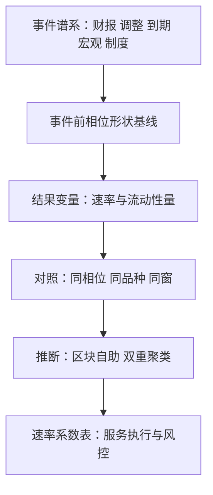
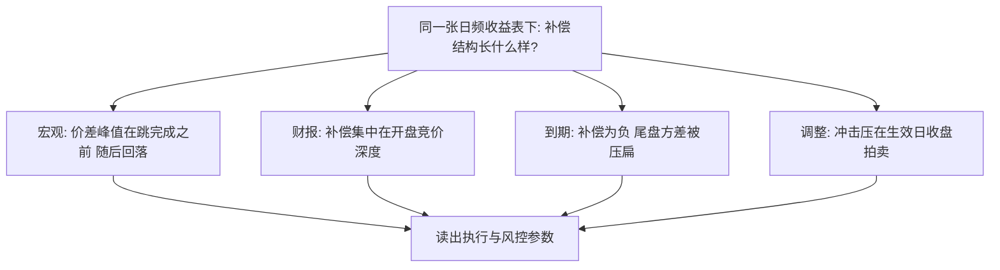

# 事件研究的微观应用

把窗口从「日」换到「秒」，事件研究回答的问题就从「值多少钱」变成「谁在何时如何供给流动性」。

<footer>—— 据 MacKinlay, Journal of Economic Literature, 1997；Harris, Trading and Exchanges, 2003 整理</footer>

[上一课](/quant/ed-pead-eventization)把漂移写成事件持仓；本课是方法落地。[事件研究的微观版本](/quant/obd-eventstudy-micro)已立好协议——结果变量换微观量、对照加相位与共同因子控制、推断用区块自助与双重聚类；本课把协议套到第 1 至 5 课的事件谱系上，逐类给出结果变量、对照与读数含义。它做的是应用：协议不重推，谱系外的新类型暂不涉及。

## 问题

日频事件研究把两个问题合成一个数：价格发现快不快，水平被推高多少。微观口径把二者拆开，而**每类事件拆开后的形状不同**：宏观发布跳得快、回吐快，财报隔夜的定价误差集中在开盘竞价，指数调整的冲击压在生效日拍卖，期权到期改变尾盘方差，制度变化移动速率系数。用同一个「公告日异常收益」度量这五种机制，得到的既不是价格发现也不是水平，而是加权平均——缺口因此是逐类的设计表。

术语翻译：「结果变量」就是把被测量的东西从收益率换成微观量，如开盘 30 分钟价差、撤单率；「对照」是选一个除事件外一切相似的基准（同股非公告开盘、同分钟无发布日）。两者相减，剩下的才是事件留下的净痕迹。

### 设计表

| 事件 | 结果变量 | 对照 |
| --- | --- | --- |
| 财报 | 开盘 30 分钟收益、价差、定价误差 | 同股非公告开盘相位 |
| 指数调整 | 拍卖成交占比、冲击系数、生效后回吐比 | 平静日收盘拍卖 |
| 期权到期 | 尾盘收益方差、收盘价聚集频率 | 非到期同相位 |
| 宏观发布 | 跳完成时间、价差峰值与回落半衰 | 无发布日同分钟 |
| 制度变化 | 撤单率、深度、费率敏感性等系数 | 不受影响品种同窗 |

指数调整与宏观两行的对照时点，用[收盘竞价不平衡](/quant/close-auction-imbalance)与实时快照口径：**用事件当时已公布的量，不用事后重组的量**——微观研究最大的自欺都从时点错配进来。

财报隔夜的反应主要落在开盘集合竞价与头三十分钟；把「次日收盘」当公告反应，会把公告跳与漂移首段混在一起——第 1 课的窗口纪律在秒级上以更高分辨率复现。

## 方法

**先画事件前形状。** 微观量有强日内季节性与体制依赖：「事件后 vs 事件前」的比较都要先确认事件前相位是基线；形状搬家日（半日市、规则过渡日）先剔除。

**推断按微观数据的现实来。** 序列相关与横截面相关都强：区块自助或双重聚类是底线配置；单次事件功效天然弱，靠机制证据累积——系数变化的方向与幅度是否与通道预测一致，比显著性检验更有分量。

**输出是速率表，不是评分卡。** 每类事件产出一行：价格发现完成时间、流动性摆动的幅度与半衰、对冲流符号。读数直接服务前几课的交易设计：财报的执行窗、调仓生效日的参与上限、到期尾盘的风险预算。微观表是参数来源，非打分卡。

## 机制

微观口径为什么能改写结论：事件风险的承担者是流动性供给者，价差与深度的时序就是风险补偿的合同条款。宏观发布前价差加宽、后一两分钟恢复——补偿峰值在定价完成之前；财报隔夜的定价误差集中在开盘释放——补偿集中在竞价深度；到期尾盘方差被压扁——补偿是负的（对冲反而轻松）。同一张日频收益表下藏着五种不同的补偿结构；执行与风控参数应从补偿结构里读出，而不是从收益平均值里猜。这也是本课放在风控之前的原因：前五课立对象，第 6 课立持仓，本课立测量，第 8 课的风控才有数可看。

直觉类比：把流动性供给者想成汛期摆渡的船夫。洪水（宏观发布）来临前先抬价，水退就降价；财报日像定时涨潮，船夫把大船提前泊在竞价码头；到期尾盘反而风平浪静，摆渡近乎免费。补偿各有各的「时间表」，速率表记录的就是它。

## 边界

时间戳与快照纪律决定一切：公布时点快照、时标对齐、盘后归属，任何错配都会让速率表变成噪声表。跨市场要重校准：同样的事件在不同做市结构与竞价制度下速率形状不同，表不可直接搬运。单事件结论只做描述不进参数；参数靠多事件截面累积。微观表回答「机制是什么」，不回答「该不该做」——后者需要成本模型与容量分析，是执行侧的账。

常见误区：拿一次事件的速率表直接去定参数。单次事件功效天然弱，快照错一秒、口径错一档，表就成噪声；参数要靠多事件截面积累，并用机制形状（方向、半衰、符号）反复核对，而不是靠一次漂亮的读数。

## 小结

- 逐类设计：结果变量换微观量、对照对齐相位与品种、推断防序列与横截面相关。
- 先画事件前形状基线，形状搬家日剔除；快照口径用事件当时已公布的量。
- 微观表把日频异常收益拆成价格发现速度与补偿结构，分别服务执行与风控。
- 单事件只做描述；参数靠多事件截面与机制形状核对累积。
- 出处：MacKinlay, *Journal of Economic Literature*, 1997；协议见[事件研究的微观版本](/quant/obd-eventstudy-micro)；快照口径见[收盘竞价不平衡](/quant/close-auction-imbalance)；Harris, *Trading and Exchanges*, 2003。
