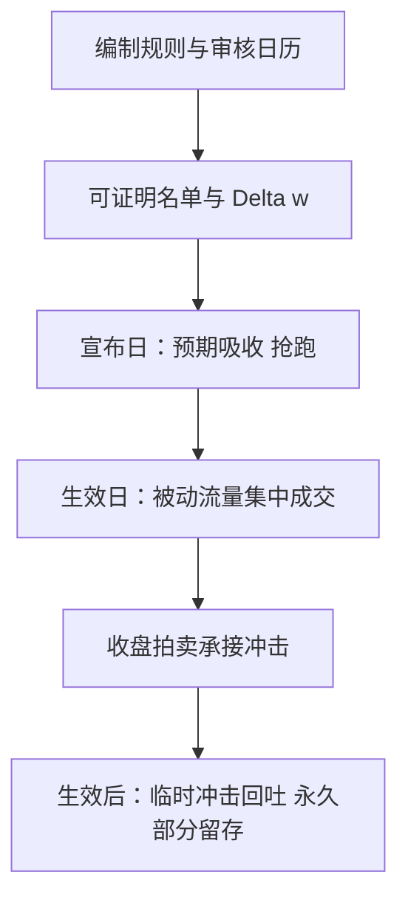
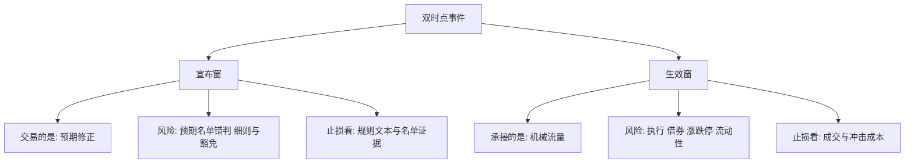

# 指数调整事件

被纳入指数的公司在宣布日上涨，尽管公司没有发生任何基本面变化；价格响应的是需求，不是消息。

<footer>—— 据 Shleifer, Journal of Finance, 1986；Harris and Gurel, Journal of Finance, 1986 整理</footer>

[上一课](/quant/ed-earnings-event)把财报收成五元组：时点可知，载荷未知。本课挪到事件谱系的另一端：指数调整的时点与数量都由公开规则事先决定，载荷几乎没有新信息——它交易的是**规则决定的机械资金流**。策略经济学的完整展开在[指数调仓套利](/quant/index-rebalance-arb)里已经写透；本课在事件化框架里写它与其他日程事件的分工：谁在何时必须成交多少，风控在哪里换挡。

## 问题

指数调整事件的定义有三层。第一，**时点由规则日历给出**：定期审核（罗素重组、标普季度审核、MSCI 半年调整）的宣布日与生效日提前公开，无需预测「公司会不会公告」。第二，**数量可事先推算**：调入调出名单可由编制规则在当时证明，权重变动 $\Delta w$ 乘以跟踪产品的资产规模，就是被动资金必须成交的量。第三，**载荷近似为零**：被调入不是好消息——它是其他投资者将要被迫买入的好消息。放回五元组：$T$ 有宣布与生效两个；$X$ 是名单与权重变动；$E$ 是事前可推算的预期名单，抢跑由此而来；$W$ 是宣布到生效的窗口；$F$ 是 $\Delta w$ 对应的机械流量。缺口在于：流量在时间线上如何分布，谁能提前承接、谁必须在生效日吃进。

直觉类比：被调入指数就像被选为全班必须买的教学范本——公司本身没变好，变的是「有一群人不管价格多高都得买你」。宣布日涨的是这条强制需求，不是基本面；把上涨读成「好消息」就找错了因果。

### 双时点结构

财报是单时点事件，指数调整天然是双时点：宣布日 $\tau_a$，规则生效日 $\tau_e$，$\tau_a\lt\tau_e$。宣布效应在 $\tau_a$ 后开始吸收预期；生效日的集中成交（常压进收盘拍卖，[收盘竞价不平衡](/quant/close-auction-imbalance)的机制在调仓日被放大）打进实际冲击。两个窗口承载两种不同的交易：前者交易预期修正，后者承接流动性。把它们混成一个「调仓效应」，回测会同时高估两者。

Harris 与 Gurel（1986）：宣布日样本平均抬升约 3%、成交量放大近一倍，而公司价值不变——需求移动而非信息。拿旧效应当现值是这一行最常见的错误。

## 方法

**名单在宣布前推算，只用当时可知的信息。** 编制规则给出市值、流动性、行业配额的门槛，按生效日前数据可证明的候选名单就是 $E$。事后名单做研究可以，做信号不行——[指数调仓套利](/quant/index-rebalance-arb)反复强调的口径。

**流量按产品分解。** $F\approx\sum_f (w^{\mathrm{new}}_f-w^{\mathrm{old}}_f)\cdot \mathrm{AUM}_f$，再除以日均成交额定冲击量级。被动基金、ETF（[ETF 申赎](/quant/cn-etf-creation)）、杠杆与增强产品的执行风格不同：有的钉收盘，有的分段。流量分解到执行风格，才能预测生效日拍卖的真实压力。

数字实例：某股新增权重 0.2%，跟踪指数的被动资产共 10 万亿美元，机械买盘约 0.2% × 10 万亿 = 200 亿美元；若该股日均成交额 20 亿美元，相当于 10 个交易日的成交量——而其中大头还压进生效日收盘拍卖的几分钟里。

**窗口分账。** 宣布窗测预期吸收，生效窗测流动性冲击，生效后窗测回吐与留存。三段账分开记，效应衰减与拥挤才有观测点。

## 机制

价格机制是**向下倾斜的需求曲线**：被动资金对价格不敏感，它的到达制造暂时性价格压力；灵活资本承接压力要求补偿。临时部分在生效后回吐，永久部分对应指数产品将长期持有的权重——两类效应用同一个哑变量去估，就把回吐与留存搅成了噪声。拥挤机制决定效应的斜率：日历公开使策略可复制，复制不需要模型只需要日历；资本涌入后宣布效应被提前吸收，生效日冲击变浅，一旦流量异常放大，承接资本的同步减仓会把冲击放大回来。

风控换挡点在时间线上：宣布窗的主要风险是「预期名单错了」（细则、快速进出与豁免），生效窗的主要风险是执行（借券可得性、涨跌停与流动性）——两窗的止损逻辑不同，不能共用一条线。

常见误区：用生效日一天的异常收益代表「指数效应」。临时冲击会在生效后回吐，永久部分才留存；两者混进同一个哑变量，估出的数既不是回吐前的高点、也不是留存后的水平，而是一团解释不了的噪声。

## 边界

本课不重写调仓套利的容量与执行细节，那是[指数调仓套利](/quant/index-rebalance-arb)的对象；也不写对未公开名单的刺探——公开规则下的推算是研究，非公开信息是另一套信息集。权重的被动漂移（不调样也发生的权重变动）是连续流量，不是事件，混进事件表会稀释日历效应。同日多指数生效叠加时，事件不再是独立样本，要按组合处理。

## 小结

- 指数调整是规则决定的双时点事件：宣布日吸收预期，生效日承接机械流量，两窗分账。
- 名单可由公开规则事先证明，流量可由规则与产品规模推算；事后名单不能当信号。
- 价格响应是需求移动不是信息：临时冲击回吐，永久部分留存，不可共用一个哑变量。
- 拥挤使效应衰减；日历公开性让复制不需要模型，溢价随资本周期起伏。
- 出处：Shleifer, *Journal of Finance*, 1986；Harris and Gurel, *Journal of Finance*, 1986；Chen, Noronha and Singal, *Journal of Finance*, 2004；Madhavan, *Financial Analysts Journal*, 2003。
