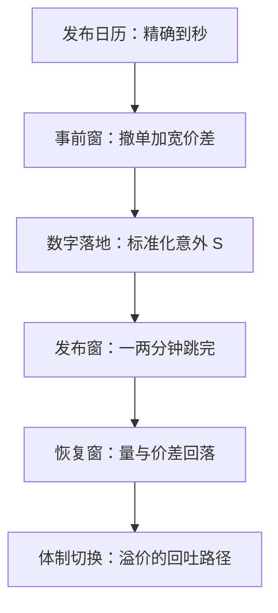
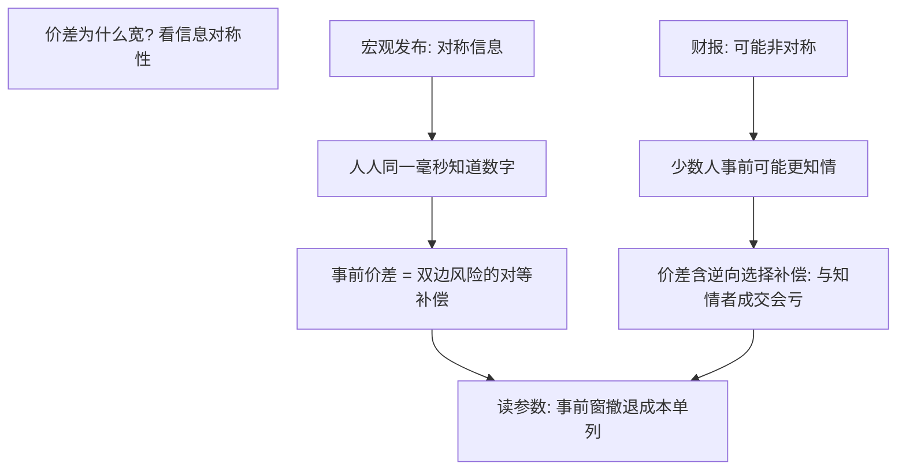

# 宏观发布事件

宏观新闻在公布后的几分钟里就基本定完价；此后市场的任务不再是发现数字，而是消化它的含义。

<footer>—— 据 Fleming and Remolona, Journal of Finance, 1999；Andersen, Bollerslev, Diebold and Vega, American Economic Review, 2003 整理</footer>

[上一课](/quant/ed-opex-event)的载荷可由公开持仓算出；宏观发布把谱系倒过来——**时点精确到秒，载荷在公布前对所有人未知**。它是谱系里「确定性最高、可预测性最低」的一类：非农、CPI、GDP、央行利率决定都挂在公开日历上，数字谁也不比谁先知道。本课写发布日历、标准化意外、分钟级反应与事前的流动性摆动。

## 问题

宏观发布的事件化有三段缺口。第一，**公告前的流动性撤退**。做市商与限价单提交者无法预知数字方向，风险是纯双边的；他们撤单、加宽价差，把承接风险的成本变成事前的流动性洼地。只看发布后的分钟，会把事前价差算进平均成本，成交账立刻变坏。第二，**公布的瞬间是跳跃，不是过程**。国债市场的证据是价格在最初一两分钟基本跳完，量与价差的峰值随后才到——两者不同步，窗口不按秒分层就会被平均掉。第三，**意外必须标准化**。非农差 5 万人与 CPI 差 0.1 个百分点不可比；跨指标比较要除以各自的历史意外波动。

直觉类比：发洪水前，渡口船夫先把船收起来（撤单），留下的少数船坐地起价（价差加宽）。发布前 5–15 分钟的「事前窗」就是这段洪水期；回测若假设这段窗口照常成交，等于假设洪水里船照常开，成本账自然全面偏乐观。

### 意外的尺度

$$
S_j=\frac{A_j-C_j}{\sigma_{A_j-C_j}},
$$

$A_j$ 为实际值，$C_j$ 为发布前一致预期，$\sigma_{A_j-C_j}$ 为该指标历史意外的滚动标准差，是债券市场实证的标准口径（Balduzzi、Elton 与 Green，2001）。用它才有「这次意外多大」的公共答案；原始差值让每个指标活在自己的单位里。

Croushore 与 Stark（2001）的实时数据口径：GDP 首次公布与多年后的修订值可以差出整整一个百分点；用修订值回测公告反应，等于用市场从未见过的数字。

## 方法

**日历到秒，数据用实时口径。** 事件表的 $T$ 用发布机构的实际时间戳，不是计划的整点；$X$ 与 $E$ 取发布时刻可得的数据（首次公布值、发布前预期），修订值只用于长窗研究并单独标注。不这么做会错在哪：一半以上的「公告后异象」换实时口径后消失，剩下的才是市场真正定价过的东西。

**窗口三段。** 事前窗（发布前 5–15 分钟）测撤退：价差、深度、撤单率；发布窗（最初 1–2 分钟）测价格发现完成速度；恢复窗（其后半小时到数小时）测波动与价差回落。三段对无发布日的同时段做对照，日内季节性才不会冒充事件效应。

**交易面分两条线。** 体制线不赌数字方向，交易发布后波动与价差的体制切换——期权定价在公告前已含溢价，公布后的回吐路径就是交易对象。溢价线：股票在发布日的平均收益系统性更高（Savor 与 Wilson，2013），把持有期对准发布日是被付费承担的公告风险。两条线的风险预算不同，不能混账。

数字实例：非农实际 18.0 万、预期 20.0 万，差 −2 万；该指标历史意外的滚动标准差若为 5 万，则 $S=-0.4$，温和意外。CPI 实际 0.4%、预期 0.3%、历史意外波动 0.1 个百分点，则 $S=+1.0$。除以各自的 $\sigma$ 后，两个单位不同的指标才能放进同一张表排序。

## 机制

宏观发布定价为什么快：它是对称信息事件——所有人同一毫秒听到同一个数字，没有谁更知情，竞争全压在解释与速度上。与财报对照：财报前少数人可能更知情（边界由监管划出），宏观前人人同样无知，事前价差是双边风险的对等补偿，而非逆向选择补偿。Ederington 与 Lee（1993）的经典结论：价格发现集中在极短窗口，时点与意外大小解释了绝大部分波动，其余「消息」几乎不留痕迹。

事前摆动为什么单独记账：撤单是理性避险，同一笔成交在事前窗与恢复窗的成本相差数倍；策略若只在事前窗进出（发布前平仓、发布后接回），付的就是这份避险溢价。把分钟级反应测干净的协议见[事件研究的微观版本](/quant/obd-eventstudy-micro)。

## 边界

指标间冲击不对称：就业与通胀对利率资产是巨浪，零售与库存是涟漪；把所有发布当一个「事件池」会稀释真正定价的少数。跨市场复用要重校准：发布时点、开盘机制与做市结构不同，回吐形状不同。意外很大时反应曲线变平（市场转向质疑数据质量与修正），线性外推在高分位失效。分钟级体制交易的容量与成本在微观定价，日频回测给不出可实现收益；公告溢价要用长样本与发布日加权来算，小样本月度对比信不过。

常见误区：把所有宏观发布倒进一个「事件池」取平均。巨浪被涟漪稀释后，会得出「宏观发布没多少反应」的错误结论；正确做法是按指标分池，只对就业、通胀这类高冲击发布单独记账。

## 小结

- 宏观发布是时点确定、载荷未知的事件；意外经标准化才可跨指标比较。
- 事前窗流动性撤退、发布窗一两分钟内价格跳完、恢复窗量价回落，三段分账。
- 回测与事件表必须用实时口径，修订值会让公告反应变成幻象。
- 交易分体制线与溢价线：一个赚波动回吐，一个被付费承担公告风险。
- 出处：Ederington and Lee, *Journal of Finance*, 1993；Fleming and Remolona, *Journal of Finance*, 1999；Balduzzi, Elton and Green, *Review of Financial Studies*, 2001；Savor and Wilson, *Journal of Financial Economics*, 2013。
