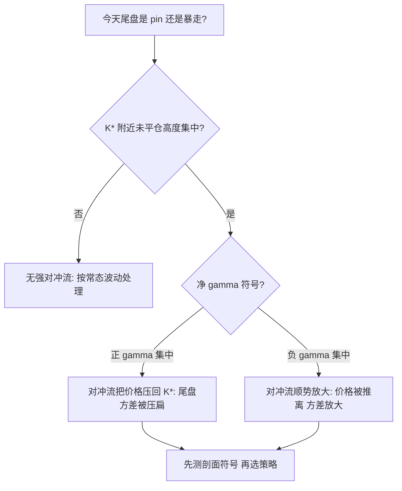
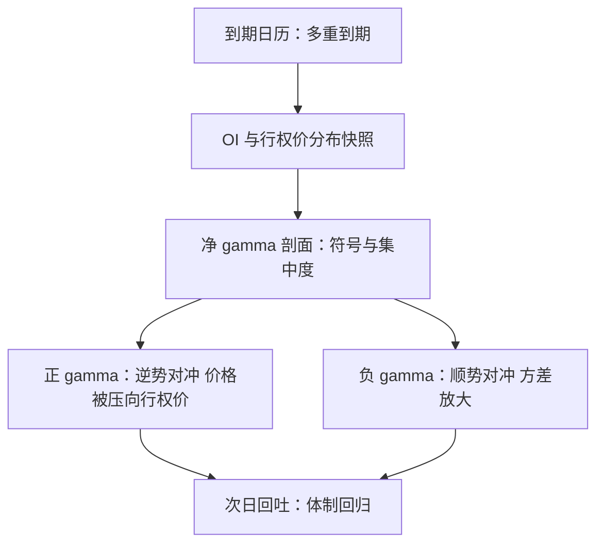

# 期权到期事件

到期日，标的收盘价系统性地聚在大持仓行权价附近；这不是巧合，是两边的对冲流在同一价位上互相抵消。

<footer>—— 据 Ni, Pearson, Poteshman and Whitefoot, Journal of Financial Economics, 2005；Stoll and Whaley, Financial Analysts Journal, 1987 整理</footer>

[上一课](/quant/ed-index-rebalance-event)的流量来自跟踪规则的会计；本课的流量来自衍生品的对冲会计。期权到期是日历上最精确的事件：时点定到收盘，规模可由未平仓合约与行权价分布事先近似。本课写到期日历、对冲流的方向与集中、行权价聚集（pin）与到期后的回吐；波动率交易面另见[事件波动](/quant/vt-event-vol)。

## 问题

到期事件的特殊性在于：**载荷可由公开持仓算出**。财报的载荷无人预知，指数调整的由规则给出，期权的载荷藏在每天公布的未平仓量里。做市商对客户的净头寸决定到期前的对冲流方向：客户买期权，做市商持正 gamma，逆势对冲起稳定作用；客户卖期权，做市商持负 gamma，顺势对冲起放大作用。把全行权价的净 gamma 加总，

术语翻译：gamma 就是「标的每动 1 元，对冲仓位要跟着改多少」的敏感度。正 gamma 意味着涨了要卖一点、跌了要买一点，动作天然逆势、像踩刹车；负 gamma 正相反，涨了追买、跌了追卖，天然像踩油门。

$$
\Gamma_{\mathrm{tot}}=\sum_K \mathrm{OI}_K\cdot \Gamma_K(S,t),
$$

其符号与集中度就是尾盘流量形状的估计。缺口有三：第一，把到期效应当成「庄家操纵价位」的民间叙事（max pain），丢掉对冲会计的真实机制；第二，忽略时点结构——对冲流在到期前一周累积、最后一日尾盘最尖；第三，把个股期权、指数期权与期货的到期混成一个「到期日」，而交割机制与流量并不同步。

### Pin 的条件

聚集不是常态而是条件事件。当某行权价 $K^\*$ 的未平仓高度集中、现价满足 $|S-K^\*|$ 足够小、距到期足够短时，gamma 急剧变尖：价格每偏离一档，做市商需买卖的标的量超线性增长，对冲流把价格推回 $K^\*$，尾盘方差被压扁。反过来，负 gamma 集中时同样的机制把价格推离。同一个日历事件，两种相反的尾部——先测剖面符号，再谈交易。

Ni、Pearson、Poteshman 与 Whitefoot（2005）：到期日收盘价聚集在大持仓行权价的频率显著高于普通日，且随该行权价的未平仓集中度增强——可检验的对冲后果，不是操纵传闻。

## 方法

**日历分层。** 月度与季度到期（含叠加指数期权与期货的多重到期日）、个股实物交割与指数现金交割分列；期货滚动的移仓期是另一段流量，不与期权到期混账。多重到期日的叠加成交量造就了著名的到期巨量，也促成了后来的收盘程序改革。

**持仓剖面换流量。** 每日收盘后取 OI 与行权价分布，逐档算 $\Gamma_K$ 与净符号，得尾盘对冲流的估计剖面。不这么做会错在哪：只看总 OI 或最大仓位行权价，分不清稳定与放大两种尾部，把「有时 pin、有时暴走」当成随机噪声。

**窗口三段。** 到期前一周（对冲流渐强、波动特征改变）、到期日尾盘（gamma 最尖）、次日（回吐，方差回归常态）。把到期日的异常当新体制，会错把一日现象外推成永久参数。

## 机制

经济机制是**对冲需求的时限性**。期权临近到期，时间价值归零，对冲比率的敏感度集中到行权价附近；同一时刻，所有参与者共享同一条日历。对冲流因此不是噪声：它是可预测的方向、可估计的规模、有明确截止时间的需求——这正是五元组的定义。价格聚集是对冲流在行权价上的驻点；尾盘的成交量是持仓向交割机制交接的记账。到期后的回吐来自时限消失：gamma 剖面重新展开，方差回到由标的自身波动决定的水平。

数字实例：一份 delta 0.50 的平值期权，到期前一周 gamma 约 0.05——标的涨 1 元，delta 升到约 0.55，做市商要多买 0.05 份标的保持中性。到期当天价格贴着行权价时，同样的 1 元移动会让 delta 在 0 与 1 之间近乎跳变，对冲动作被放大数倍，这就是尾盘流量「最尖」的来源。

客户行为侧把链条补全：期权市场的净需求改变期权价格与做市商的对冲需求（Gârleanu、Pedersen 与 Poteshman，2009；净买压见 Bollen 与 Whaley，2004），对冲需求再反馈到标的价格——到期日只是反馈被时限放大的日子。

## 边界

Pin 是条件事件，不是保证；把「大 OI 行权价必被钉住」当交易依据，会在负 gamma 集中的月份反复吃亏。交割机制因市场而异：现金交割把流量压在收盘，实物交割摊到行权日前后，跨市场套用模板要重校准。0DTE 让到期窗口变密变短，日内出现多个「准到期时点」，微观形状见[0DTE 与波动](/quant/amaya-0dte-volatility)；推断协议用[事件研究的微观版本](/quant/obd-eventstudy-micro)。未平仓数据是收盘快照，日内建仓不进剖面，尾盘突发大单会改变对冲流方向——剖面是估计，不是承诺。

常见误区：「最大持仓行权价必被 pin」。pin 要先看该价位附近净 gamma 的符号——负 gamma 集中时同样的到期日会把价格推离而不是钉住；只看 OI 大小不看符号，会在这些月份反复吃亏。

## 小结

- 到期是载荷可由公开持仓算出的事件：净 gamma 剖面给出尾盘对冲流的方向与集中度。
- 正 gamma 稳定、负 gamma 放大；行权价聚集（pin）是条件事件，不是常态保证。
- 窗口三段：到期前一周、到期日尾盘、次日回吐；回吐账不能省。
- 多重到期与期货滚动不同步，分账处理；交割机制决定流量压在哪个时段。
- 出处：Stoll and Whaley, *Financial Analysts Journal*, 1987；Ni, Pearson, Poteshman and Whitefoot, *Journal of Financial Economics*, 2005；Gârleanu, Pedersen and Poteshman, *Journal of Finance*, 2009。
