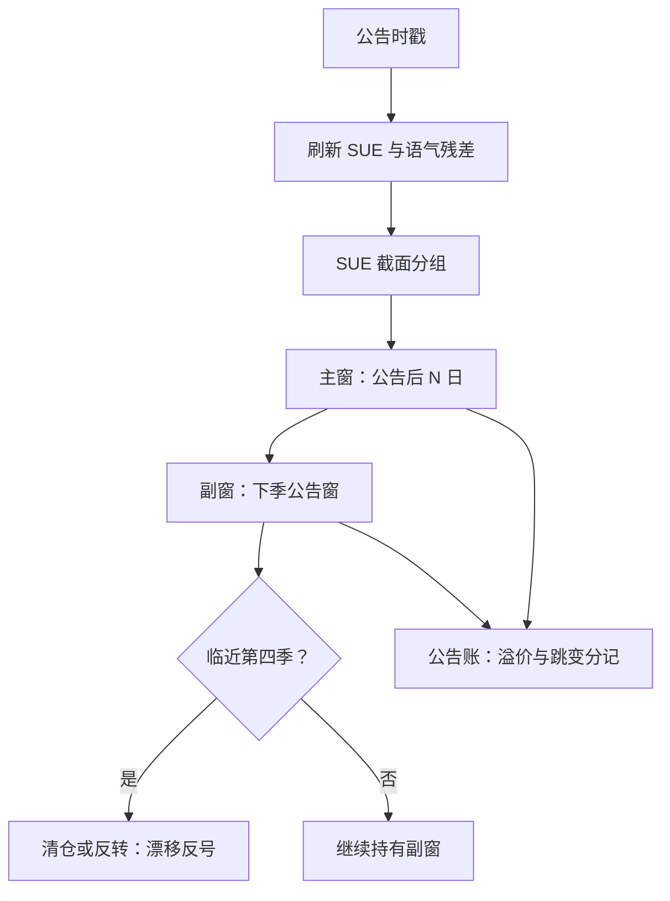
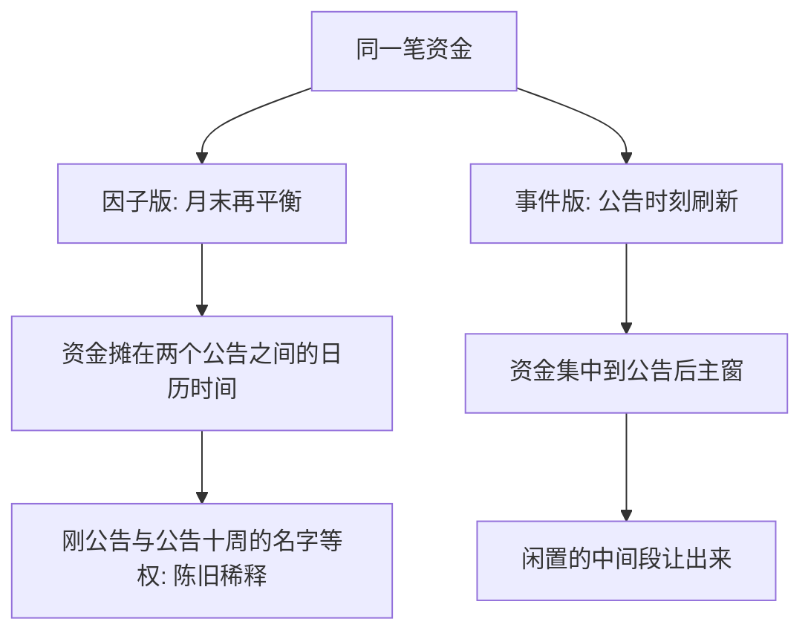

# 盈余漂移的事件化

漂移不在日历时间里均匀发生，而是在下一次公告附近再集中一截；按月度因子持有它，等于在信息最密的地方睡大觉。

<footer>—— 据 Bernard and Thomas, Journal of Accounting Research, 1990；Frazzini and Lamont, Journal of Financial Economics, 2007 整理</footer>

[上一课](/quant/ed-regulatory-event)收掉制度事件；本课回到财报，把五元组用到最成熟的信号上：把[盈利意外 PEAD / SUE](/quant/pead-sue) 从月频截面因子改写成以公告为条件的事件策略。因子版按月末再平衡、持仓不看日历；事件版在公告时刻刷新、按事件日历进出。本课写改写三步——信号时点、持仓窗口、增量条件——与必须分清的两笔账：漂移与公告溢价。

## 问题

因子化丢掉了三样东西。第一，**信号的陈旧度**。月度组合里混着刚公告与公告十周的股票，而漂移最肥的段落在公告后头几天；新旧信号等权持有，等于用闲置仓位稀释事件收益。第二，**公告窗风险没有定价**。因子组合被动站在每次公告旁：公告跳方向未知，波动与价差先加宽再回落。事件化要显式回答：跨公告持有是收溢价还是躲跳变。第三，**增量信息没有合并窗口**。[电话会语气](/quant/earnings-call-tone)的残差语气、指引修订与 SUE 在同一个事件簇里，因子框架里只是另一列特征；事件框架里有天然的合并时点——公告本身。

直觉类比：信号像面包，有新鲜度。月度因子组合把刚出炉和放了十周的面包混在一个篮子里卖；漂移最「新鲜」的段落是公告后头几天，新旧等权等于用陈面包稀释刚出炉的——篮子看起来还是面包，味道已经被平均掉。

### 多季结构的约束

Bernard 与 Thomas 的发现里有因子框架装不下的细节：漂移在下一、二、三季的公告窗附近再次集中，到第四季往往反号。持仓窗口必须围绕多季结构设计，而不是用单一持有期常数把它平均掉。

Livnat 与 Mendenhall（2006）：分析师预测算的 SUE 比时间序列模型算的漂移更强，公告前后机构交易越活跃漂移越大——信号定义与事件窗定义互相咬合，不能各改各的。

## 方法

**信号在公告时刻刷新。** 公告落地即算 SUE、更新语气残差与指引状态，事件表按 $(T, \mathrm{SUE}, \ldots)$ 入库；未刷新的旧信号不进当期组合。不这么做会错在哪：陈旧信号把「公告后第 1 天建仓」混成「第 60 天建仓」，事件的时序结构全部抹平。

**窗口对准漂移的时序。** 持仓写成两段：公告后 $N$ 日的主窗（漂移最陡），加上下一季公告窗的副窗（漂移再集中处），第四季反号前清仓或反转。同日扎堆按截面分组：单票风险二值，几十票同日公告的组合才是统计意义上的漂移。

**公告账单独记。** 持有主窗赚漂移；跨公告持有，额外赚公告溢价（Frazzini 与 Lamont，2007：财报周的收益系统性高于非财报周）并承担跳变。策略必须显式选择——避开公告窗（主窗在公告后起算，自动避开下次公告），或保留跨季副窗（赚溢价、付跳变）；两者波动预算不同。

术语翻译：「跨公告持有是卖保险」——你像保险公司一样承保公告日的突发跳变（方向未知、价差摆动），财报周的超额收益就是收到的保费。主窗在公告后才建仓的策略则躲开承保期，只赚漂移、不收保费，也不会被跳变击中。

## 机制

事件化能提高可实现收益，机制在于**持有期对准了信息处理期**。漂移由系统性反应不足驱动，反应不足在公告时产生：预期形成、意外落地、注意力集中都在公告窗。因子版把资金摊在两个公告之间的日历时间，事件版集中到信息处理的时段，闲置的中间段让出来。多季再集中是同一反应不足的重复：投资者修正了这一季的意外，仍按旧模型外推下一季（Bernard 与 Thomas 押在盈余自相关的错误先验上），新公告每次都再触发一段修正。第四季反号则是修正过度：市场最终学会外推，把前几季的欠账补过头。

公告溢价的机制反着写：跨公告持有是卖保险——公告日的双跳风险（方向未知、流动性摆动）由持有者承担，补偿是财报周的超额收益。事件化把这笔保险从被动承担变成显式选择。

常见误区：以为漂移会线性延续，把副窗一直拿到第 N 季。证据是第四季常反号——市场最终学会外推，把前几季欠账补过头；不设反号检查点，前几季赚的漂移可能在第四季整段还回去。

## 边界

成本与小盘偏倚沿用[盈利意外 PEAD / SUE](/quant/pead-sue) 的口径：等权小盘样本会高估可实现收益，主窗换手按事件频率而非月频计费。预告与快报不与正式公告混表（第 1 课边界继续有效）。漂移强度随资本进入衰减，多季结构在公开化高的市场变浅——历史窗口参数不能直接外推。事件化不是免费午餐：月频分散组合换成事件日的集中建仓，扎堆与容量约束在事件框架里更紧，不是更松。

## 小结

- 三步：信号在公告时刻刷新、窗口对准漂移时序、增量信息在事件簇内合并。
- 持仓分主窗副窗：公告后 N 日是漂移主段，下一季公告窗是再集中处，第四季反号前离场。
- 两笔账分记：主窗赚漂移，跨公告赚溢价并承担跳变；选择要显式。
- 陈旧信号与月度再平衡抹平事件时序；事件表按公告时戳入库。
- 出处：Bernard and Thomas, *Journal of Accounting Research*, 1989/1990；Livnat and Mendenhall, *JAR*, 2006；Frazzini and Lamont, *Journal of Financial Economics*, 2007；Ball and Brown, *JAR*, 1968。
