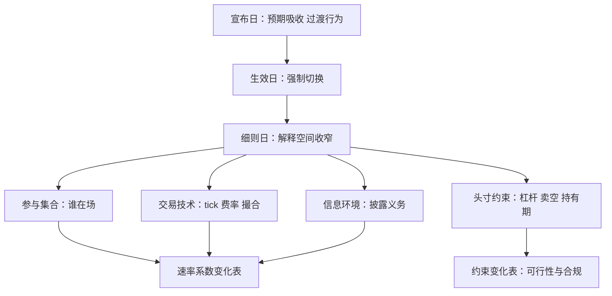

# 监管与制度事件

制度改变的不是某只股票的现金流，而是所有人共同面对的速率方程；它的样本量是 1，机制证据只能来自速率本身。

<footer>—— 据 Leuz and Wysocki, Journal of Accounting Research, 2016；Harris, Trading and Exchanges, 2003 整理</footer>

[上一课](/quant/ed-macro-release-event)的载荷未知但时点确定；制度事件连时点也不确定——宣布、征求意见、生效、细则各占一段日历，可相隔数月。本课写监管与制度变化的事件化：tick、费率、撮合迁移、涨跌停参数、借券与减持规则。方法协议已由[事件研究的微观版本](/quant/obd-eventstudy-micro)立好；本课写对象面：时间线怎么登记，适用范围怎么分组，合规怎么进事件表。

## 问题

制度事件与前三类的根本差别是**改写规则本身**：前三类发生在给定规则下，它改变规则下的行为函数。事件化因此多三件事。第一，**时间线三段**：宣布日，预期吸收、行为开始适应；生效日，强制切换；细则日，解释空间收窄。只用生效日做事件窗，会漏掉宣布效应与过渡期，把适应误判为突变。第二，**样本量是 1**：一次制度变化不能重复抽样，统计推断让位于机制证据——系数变化与理论预测的形状核对。第三，**适用范围给出天然对照**：受影响与不受影响的品种同窗对比，是制度事件最干净的设计资源，日历事件反而没有。

### 四条作用通道

制度通过四条通道起作用：**参与集合**（谁能交易、谁须披露、谁被请出市场）；**交易技术**（tick、费率、撮合、竞价时长）；**头寸约束**（杠杆、卖空、持有期、报备）；**信息环境**（披露义务与频率）。一次变化常同时动几条通道，单一归因从设计上不成立——与[事件研究的微观版本](/quant/obd-eventstudy-micro)「复合事件要拆」同源。

Bushee 与 Leuz（2005）：OTCBB 强制披露规则实施后，大量小公司宁可退到粉单甚至注销也不补披露——制度事件先改变参与集合本身，其次才是留在场内的人怎么交易。

## 方法

**时间线登记。** 事件表加三个时点字段（宣布、生效、细则定稿）与适用范围字段（品种、门槛、豁免）。回测分段按生效时点切，研究分段按宣布时点切——不同时切，会同时错。

**分组对照。** 受影响组与对照组同窗相比，结果变量用微观量：价差、深度、撤单率、定价误差、成交分布的相位。涨跌停参数与竞价安排的对照设计，A 股语境见[涨跌停与集合竞价](/quant/cn-limit-auction)。

**合规映射。** 规则改变头寸的合法性与成本：借券暂停使对冲腿消失，减持限制改变退出路径，报备要求改变时延预算。这些不进 alpha 模型，进可行性表——旧规则下成立、新规则下不可实现的策略，研究价值为零。制度事件表因此输出两张表：速率系数表给研究，约束变化表给风控合规。

## 机制

制度事件的经济机制是**改变均衡的条件而不是均衡的位置**。做市商价差由逆向选择、存货与指令处理成本构成；tick 与费率动指令处理成本，撮合迁移动指令到达的相位，披露义务动逆向选择。预测系数变化的方向要用通道推，不用「好事坏事」推：同一项披露义务，对逆向选择是利好（信息更对称），对参与集合是利空（无力披露者退出），对价差的作用相反，净效应是实证问题。宣布与生效的分离还制造一段适应期：规则公开后、强制前，受影响者已在调整——过渡行为是机制假设最好的检验场，删掉它等于丢掉样本里最有信息的一段。

## 边界

本课不写合规规避——红线是另一门课的事；研究回答「规则改变了什么」，不回答「怎么在边缘行走」。一次性事件的推断天然脆弱：对照组若也间接受影响，对照失效，结论降级为描述。跨市场外推要重校准：同样的 tick 缩减在不同做市结构下方向都可能不同。宣布效应常被重大消息日污染（政策常随宏观事件发布），事件窗要剔除或控制共发事件，否则制度效应与宏观冲击分不开。

## 小结

- 制度事件改写规则本身：时间线三段，样本量为 1，靠机制证据不靠重复抽样。
- 四条作用通道：参与集合、交易技术、头寸约束、信息环境；复合通道必须拆开归因。
- 适用范围给出天然对照组；过渡期行为是最有信息的一段，不能从样本里删掉。
- 事件表输出两张表：速率系数表给研究，约束变化表给风控合规。
- 出处：Bushee and Leuz, *Journal of Accounting Research*, 2005；Leuz and Wysocki, *JAR*, 2016；微观协议见[事件研究的微观版本](/quant/obd-eventstudy-micro)；Harris, *Trading and Exchanges*, 2003。
