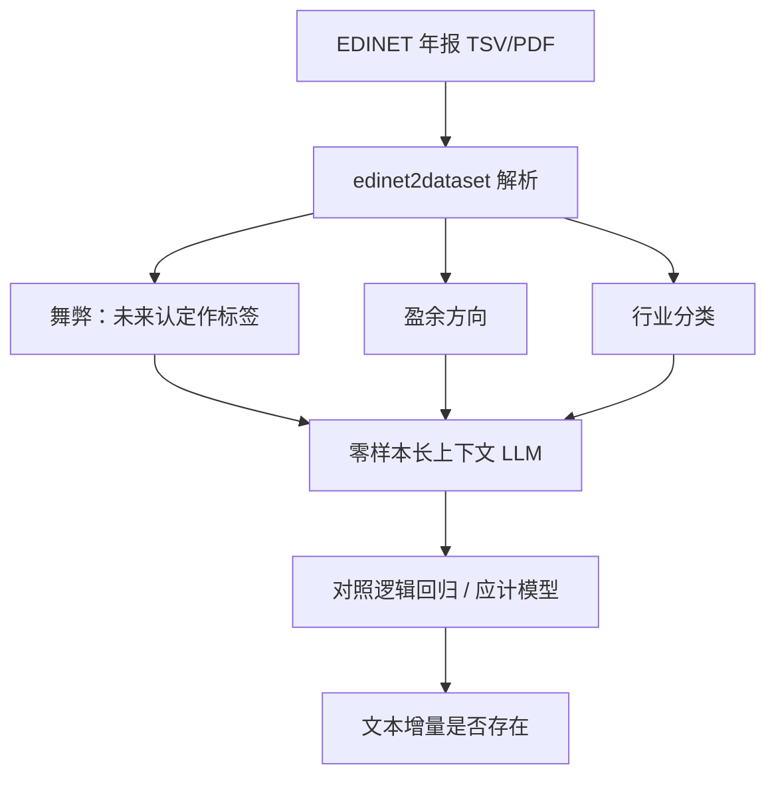

# EDINET-Bench 金融长文档

    
即便最强的大模型，在舞弊识别与盈余方向预测上相对逻辑回归也只有边际优势；把整份年报塞进上下文，并不等于具备专家级推理。

    <footer>—— Sugiura, Ishida, Makino, Tazuke, Nakagawa, Nakago and Ha, EDINET-Bench, arXiv:2506.08762，ICLR 2026</footer>

Sakana AI 与京都大学的 Sugiura 等人用日本金融厅 EDINET 十年有价证券报告，构造开源基准 EDINET-Bench：会计舞弊检测、盈余预测、行业分类。任务要求读完整份年报，跨多个表格与叙述章节整合证据，而不是在预先抽好的段落上做 FinQA 式填空。零样本下，前沿 LLM 在二分类任务上只略强于逻辑回归。作者的结论不是「模型无用」，而是「直接把报告贴进提示不够」，需要更接近分析师工作环境的脚手架。数据集与构建工具（`edinet2dataset`）公开。本篇写长文档金融任务与短问答基准的差别、标签如何从监管体系自动生成、以及量化研究如何避免把年报分类准确率当成基本面 alpha。

## 问题

FinQA、ConvFinQA、FinanceBench 测的是给定片段上的数值推理或开放问答，输入已经过筛选。真实分析师面对的是整份披露：资产负债表、损益、现金流、风险叙述、会计政策，彼此对照。舞弊与盈余变化尤其如此：信号分散在附注、异常应计、审计意见与管理层讨论里。既有日语金融基准多偏考试题；英文 AuditBench 等仍不是「十年真实年报 + 公开标签」。EDINET-Bench 宣称是首个开源的会计舞弊检测数据与评测。

标签定义决定任务是不是可学。舞弊是稀有、滞后、依赖监管事后认定的事件；盈余方向是相对高频但仍难的二分类。若标签用未来更正或未来处罚在报告发布当日即视为可知，模型就在做前视。基准必须把文件时点与标签时点拆开：报告发布时可用的表与文本，对后来才揭晓的舞弊做预测，这才是检测而不是复盘。

### 整份报告不是「更长的 FinQA」

FinQA 的难度在多步算术与表内定位。整份年报的难度在检索、对齐与忽略：数千行 TSV / PDF 里只有少数格子与任务有关，其余是噪声。上下文窗口即使塞得下，注意力仍会稀释。作者强调专家级推理：同比、多表勾稽、叙述与数字对照。行业分类相对容易，因为业务描述段落信息集中；舞弊与盈余则要求跨页证据。这与[多模态文档](/quant/finmmdocr) 的跨页计算是同一类压力，只是 EDINET-Bench 以日语文本+表为主，不一定提供页面截图。

逻辑回归基线用的是传统财务比率与应计，不是「没读文本」。LLM 若只略胜，说明文本通道没有被当前用法打开，或者文本增量本身很小。二者都值得报，不能只报模型排行。

## 方法

**语料。** EDINET 是日本版「电子披露」，类似美国 EDGAR。`edinet2dataset` 经 API 下载有价证券报告，解析 TSV：元数据、摘要指标、BS / PL / CF、以及事业风险等文本。2014 年起各财年数千份报告。自动构建的优点是可滚动加入新一年；缺点是解析错误会变成基准噪声，必须版本化。

**三任务。** 舞弊检测：以事后公开的不当会计或更正为标签，输入为当时年报。盈余预测：预测次年盈余变化方向，可与 Kim 等人用 GPT-4 在匿名报表上的研究对照，但本基准公开数据与代码。行业分类：从报表推断行业，标签可用证券代码委员会分类，也可设想组合经理的自定义行业。评测以分类指标为主；舞弊的类别不平衡要求报 PR AUC 或 F1，而不是准确率。

**实验。** 零样本 LLM 对二分类只略胜逻辑回归，说明「整份报告 + 通用模型」尚未构成专家系统。作者呼吁更丰富的脚手架：任务特定推理、模拟分析师流程、而不是单轮提示。对量化实验室，这意味着文档模型应嵌入抽取器、比率计算器与检索，而不是指望一次 `complete()`。

### 标签、时点与泄漏

自动打标必须回答：处罚公告日、更正报告日、原年报日三者谁进入信息集。训练若包含「已更正版本」去预测该年的舞弊，模型会看见更正本身。正确做法是只用原报告版本，标签来自未来才公开的事件，且测试公司与训练公司按时间切分，避免同一舞弊案的多年报告互相泄漏。行业分类若用未来改类结果当标签，会把即将转型的公司当成当时已是新行业。这些是[前视](/quant/look-ahead-bias) 在披露数据上的翻版。

日语年报的数字与汉字混排、全角标点、表格跨页，会让只按英文 FinQA 调过的分词失败。评测日语文档模型时，不要用英文提示模板硬套。

## 机制

LLM 略胜线性基线的机制，可能来自有限的叙述理解（风险语气、会计政策变更），也可能来自提示里偶然泄漏的规模与行业先验。若把公司名与年份匿名——Kim 等的做法——准确率往往会掉，说明模型在用实体记忆而不是表推理。EDINET-Bench 公开代码，使这类消融可复现。舞弊任务上，Beneish、Dechow 应计模型是经济学基线；LLM 必须在这些比率之外证明文本增量，否则只是用更贵的方式拟合应计。

长上下文失败的机制是丢失与混淆：相关附注在第 80 页，模型在前 20 页的 MD&A 上形成意见。检索增强（RAG）可以把问题变成「先找再读」，但检索器本身会漏掉跨表勾稽。这解释了为何作者说需要脚手架：工具调用计算器、强制引用页码、多步对照，而不是更大的窗口。

行业分类的机制更接近主题模型：业务描述足够时，不必精读折旧政策。它适合当文档管道的冒烟测试——解析崩溃时行业准确率会先掉——不适合当「理解金融」的充分统计。

### 从日本披露到其他法域

EDINET 的结构化 TSV 比纯 PDF 友好，美国 10-K 的 HTML/XBRL、中国年报 PDF 各有各的坑。基准的可迁移思想是：**用监管源自动构建、任务要跨表、基线要有传统计量模型**。直接把日语权重用到 A 股年报上不合理；应在本国披露上重建同构任务，并遵守本国披露日历（中国年报多在 4 月 30 日前，见[时点基本面](/quant/point-in-time)）。

## 边界与工程取舍

不要用测试年的处罚公告微调后再测同一案件。不要把盈余方向准确率翻译成 PEAD 策略而不做[公告后漂移](/quant/pead-sue) 的标准手续与成本。不要在上下文塞不下时静默截断年报尾部——舞弊信号常在附注。计算预算应计入检索与工具轮次，而不是只计入单次生成。

对投资流程，长文档模型的输出应是可引用的抽取（某页某行的应收账款）与比率，交给确定性代码算应计与质量因子。模型意见可以当研究备忘，不能当[闸门](/quant/trading-kill-switch) 的唯一输入。开源基准的价值是可重复的失败：目前失败说明的是用法与任务难度，不是「年报没有信息」。

「专家级」在论文里指跨表综合，不是指模型已达注册会计师。人类专家也有脚手架：审计程序、同业比较、函证。要求模型在无工具零样本下击败带特征的逻辑回归，本身是苛刻协议；改协议必须同时改基线。

## 小结

- EDINET-Bench（Sugiura et al., arXiv:2506.08762，ICLR 2026）用十年日本年报评测舞弊、盈余方向与行业分类，强调整份文档与跨表推理。
- 前沿 LLM 零样本仅略胜逻辑回归；直接贴报告不够，需要检索、计算工具与分析师式流程。
- 标签时点必须后于报告时点；更正版本不能进入当时信息集。
- 量化上只把抽取与比率接入 PIT 因子，分类准确率不是交易信号。
- 出处：Sugiura, Ishida, Makino, Tazuke, Nakagawa, Nakago, Ha, *EDINET-Bench: Evaluating LLMs on Complex Financial Tasks using Japanese Financial Statements*，arXiv:2506.08762；数据 `SakanaAI/EDINET-Bench`。
