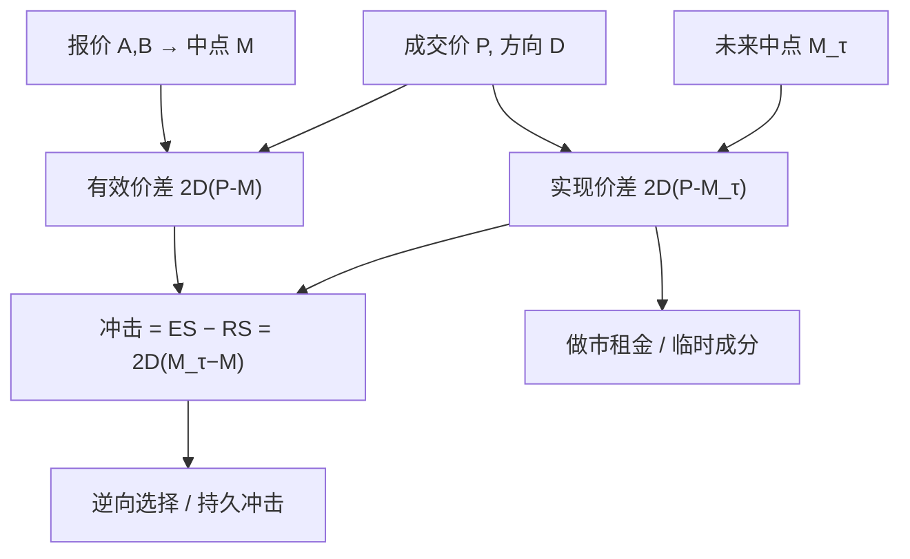

# 有效价差与实现价差

    
报价价差是挂在簿上的宽度；有效价差是成交相对中点实际付了多少；实现价差是做市商把这笔存货再转手之后还剩多少。

    <footer>—— Huang and Stoll, Dealer versus Auction Markets: A Paired Comparison of Execution Costs on NASDAQ and the NYSE, Journal of Financial Economics 1996</footer>

比较两个市场谁更「便宜」，不能只看买一卖一的距离。报价可以很窄，成交却经常打穿；也可以报价宽，成交却大量发生在中点。Huang 与 Stoll 在对照 NASDAQ 做市商市场与纽交所竞价市场时，把执行成本拆成可计算的几截：**报价价差**、**有效价差**、**实现价差**，并用有效减实现去逼近价格冲击（逆向选择）。这套分解是交易成本实证的骨架，也是把 Glosten–Harris、Huang–Stoll 价差分解接到数据上的入口。它测的是已经发生的成交有多贵，不是 [PIN](/quant/pin) 那种生成模型里的知情概率。

## 问题

报价价差 $A-B$ 是做市商（或限价簿）对外宣布的一轮往返成本。实际成交价 $P$ 往往在价差内部，因为隐藏流动性、价格改善、或成交发生在更深的档。对主动方，真正付的是 $P$ 相对当时中点 $M=(A+B)/2$ 的距离。对被动方，这笔单变成存货之后，中点会动；若中点朝着不利于存货的方向走，被动方的利润会被吃掉。执行成本因此至少有两个时间点：成交当时，以及存货被重新定价之后。

若只报告报价价差，竞价市场与做市商市场无法比：一个把流动性写在明档，一个把一部分谈判留在成交里。若只报告有效价差，又看不到事后冲击——知情单可以让有效价差看起来不大，却在随后把中点推走。问题是给出一套符号一致、可按成交加总的定义，并把冲击从实现利润里分开。

### 方向 $D$ 必须先定义

所有价差公式都乘以成交方向 $D$：主动买 $+1$，主动卖 $-1$。没有 $D$，$(P-M)$ 的符号无意义。Lee–Ready 用成交价相对中点，平价时用 tick 检验。方向错误会把有效价差系统性压低（随机分类使 $D(P-M)$ 期望变小）。高频、多交易所、中点延迟一毫秒，分类错误率就不是可以忽略的边角。

有效价差不是「成交价减买一」。买一是被动卖的报价，主动买成交可能发生在卖一、卖二甚至中点。中点是当时公开买卖的中心，用来当未受本笔成交污染的参考价——前提是报价时间戳与成交时间戳对齐。错配毫秒，中点就可能已经含了本笔。

## 方法

记成交价 $P_t$、同时刻（或紧前）中点 $M_t$、方向 $D_t$。**有效价差**

$$
\mathrm{ES}_t=2D_t(P_t-M_t).
$$

乘 2 是为了与报价价差同量纲：一轮买加一轮卖。单笔主动买若在卖价成交且没有改善，有效价差等于报价价差；若有价格改善，有效价差更小，甚至为负（成交越过中点，在对方一侧）。

取滞后 $\tau$（五分钟、十五分钟、或下一笔报价更新），**实现价差**

$$
\mathrm{RS}_t=2D_t(P_t-M_{t+\tau}).
$$

它把参考价换成未来中点：被动方若以 $P_t$ 买入（对应主动卖，$D_t=-1$），之后中点下跌，实现价差变负。Huang–Stoll 把**价格冲击**写成有效减实现：

$$
\mathrm{ES}_t-\mathrm{RS}_t=2D_t(M_{t+\tau}-M_t).
$$

即方向乘以后续中点变动。冲击大，说明成交后价格顺着主动方走，通常解释为逆向选择或持久的存货压力。实现价差则更接近做市商扣除冲击后的利润：报价价差里的订单处理与存货成分。

### $\tau$ 的选择改变成分而不改变会计恒等式

恒等式 $\mathrm{ES}=\mathrm{RS}+\mathrm{Impact}$ 对任意 $\tau$ 成立。$\tau$ 太短，冲击尚未实现，实现价差偏高、冲击偏低；$\tau$ 太长，不相关信息进入 $M_{t+\tau}$，冲击方差变大，均值仍可解释为持久成分。五分钟是美股文献的常见折中，不是定理。开盘、收盘、宏观发布前后，$\tau$ 应缩短到与信息释放匹配的尺度。跨市场比较必须锁定同一 $\tau$、同一方向算法、同一是否对成交量加权。

## 机制

有效价差捕捉的是**相对公开中点的即时偏离**。限价簿足够深、市价单只扫一档时，它接近报价价差；冰山、暗池、零售内化会把大量成交推进价差内部，有效价差小于报价价差。实现价差捕捉的是**这笔成交作为存货的事后盯市**。若对手是非知情、随后中点随机游走，实现价差的期望约等于有效价差；若对手知情，中点漂移，实现价差被压缩。

这与 Huang–Stoll（1997）把价差拆成逆向选择、存货、订单处理三块是同一套会计：有效与实现提供不需要完整参数模型的约化统计量。Roll 模型用收益序列协方差估价差，吃的是收盘价，看不见盘中改善；本篇这组度量吃的是带方向的成交，分辨率高得多，也对数据质量苛求得得多。

加权方式会改变故事。等权有效价差突出小单；成交量加权、成交额加权才接近机构实际付的成本。大单拆成多笔时，应按父单聚合再算一个有效价差，否则会把扫档过程拆成许多「看起来很便宜」的子笔。

### 与 PIN、VPIN 的分工

PIN 回答生成过程里知情交易的概率，VPIN 回答成交量时钟上的流量毒性，有效/实现价差回答**已经成交的那一笔有多贵、贵在冲击还是价差租金**。毒性高的时段，冲击成分应上升、实现价差下降——这是联合检验，不是互相定义。不要用 PIN 替代有效价差去给交易台报成本，也不要用实现价差替代 PIN 去做信息风险的横截面。

## 边界与工程取舍

公式假设存在可观测的买卖报价与中点。集合竞价只有成交价，没有连续中点，有效价差要另定义参考价（例如开盘前的虚拟中点，或不用开盘笔）。涨跌停时一侧报价缺失，中点失真。盘后、暗池成交若没有同步的公开中点，应标成缺失而不是拿过期中点硬算。

不要把负的有效价差一律当数据错误：中点穿越、零售价格改善、收盘拍卖的交叉都可以产生负值。不要把实现价差当成做市商的会计利润：还有手续费、返佣、存货隔夜、对冲成本。$\tau$ 跨越隔夜时，实现价差混入[隔夜收益](/quant/calendar-overnight)，应分开报告。方向分类应在清洗后的成交上做，先经过 [Tick 数据清洗](/quant/tick-cleaning) 与 [异常成交](/quant/outlier-trades)，否则错价会以巨大的 $P-M$ 主导均值。

Huang–Stoll 1996 的配对比较依赖当时 NASDAQ 的做市商结构与纽交所的专家制度。今日的电子限价簿、零售内化、拍卖机制不同，公式仍可用，制度解释不能照抄「做市商市场更贵」那一句结论。

## 小结

- 报价价差是挂牌宽度；有效价差 $2D(P-M)$ 是成交相对当时中点的成本；实现价差 $2D(P-M_{τ})$ 是对照未来中点后被动方还剩的价差。
- 价格冲击等于有效减实现，即方向乘中点漂移，约化地对应逆向选择。
- $\tau$、方向分类、成交量加权决定水平与排序；跨市场比较必须锁口径。
- 负有效价差可以是改善而不是错价；隔夜、停牌、无报价时段要单独处理。
- 与 PIN/VPIN 分工：成本会计对生成概率，二者联合看毒性是否真的让冲击变贵。
- 出处：Huang and Stoll, *Dealer versus Auction Markets*, Journal of Financial Economics 1996；价差成分的参数分解见 Huang and Stoll, Journal of Finance 1997。
