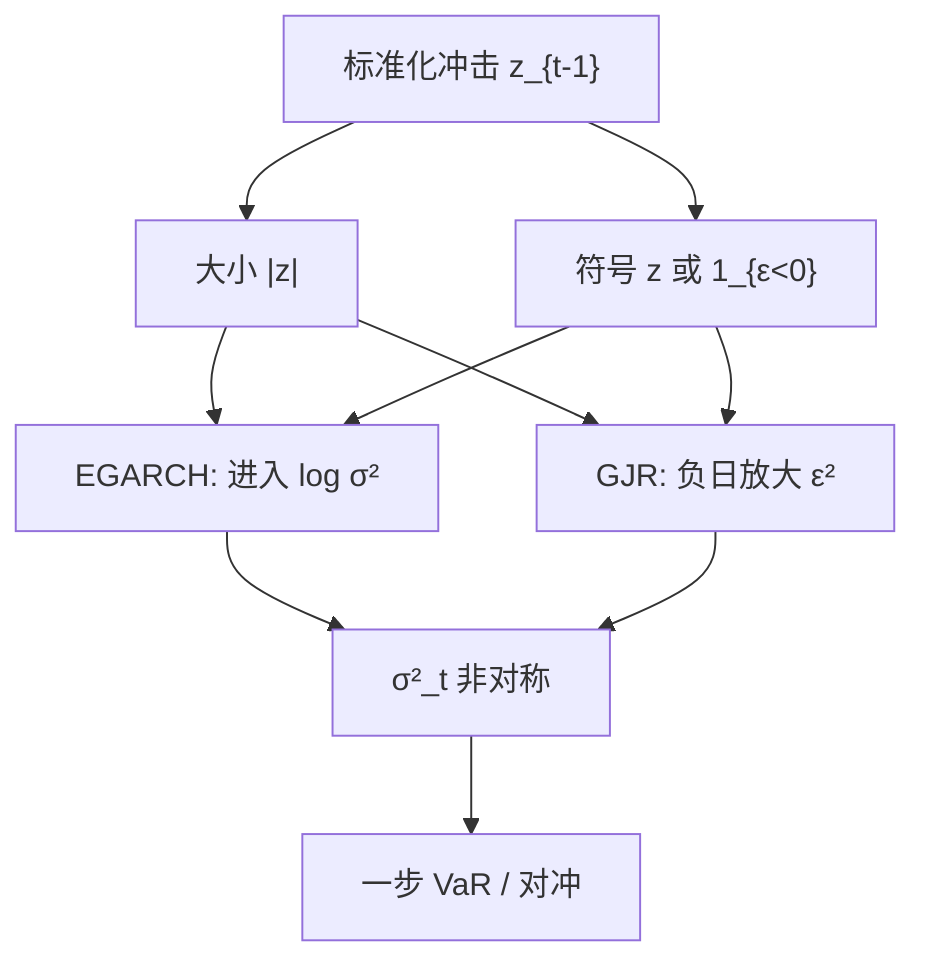

# EGARCH / GJR

股票的条件方差对负冲击的反应强于对正冲击；把符号放进方差方程，不必牺牲正性，也能写出这条杠杆通道。

<footer>—— Nelson, Conditional Heteroskedasticity in Asset Returns: A New Approach, Econometrica 1991；Glosten, Jagannathan and Runkle, Journal of Finance 1993</footer>

GARCH(1,1) 对正负残差一视同仁，但股票指数的波动在下跌后升得更猛。Black（1976）用财务杠杆讲故事：股价跌则公司杠杆升，股权波动升。Nelson（1991）的 EGARCH 在对数方差上同时放入冲击的绝对值与符号；Glosten、Jagannathan 与 Runkle（1993）的 GJR 在水平平方上加一个负残差哑变量。两者要解决的是**非对称波动**，不是另起一套积分波动理论。对象仍是日收益的条件方差；有 RV 时，非对称可以写进 HAR 或已实现 GARCH 的杠杆项，逻辑同源。

## 问题

设 $z_t=\varepsilon_t/\sigma_t$。对称 GARCH 里 $\varepsilon_{t-1}^2$ 进入 $\sigma_t^2$，符号消失。经验上，对股票，$\mathrm{Corr}(r_t,RV_{t+1})$ 为负，新闻冲击曲线（把 $z$ 映到下一期方差）在负半轴更陡。若忽略非对称，下跌后的 $\sigma_t$ 偏低，VaR 与期权对冲会在最需要的一侧失准；上涨后的方差可能被高估。问题是在保持方差为正、过程平稳的前提下，让新闻冲击曲线不对称，并估计不对称有多强。

Nelson 的 EGARCH(1,1) 典型形式为

$$
\log\sigma_t^2=\omega+\beta\log\sigma_{t-1}^2+\alpha\bigl(|z_{t-1}|-E|z_{t-1}|\bigr)+\gamma z_{t-1}.
$$

$\gamma<0$ 时负 $z$ 抬高下一期对数方差。对数保证 $\sigma_t^2>0$，不必对 $\alpha,\beta$ 做非负约束。GJR-GARCH 为

$$
\sigma_t^2=\omega+\bigl(\alpha+\gamma\mathbf{1}_{\{\varepsilon_{t-1}<0\}}\bigr)\varepsilon_{t-1}^2+\beta\sigma_{t-1}^2.
$$

$\gamma>0$ 对应股票上的杠杆效应。Zakoian 的 TARCH 用绝对值而非平方，同一家族。

### 杠杆效应与波动反馈不是同一条因果

杠杆假说：价格跌 → 财务杠杆升 → 未来波动升。波动反馈（Campbell–Hentschel）：预期波动升 → 要求收益升 → 当期价格跌。两者都产生负的收益–波动相关，但时点不同。EGARCH/GJR 是简化式：它们拟合新闻冲击曲线，并不识别是杠杆还是反馈。用日频模型去「证明」公司财务杠杆，对象错了；要用期权或高频连续时间模型，才更接近识别。简化式对风控仍然有用：它把不对称写进 $\sigma_{t|t-1}$。

商品与汇率上 $\gamma$ 的符号可以反转或接近零。把股票上估出来的 EGARCH 参数直接套到商品账簿，是把一种市场的新闻冲击曲线当成物理常数。分资产估计，再决定要不要在风险模型里共用非对称。

## 方法

**估计。** 仍用条件（准）极大似然。EGARCH 无正性约束，优化更自由，但 $\log\sigma^2$ 在极端 $z$ 下可以跑得很远，数值要裁剪创新或用稳健 $z$ 分布。GJR 保持水平方程，约束 $\omega>0$，$\alpha\ge 0$，$\alpha+\gamma\ge 0$，$\beta\ge 0$，平稳性涉及非对称下的期望系数，不是简单的 $\alpha+\beta<1$。创新用高斯或 t；股票上 t 或 GED（Nelson 原文用 GED）更常见。

**新闻冲击曲线。** 估计后画出 $z\mapsto\sigma_{t}^2(z)$（其余固定在稳态）。比较对称 GARCH、EGARCH、GJR 在 $z=-2$ 与 $z=+2$ 处的高度。样本外用 QLIKE、VaR 违反率、以及下跌日后的预测误差，而不是只看样本内似然——非对称多一个参数，样本内几乎总会赢。

**与均值的联合。** GJR 原文关心的是股票超额收益与波动的关系：方差进入均值（GARCH-M）时，非对称会改变风险回报的估计。工程上若只做风控，均值保持常数即可；若要用 $\sigma_t$ 当时变风险价格，必须声明是简化式，且对「波动升则期望收益升」的检验极弱、样本敏感。

### 诊断：符号相关，不只是平方 ACF

对称 GARCH 抽干平方 ACF 之后，标准化残差与滞后平方仍可能有相关（负收益预示高未来方差）。这是非对称的指纹。Engle–Ng 的符号偏检验、负负偏检验，就是在问这条曲线要不要弯。通过平方 Ljung–Box 但没做符号检验，就宣布 GARCH(1,1) 足够，会把杠杆效应剩在尾部。

## 机制

EGARCH 把冲击拆成大小与方向：绝对值项吸收对称的 ARCH 效应，符号项吸收杠杆。对数域上加总，等价于方差上的乘性冲击，极端日不会像水平 GARCH 那样把 $\sigma^2$ 加出一个巨大的加法项——但指数回来后仍然可以很大。GJR 更直：负日的 $\varepsilon^2$ 多乘 $\gamma$，是加法非对称。两种机制在中等冲击上往往难分，在极端负日上 EGARCH 的乘性与 GJR 的加法会分叉；样本外哪一个好，随市场与损失而定。

持续性仍然由对数自回归系数（EGARCH 的 $\beta$）或 GJR 的 $\beta$ 加平均 ARCH 系数决定。非对称不自动等于更长记忆。危机年会同时抬高持续性估计与 $\gamma$：一次持续下跌既像杠杆，也像水平突变。分段样本或允许方差水平切换，能避免把一次 2008 写成永远更大的 $\gamma$。

Nelson 强调 EGARCH 可对 $z$ 的正负施加不同的指数衰减，且对数保证正性。正性在 GJR 里靠约束，在 EGARCH 里靠变换。变换不是免费：对 $\log\sigma^2$ 无偏的预测，变回 $\sigma^2$ 要 Jensen 项；多步预测 EGARCH 通常靠模拟。

### 高频杠杆项是同一非对称的另一分辨率

RV 对昨日负收益回归，系数常为负，HAR 可加杠杆。那是已实现测度上的简化式，信息集更富，但仍不识别财务杠杆。日频 EGARCH 与带杠杆的 HAR 应互相校准：若高频里几乎没有非对称、日频 $\gamma$ 很大，可能是隔夜跳在作怪，应拆开隔夜与日内，见 [日历效应](/quant/calendar-overnight）。

## 边界与工程取舍

非对称在个股上比指数上噪：个股特质跳会把 $\gamma$ 打飞。风险模型更常对指数、行业、因子组合估 EGARCH/GJR，个股用映射。EGARCH 多步预测与矩没有 GARCH(1,1) 那么干净；若产品只需要一步 VaR，两者都可用；若需要解析的多期方差，GJR 或带杠杆的 GARCH 更省事。

不要把 $\gamma$ 显著当成可交易的「跌了就做多波动」。那是条件方差的拟合，执行还要方差风险溢价与成本。不要在对称 GARCH 与 EGARCH 之间用全样本 AIC 选完再报告唯一模型的 t 值。预指定：股票指数用非对称，汇率用对称，作为默认，其余当稳健性。正性约束在 GJR 上可能顶住（$\alpha=0$，$\gamma>0$），含义是「只有下跌日更新方差」，应报告，而不是当作优化失败。

新闻冲击曲线在 $z$ 的两端样本很少。$\gamma$ 往往被少数极端日识别。估计应检查删掉最大的一两个负收益后 $\gamma$ 是否还在。若消失，模型是在拟合跳跃，不是稳定的杠杆通道——跳跃应单独建模或用稳健损失。

## 小结

- Nelson 的 EGARCH 在对数方差中同时放入冲击大小与符号；GJR 在水平 GARCH 上为负残差加额外权重。
- 两者拟合新闻冲击曲线，并不识别财务杠杆与波动反馈。
- 符号偏检验能发现对称 GARCH 抽不干的非对称；样本外应用 QLIKE 与下跌日误差，而不是只比样本内似然。
- 个股 $\gamma$ 噪、指数更稳；多步预测 EGARCH 常需模拟，GJR 更贴近水平 GARCH 的工程。
- 极端日可以单独识别 $\gamma$；应做删除诊断，以免把跳跃写成永恒杠杆。
- 出处：Nelson, *Conditional Heteroskedasticity in Asset Returns: A New Approach*, Econometrica, 1991；Glosten, Jagannathan and Runkle, *On the Relation between the Expected Value and the Volatility of the Nominal Excess Return on Stocks*, Journal of Finance, 1993。
