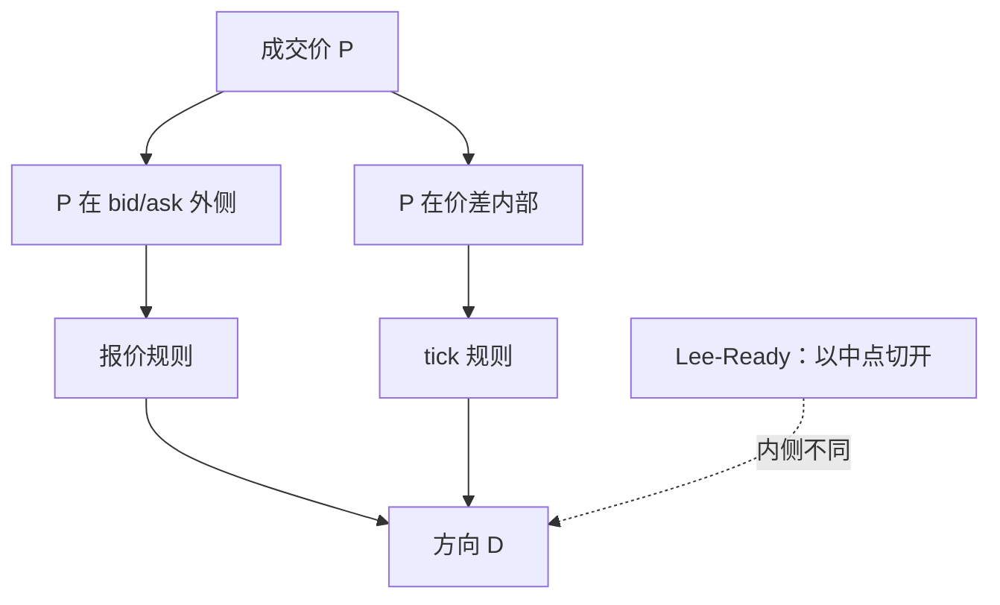

# Ellis-Michaely-O'Hara 改进

打在买一卖一上的成交，报价规则已经够用；困难集中在报价内侧。把内侧全部交给中点一侧的 Lee–Ready，会把本该用 tick 的成交误判。

<footer>—— Ellis, Michaely and O'Hara, The Accuracy of Trade Classification Rules, Journal of Financial and Quantitative Analysis, 2000</footer>

附录微观结构续从方向分类补起。[Lee-Ready](/quant/lee-ready) 用中点切开买卖，平价才用 tick。[Tick / Quote 规则](/quant/tick-quote-rule)把两条规则拆开对照。Ellis、Michaely 与 O'Hara（2000）用带真实主动标志的系统订单数据表明：报价规则在成交位于 bid/ask 时更准，tick 规则在中点附近相对不那么糟，组合整体最好——但他们建议的切法与 Lee–Ready **不是同一刀**。本课写这把刀：外侧用报价，**内侧（含中点与价差内部）用 tick**，以及它如何改变有效价差与 Huang–Stoll 输入。不重写两条规则的公式。

## 问题

Lee–Ready 的报价检验是 $P\gt M$ 为买、$P\lt M$ 为卖。于是位于 $(M,A)$ 的成交——价格改善、优于中点但仍低于卖价——一律标成买。EMO 的经验是：这类内侧成交的真实主动方更混杂，用 tick 往往比用相对中点更好；真正干净的是打在 $A$ 上的买和打在 $B$ 上的卖。缺口是：默认算法把「不在中点」当成「报价已经足够」，EMO 把「不在 bid/ask」当成「应交给 tick」。在 $n=1$ 的 tick 约束股票上，价差内部几乎只剩中点一格，两把刀收敛；在价差较宽或内部化很多时，两把刀分叉，方向序列不同，[Huang-Stoll](/quant/huang-stoll-spread) 的 $\theta$ 会跟着走。

问题不是谁的正确率永远更高，而是按落点分层选规则，并报告分层覆盖。EMO 论文的贡献是分层证据，而不只是又一个全样本百分比。

### 操作性定义

记买价 $B$、卖价 $A$、中点 $M$。EMO 风格分类：

- $P=A$（或在卖价外侧）→ 买
- $P=B$（或在买价外侧）→ 卖
- 否则（开区间 $(B,A)$，含中点）→ tick 规则

与 Lee–Ready 的差别集中在 $(B,M)$ 与 $(M,A)$。Lee–Ready 在这里用报价检验；EMO 用 tick。外侧两侧一致。实现时必须定义「等于」：是否允许亚 tick、是否用保护报价还是本所报价。碎片化下 $P$ 相对 SIP 的 $A$ 可能「在内侧」，相对本所却在卖价上。报价源要锁死。

五秒滞后是 Lee–Ready 的历史补丁。EMO 评估的是分类规则本身。现代复制应用成交前最后有效报价，不要把五秒和 EMO 绑在一起。

## 方法

在有主动标志的子样本上按落点分层：at-ask、at-bid、inside、outside。分别报告报价规则、tick 规则、Lee–Ready、EMO 的正确率与覆盖。期望模式来自 EMO：外侧报价规则胜，内侧 tick 相对较好，全样本组合胜但组合定义不同。没有标志时，用随后中点移动的符号做弱检验：标成买的成交之后中点应更常上涨——这不能当正确率，只能当两条规则分歧时谁更像冲击。

下游：有效价差 $\mathrm{ES}=2D(P-M)$ 在 EMO 下，内侧成交的 $D$ 来自 tick，可能与 $(P-M)$ 的符号不一致，于是单笔 ES 可为负。这不是 bug：改善成交的符号本就更不确定。应分层报 ES，而不是把负 ES 洗掉。Huang–Stoll 输入换 EMO 后，$\theta$ 变化应作为敏感性，而不是作为「更真的逆向选择」。

### 小数化之后内侧更厚

EMO 样本是纽约专家时代。小数化、内部化、中点 ATS 使内侧成交占比上升，分层变得更重要，而不是更不重要。把 2000 年的全样本 81% 正确率写进 2020 年代论文当精度，是引用不当。应在自己的场所与年代上重做分层表。官方主动标志优先；没有标志时声明用的是哪一把刀。

## 机制

外侧成交的几何硬：主动买打在卖价，是 taker 吃展示流动性。内侧成交的生成过程杂：价格改善、隐藏单、零售批发、暗池打印到磁带。相对中点的符号不再等于主动方。tick 规则用价格序列的局部动量当代理，在内侧的混杂过程里有时更稳，因为它不依赖一个可能过时或含零股的 $M$。这不是理论最优，是经验分层。机制上，方向误差进入所有「带符号流量」：OFI、lambda、PIN 计数、实现价差。EMO 的改进是减少内侧的系统性误判，不是消灭误差。

不要用 EMO 去「修正」集合竞价成交。拍卖没有 bid/ask 落点这套几何。方向应来自不平衡，见开盘课。

### 内侧成交的有效价差应为负仍要保留

EMO 在内侧用 tick，$D$ 与 $(P-M)$ 可以异号，单笔 ES 为负。这是改善成交的不确定性，不是脏数据。分层报告，不要把负 ES 洗成缺失。

## 边界

期货只有成交打印时，EMO 退化为 tick，没有改进。债券 OTC 没有 BBO 落点，不适用。加密若有明确的 taker 标志，应直接用标志，规则分类是退化。本附录后续 BVC 是桶上分类，不要与 EMO 逐笔比正确率。

没有主动标志时，用随后中点符号只能做弱检验。它不能把 EMO 的正确率从 2000 年表格搬进你的样本。

## 小结

- EMO 在 bid/ask 用报价，在价差内部用 tick；Lee–Ready 用中点切开。
- 差别在 $(B,A)$ 开区间；一 tick 价差时两刀收敛。
- 必须按落点分层报告，全样本正确率会掩盖内侧错误。
- 方向一换，有效价差与 Huang–Stoll 份额都要做敏感性。
- 现代内侧成交更多，分层比 2000 年更要紧。
- 出处：Ellis, Michaely and O'Hara, *JFQA*, 2000；Lee and Ready, *Journal of Finance*, 1991。
