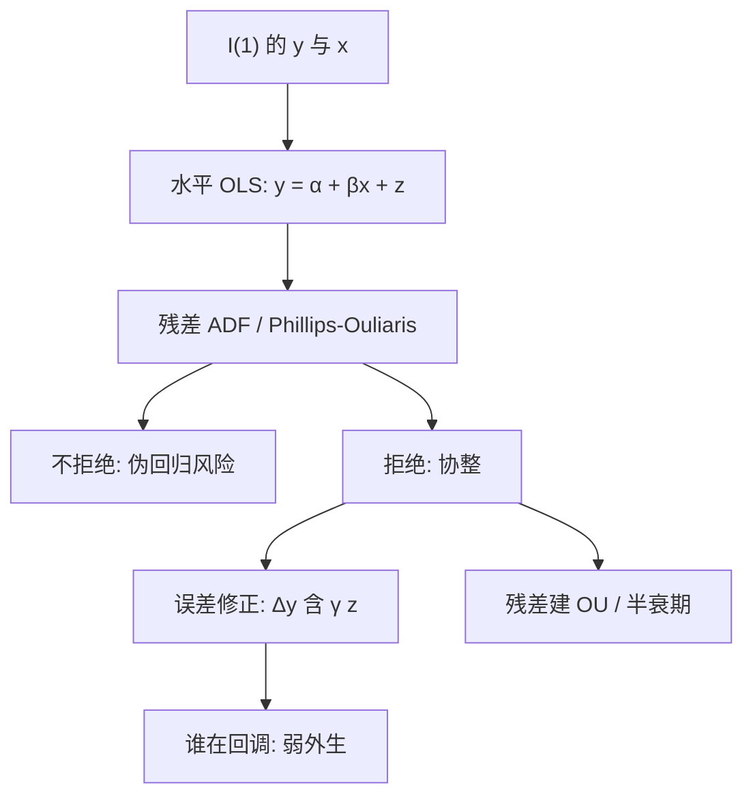

# Engle-Granger

两个单整序列可以各自乱跑，只要存在一个线性组合是平稳的；先用水平回归把这个组合估出来，再对残差做单位根检验，并在差分方程里把残差当作误差修正项。

<footer>—— Engle and Granger, Co-integration and Error Correction: Representation, Estimation, and Testing, Econometrica 1987</footer>

[上一课](/quant/jump-tests)把单路径的不连续钉完。缺口从「一只资产有没有跳」换成两只资产能不能用长期关系当价差。价差交易要的不是两只股票都平稳，而是它们的某个线性组合平稳：各自可以是随机游走，组合却有均值。Granger 把这种关系叫做协整；Engle 与 Granger 给出表示、两步估计与检验。残差进入误差修正模型（ECM），描述「偏离长期关系之后谁向谁拉」。统计套利里，对冲比往往就是这步水平回归的斜率，残差交给 [Ornstein–Uhlenbeck](/quant/ou-spread) 去谈半衰期。本篇写 Engle–Granger 作为协整的入门构造：它能识别什么、临界值为什么不是普通 ADF，以及为什么两资产之外要换 [Johansen](/quant/johansen)。

## 问题

设 $y_t$、$x_t$ 都是 $I(1)$：差分平稳，水平不平稳。若存在 $\beta$ 使 $z_t=y_t-\alpha-\beta x_t$ 为 $I(0)$，则二者协整，$(1,-\beta)$ 是协整向量。没有协整时，水平回归是伪回归：系数不收敛到有意义的量，残差仍是 $I(1)$，$R^2$ 可以很高。问题是区分「真的长期均衡」与「两道随机游走碰巧同向」。

经济上，$\beta$ 可以是对冲比、购买力平价里的系数、期现套利里的合约乘数。统计上，$\beta$ 在协整成立时超一致（速率快于平稳回归），但有限样本偏误可以很大，尤其是 $x$ 不是弱外生、或残差序列相关时。配对交易若把这段 OLS 当真理，样本外 $\beta$ 一漂，残差的平稳性一起坏。

### 误差修正表示

Granger 表示定理：协整系统等价于 ECM，

$$
\Delta y_t=\gamma z_{t-1}+\text{滞后差分}+\varepsilon_t,
$$

$z_{t-1}$ 是上一期均衡误差。$\gamma<0$ 表示 $y$ 向均衡回调。$x$ 的方程里可以有另一个载荷。谁的 $\gamma$ 显著，谁在长期关系里「被拉」；若只有 $y$ 调、$x$ 不调，$x$ 弱外生于长期系数。交易上这决定腿的选择：用更外生的那条当对冲工具，让残差主要来自被低估的那条。

协整不是相关。两只 $I(1)$ 可以高相关却不协整（共同随机趋势不够，或趋势权重对不上）；也可以相关一般但协整。用滚动相关去配对，与用 Engle–Granger 去配对，筛出来的名单可以几乎不相交。

## 方法

**两步。** 第一步在水平上 OLS：$y_t=\hat\alpha+\hat\beta x_t+\hat z_t$。第二步对 $\hat z_t$ 做增广 Dickey–Fuller（或不含常数的变体）。原假设是残差有单位根，即不协整。拒绝则承认协整。临界值比普通 ADF 更宽（更难拒绝），因为 $\beta$ 是估出来的：残差比已知 $\beta$ 时更像平稳。Engle–Granger 原表与 MacKinnon 的响应面给出随样本量和是否含趋势而变的临界值。不要用软件默认的 ADF 5% 去判残差。

残差若平稳，把 $\hat z_{t-1}$ 放进 $\Delta y_t$、$\Delta x_t$ 的回归，估载荷 $\gamma$，并加足够滞后使 $\varepsilon_t$ 近白噪声。这就是 ECM。滞后阶用信息准则，但配对交易常在残差上直接建 [OU](/quant/ou-spread)，等于把 ECM 的线性载荷改写成连续时间均值回复。

Phillips–Ouliaris 用残差的非参数单位根检验，对短期相关更稳健。动态 OLS（Stock–Watson）在第一步加 $x$ 的领先滞后差分，减轻内生偏误。这些是两步法的修补，不是另一套协整定义。

### 只有一个协整向量

两变量至多一个线性独立的协整关系（否则二者已是 $I(0)$）。Engle–Granger 必须指定左边的 $y$：用 $x$ 对 $y$ 回归，一般得到不同的 $\hat\beta$。大样本两条应互为倒数，有限样本不是。规范化（谁当被解释变量）是识别选择。多资产时，协整秩可以是 2、3，…，两步法不能同时估多个向量，应换 Johansen 的系统极大似然。

检验功效在 $\gamma$ 接近 0 时很弱：几乎不回调的协整，残差像单位根。半衰期极长的价差，Engle–Granger 会经常不拒绝，交易上也不该做——那是 [半衰期阈值](/quant/half-life-bands) 要挡掉的对象。

## 机制

$I(1)$ 序列由随机趋势主导。协整意味着随机趋势是共同的，权重恰好被 $(1,-\beta)$ 消掉，剩下的 $z_t$ 只有短期噪声。OLS 在这种「共同趋势」结构里不是去拟合循环，而是去对齐趋势的系数，所以超一致。单位根检验再问：对齐之后是否还剩趋势。ECM 把水平的长期约束翻译成差分方程里的纠错：偏离越大，下一期差分的期望越把价格往回拉。

伪回归的机制对称：没有共同趋势时，OLS 仍会找一个让样本内残差方差小的斜率，但残差带着单位根，样本外裂开。这就是为什么配对必须样本外验证残差是否仍平稳，而不能看样本内 $t$ 统计量。

对数价格对对数价格的 $\beta$ 是弹性，价格对价格的 $\beta$ 是股数比。混合使用会让残差量纲错误，OU 的 $\kappa$ 没有意义。期现、ETF 与净值，应先对齐乘数与费用，再跑 Engle–Granger。

### 结构断裂

协整向量可以在某日改变：合并、指数调整、会计制度。全样本 OLS 会折中出一条谁也不服务的 $\beta$，残差像单位根或像带漂移的平稳。Gregory–Hansen 一类允许均值或斜率断裂的残差检验。交易上更常做滚动 Engle–Granger：承认 $\beta$ 慢变，但这与「真正的常数协整」不是同一假设，也把多重检验引进筛选流程。

## 边界与工程取舍

两步把估计误差从 $\beta$ 带进残差检验，小样本偏自由。序列相关、异方差、跳跃使 ADF 的尺寸扭曲。若真实关系是非线性或门限协整，线性残差可以不平稳，并不证明没有均值回复。

不要对已经差分的序列做 Engle–Granger：差分后的回归不是协整回归。不要在十个候选配对上做二十次检验却仍用 5% 临界值。不要把 ECM 的 $R^2$ 当可交易边缘：可交易性取决于残差的波动是否覆盖买卖价差与冲击，见开平阈值。

与 Johansen 相比：二维、明确谁对谁回归、只要一个向量时，Engle–Granger 简单、透明，对冲比就是 $\hat\beta$。篮子、要检验秩、要约束 $\beta$ 时，用 Johansen。两者残差都可以再套 OU；协整检验通过不是 OU 参数稳定的保证。

Engle–Granger（1987）写的是表示与检验，不是一套完整的配对交易规则。Gatev、Goetzmann 与 Rouwenhorst 后来用距离法而不是协整做相对价值；协整路径的交易规则是后续工程，临界值表本身不告诉你开仓该几倍标准差。

## 小结

- 协整：各序列 $I(1)$，某线性组合 $I(0)$；Engle–Granger 用水平 OLS 加残差单位根检验来承认它。
- 残差检验的临界值严于普通 ADF；应用 MacKinnon 一类表，不能拿默认 ADF 当结论。
- 表示定理给出 ECM，载荷说明谁向均衡调整；对冲比通常取水平回归的 $\beta$。
- 两变量只有一个协整向量，且依赖左边变量的规范化；多资产换 Johansen。
- 通过检验不等于样本外仍平稳，也不等于扣除成本后可交易。
- 出处：Engle and Granger, *Econometrica*, 1987；临界值见 MacKinnon；残差检验变体见 Phillips and Ouliaris, 1990；相对价值的经验对照见 Gatev, Goetzmann, Rouwenhorst, *Review of Financial Studies*, 2006。
