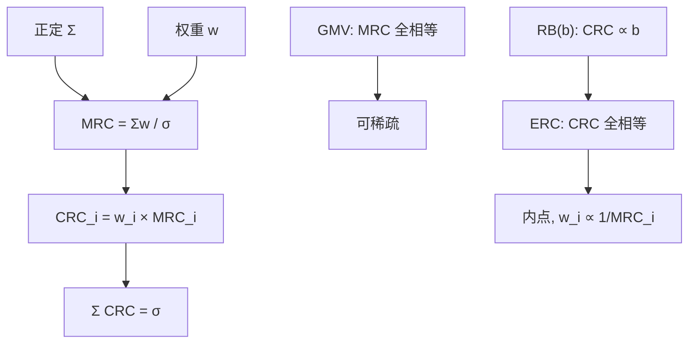

# ERC 与边际风险贡献

    
等风险贡献钉住的是权重乘边际风险，不是钉住边际本身；边际风险贡献给出「再加一单位名义」的价格，成分贡献给出「当前仓位已经买下的」那一块。

    <footer>—— 对照 Maillard, Roncalli and Teiletche, 2010，以及风险预算里欧拉分解的标准会计</footer>

[ERC](/quant/erc) 一文给出 $w\circ(\Sigma w)=\lambda\mathbf{1}$、存在唯一与对数障碍。[风险预算](/quant/risk-budgeting) 把预算向量 $b$ 放开。[成分 ES](/quant/component-es) 把同一欧拉逻辑写到尾巴上。本篇只写波动这个齐次度量上**边际风险贡献（MRC）与成分风险贡献（CRC）的差别**，以及 ERC 究竟平的是哪一个。混用「边际平价」和「贡献平价」会把最小方差当成 ERC：最小方差要求 MRC 相等，ERC 要求 $w_i\times\mathrm{MRC}_i$ 相等。它补的是会计恒等式，不是再解一遍方程组。

## 问题

组合波动 $\sigma(w)=\sqrt{w^\top\Sigma w}$ 一次正齐次。欧拉公式给出

$$
\sigma=\sum_i w_i\frac{\partial\sigma}{\partial w_i}=\sum_i \mathrm{CRC}_i,\qquad
\mathrm{MRC}_i=\frac{\partial\sigma}{\partial w_i}=\frac{(\Sigma w)_i}{\sigma},\qquad
\mathrm{CRC}_i=w_i\,\mathrm{MRC}_i=\frac{w_i(\Sigma w)_i}{\sigma}.
$$

CRC 可加、可报 100%。MRC 是影子价格：在 $i$ 上再加一单位权重，$\sigma$ 增加多少。投资人的语言经常把两者都叫做「风险贡献」。限额若按 MRC 设，管的是增量方向；业绩若按 CRC 切，管的是存量分解。ERC 的定义是 $\mathrm{CRC}_i=\sigma/N$（或预算 $b_i\sigma$），即存量平。把 MRC 钉成常数，一阶条件是 $\Sigma w\propto\mathbf{1}$，那是最小方差（在单纯形上），解可以稀疏，与 ERC 的内点解不是同一个问题。

问题是在报告、优化器和投委会材料里固定三个符号：MRC、CRC、名义权重，并写清 ERC 用的是 CRC。多空、杠杆、现金使 $\sigma(w)$ 的定义域与齐次性变得微妙：现金若进 $w$ 且视为零波动零相关，欧拉仍可写，但「$N$ 项」是否含现金要事先声明。用 $\sigma^2$ 的欧拉 $w_i(\Sigma w)_i$ 在正权重下与 CRC 只差共同因子 $\sigma$，等贡献约束相同；一旦允许负权重，CRC 可负，平 $1/N$ 没有「每项都出一份正波动」的直觉。

### 边际相等是 GMV，贡献相等是 ERC

最小方差：$\nabla\sigma\propto\mathbf{1}$，即所有可交易方向上 MRC 一样，不能通过微调降低波动。高 MRC 的资产在最优处权重必须低到把边际拉平，或被逼到零。ERC：高 MRC 的资产也可以有正权重，只要权重足够小，使乘积 CRC 等于同伴。这正是「贵的风险单位少买、便宜的多买」，直到每项买下的块一样大。逆波动 $w_i\propto 1/\sigma_i$ 忽略相关，MRC 并不相等也不使 CRC 精确相等，除非相关结构特殊。三者的夹逼关系见 ERC 主文；本篇只需记住一阶条件里出现的是 $w_i$ 还是单独的 $(\Sigma w)_i$。

对 $\sigma^2$ 做欧拉时常用 $RC_i=w_i(\Sigma w)_i$，和为 $w^\top\Sigma w$。报告若混用「占波动的百分比」与「占方差的百分比」，数字差一个 $\sigma$ 的归一化，但 ERC 的等号约束在正权重下不变。对外沟通应固定一种，并写明分母是 $\sigma$ 还是 $\sigma^2$。

## 方法

计算：有 $\Sigma$ 与 $w$ 则一次矩阵乘得到边际方差向量 $\Sigma w$，再除 $\sigma$ 得 MRC，再点乘 $w$ 得 CRC。数值上 $\sigma$ 接近零（对冲组合）时 MRC 爆炸，欧拉会计失去意义，应改用带基准的跟踪误差或对冲后残差波动，并声明齐次对象是谁。风险预算 RB($b$)：解 $w_i(\Sigma w)_i=\lambda b_i$，即 CRC 与 $b$ 成比例而不是与 $1/N$。ERC 是 $b=\mathbf{1}/N$。求解仍可用 CCD 或带对数障碍的二次规划；障碍对应「不许用零权重把 CRC 卸掉」，这是相对 GMV 的正则。

嵌套：先在资产类上做 CRC 平价（或按 $b$），再在类内对类的预算做一次 ERC。类的 MRC 用类代表组合的 $\partial\sigma/\partial x_{\mathrm{class}}$。名单依赖的根源正是 CRC 按叶子加总：拆成十个高度相关名字，十份 CRC 目标把预算吸进该块。嵌套把「一项」从叶子改成类，MRC 仍在叶子上可算，但约束层级变了。因子 ERC 对暴露 $x=B^\top w$ 做 CRC 平价，叶子 MRC 含特异项，须另加对角惩罚，否则优化器用特异噪声去凑因子贡献。

### 从 MRC 读再平衡

$\Sigma_t$ 变，MRC 重排，原权重下 CRC 偏离目标。再平衡卖出 CRC 超标的资产——通常是波动已升或相关已升、MRC 变贵的名字。这与波动目标同向，和动量冲突。带宽应用 CRC 偏离（例如偏离 $1/N$ 超过 20% 相对份额）而不是每次把 MRC 解到机器精度。样本外评价：实现 $\Sigma^{\mathrm{real}}$ 上的 CRC 是否大致平坦，而不是优化器打印的完美平。实现 CRC 永远不会精确 $1/N$，因为 $\Sigma$ 在变；看的是是否系统性把预算堆进某一行业。

多空账本：多头 CRC 之和与空头 CRC 之和可以分开钉预算（两套 $b$），或对 $|w_i|\mathrm{MRC}_i$ 做暴露预算。直接要求 CRC$_i=1/N$ 在有负项时可能无解或解在奇怪的角上。会计上应报多头贡献、空头贡献、以及交叉项是否被欧拉吸收——$\sigma$ 对多空组合仍齐次，欧拉仍成立，只是「平」的政策要重写。

## 机制

机制是**价格 × 数量**。MRC 是风险的边际价格，由相关结构决定：与现有组合高相关的资产更贵。CRC 是已经持有的支出。ERC 让每项支出相同，于是价格高的项数量小。相关块抬高块内所有名字的 MRC，块内总 CRC 若仍按叶子 $1/N$ 去凑，总支出会超过「一个风险源一份」的直觉——这是假分散。HRP 用树先把块当成一个数量单位，见 [联结与准对角化](/quant/hrp-linkage)；ERC 若不嵌套，就不会做这件事。

欧拉分配与博弈论里的 Aumann–Shapley 在齐次风险度量上重合，这是 CRC 作为资本切开方案的公理地位，见成分 ES 一文在尾巴上的对应。波动的 MRC 估计相对尾部边际稳定得多，但 $\Sigma$ 的估计误差仍会进入价格。未收缩样本协方差让噪声低波动的名字看起来 MRC 便宜，ERC 会超配它——「平贡献」精确地买了估计误差。先修 $\Sigma$，再谈 MRC 是否可信。

增量风险 $\sigma(w+e_i\varepsilon)-\sigma(w)$ 在 $\varepsilon$ 大时不等于 $\varepsilon\cdot\mathrm{MRC}_i$。限额若按「再加一笔大名义」，应用有限差分或整块增量，不要用一阶 MRC 外推到翻倍仓位。ERC 用的是当前点的一阶 CRC，对大额头寸的「去掉我」问题要另报增量。

### 与 CVaR、杠杆产品的翻译

CVaR / ES 同样齐次（正一阶）时可以定义 MRC 与 CRC，ERC 式平价变成尾部贡献平价，估计改成坏情景上的条件期望，噪声大一个量级，只适合 $N$ 很小的资产类。杠杆风险平价产品在资产类层做近似两资产 ERC：股票 MRC 高，所以股票名义权重低于 50%，再对整个组合加杠杆把 $\sigma$ 抬到目标。杠杆不是欧拉会计的一部分；融资成本与保证金占用应在评价里单列。把杠杆前后的夏普拿来论证「MRC 方法优于 60/40」，比较的是不同可行集。

## 边界与工程取舍

不要把 MRC 热图画成 ERC 已经成立：热图可以显示谁贵，平的是乘积。不要在跟踪误差、VaR、非齐次成本函数上套同一欧拉句子而不改公式。不要对 $N=300$ 的个股 ERC 解释「每只股票风险相同」——相同的是 CRC，不是 beta，也不是名字的经济风险源。报告对投委会同时给：名义权重、MRC、CRC 占比，三列才能看出是贵而少买还是便宜而多买。

$\Sigma$ 半正定时 $\sigma$ 在核方向上为 0，MRC 不定，应先因子化或加对角。现金与期货保证金使「权重和为 1」与风险暴露脱节，欧拉应对暴露向量做，而不是对账户净值权重做完再假装齐次。与 [成分 ES](/quant/component-es) 对照：同一套符号，对象从 $\sigma$ 换成 ES，坏日子里 MRC 会跳；波动 ERC 不能当尾巴平价已经完成。

Maillard–Roncalli–Teiletche 的唯一性是 CRC 等式在 $w\gt 0$ 上的唯一性，不是 MRC 向量唯一。许多 $w$ 可以有相近的 MRC 形态（近似等边），只有一个（在给定 $\Sigma$ 上）让 CRC 精确相等。

## 小结

- 波动的 MRC 是 $\partial\sigma/\partial w_i$，CRC 是 $w_i$ 乘 MRC；欧拉保证 CRC 可加等于 $\sigma$。
- ERC 平的是 CRC（存量），GMV 平的是 MRC（边际）；二者只在特殊 $\Sigma$ 上重合。
- 风险预算把 CRC 钉成 $b$；平坦个股 CRC 名单依赖，应嵌套或上因子。
- 再平衡按 CRC 偏离，并应用实现协方差评价是否真平，而不是优化器打印值。
- 多空与非齐次对象要改会计；尾部 ERC 换对象后估计更吵。
- 出处：Maillard, Roncalli & Teiletche, *JPM*, 2010；欧拉风险贡献见 Qian 与 Roncalli 的风险预算论述；资本分配对照 Tasche 的 Euler 原则。
