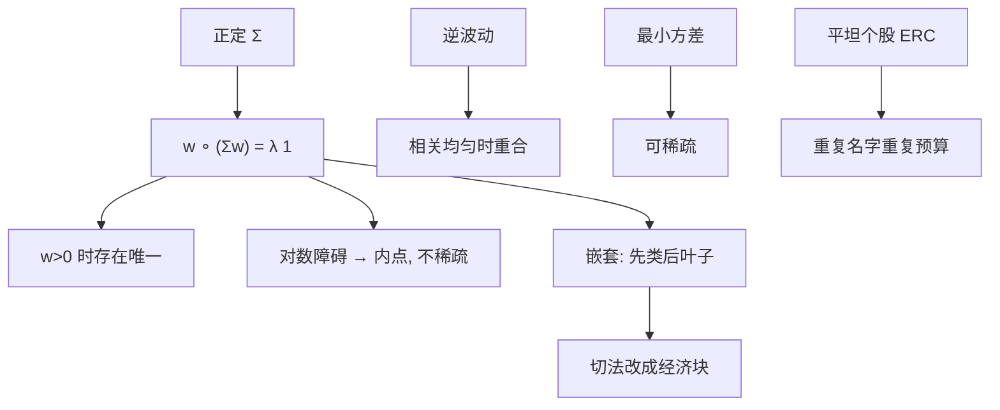

# 等风险贡献 ERC

    
让每一项资产对组合波动的欧拉贡献相等，得到的权重介于等权与最小方差之间；它是一个有唯一内点解的凸问题，而不是把名义 60/40 改名为「风险平价」。

    <footer>—— Maillard, Roncalli and Teiletche, The Properties of Equally Weighted Risk Contribution Portfolios, Journal of Portfolio Management, 2010</footer>

[风险平价](/quant/risk-parity) 一文写的是配置哲学与杠杆产品：[Markowitz](/quant/markowitz) 丢掉 $\mu$ 之后，用风险贡献代替名义权重去分散。本篇把其中的数学对象单独拿出来：等风险贡献（Equal Risk Contribution, ERC）。Maillard、Roncalli 与 Teiletche（2010）给出定义、与逆波动 / 最小方差的夹逼、以及与对数障碍的联系。Qian（2005, 2006）从可加的风险预算讲起，ERC 是预算向量 $b=\mathbf{1}/N$ 的特例。[风险预算](/quant/risk-budgeting) 把 $b$ 放开；[HRP](/quant/hrp) 把「平」改到树上。这里只把 $w\circ(\Sigma w)=\lambda\mathbf{1}$ 写清楚：存在唯一性、算法、嵌套、以及多空时会计如何破。

## 问题

给定正定 $\Sigma$ 与单纯形 $w>0,\mathbf{1}^\top w=1$，最小方差把质量堆到低波动、低相关的角上；等权忽略 $\Sigma$；逆波动 $w_i\propto 1/\sigma_i$ 忽略相关。ERC 要求

$$
w_i(\Sigma w)_i = w_j(\Sigma w)_j \qquad \forall i,j,
$$

即每项对 $\sigma^2(w)=w^\top\Sigma w$ 的欧拉贡献相同（对 $\sigma$ 的贡献在正权重下是同一组条件）。问题是：这个非线性方程组是否有唯一解、如何计算、相关结构如何改变相对逆波动的偏离，以及当资产列表把同一风险源切成许多名字时，等贡献会不会变成假分散。

「风险平价」在营销里常等于「股票与债券各出一半波动再加杠杆」。那是 $N=2$ 或资产类层的 ERC，外加一个模型外的融资决策。个股层 $N=300$ 的 ERC 是另一个组合：每只股票 $1/300$ 的贡献，高相关科技股会重复占预算。对象必须先声明是哪一张资产表上的等贡献，否则无法对照。

### 欧拉会计是前提

组合波动 $\sigma(w)$ 正齐次，欧拉公式 $\sigma=\sum_i w_i\partial\sigma/\partial w_i$ 让贡献可加、可报 $100\%$。若风险度量不是齐次的，或权重有现金项使映射仿射，「贡献之和等于总风险」失败，钉 $1/N$ 没有会计意义。CVaR 在正齐次的版本上可以定义 ERC 式贡献，但估计与优化都换成尾部对象，见 [CVaR 优化](/quant/cvar-opt)；2010 年这篇 JPM 的对象是波动。报告用 VaR、优化用 $\sigma$，平的是另一张账。

对 $\sigma^2$ 的贡献 $w_i(\Sigma w)_i$ 与对 $\sigma$ 的贡献只差一个共同因子 $\sigma$，正权重下等贡献约束相同。允许权重为负时，贡献可负，等贡献方程组可以没有正权重那套直觉解。多空要改成多头预算与空头预算分开，或对 $|w_i|$ 的暴露做预算。

## 方法

Maillard 等人证明：在 $w>0$、$\Sigma$ 正定下 ERC 存在且唯一，并且落在等权与最小方差的「之间」——用总波动与集中度刻画，不是逐分量不等式。相关全相等时，ERC 退回逆波动；波动全相等时，相关更低的资产拿更高权重。等价优化包括最小化贡献两两差的平方，以及带对数障碍的方差最小化

$$
\min_{w>0}\ \tfrac12 w^\top\Sigma w \quad\text{s.t.}\quad \sum_i \ln w_i \ge c,
$$

适当 $c$ 时 KKT 给出 $w\circ(\Sigma w)=\lambda\mathbf{1}$。对数项阻止权重坍到零，这是相对最小方差最关键的正则：GMV 可以稀疏，ERC 在内点不能。

数值。循环坐标（CCD）：固定其余，按该资产贡献相对 $1/N$ 的缺口缩放 $w_i$，再投影到单纯形；或牛顿法解 $f(w)=w\circ(\Sigma w)-\lambda\mathbf{1}$。$\Sigma$ 病态时牛顿的 Jacobian 差，应先收缩或因子化。嵌套 ERC：先在资产类之间做 ERC，再在类内做 ERC（或类内市值）。类的 $\Sigma$ 用类代表组合的协方差。嵌套改变的是「谁算一项」：$N$ 从个股变成类，重复计数被政策切掉。这与 HRP 的树不同：嵌套的切法是经济分类，HRP 的切法是样本聚类。

### 从特征组合看一阶条件

$(\Sigma w)_i$ 是资产 $i$ 的边际方差。ERC 要求权重与边际方差成反比：$w_i\propto 1/(\Sigma w)_i$。这是一种均衡：没有资产还能通过微调权重降低「贡献不平等」。最小方差要求 $\Sigma w\propto\mathbf{1}$，即边际方差全相等，权重大的资产必须是低边际风险的。两者只在特殊 $\Sigma$ 上重合。把 ERC 写成「带权最小方差」是对的（对数障碍），写成「最小方差的近似」是错的——目标不同，稀疏性不同。

实现上 $\Sigma$ 用 [EWMA](/quant/ewma-cov)、因子模型或收缩样本。ERC 对 $\Sigma$ 的估计误差敏感，只是不估 $\mu$。用未收缩样本协方差做个股 ERC，会精确地把噪声相关当成「重复」，把噪声低波动当成「便宜风险单位」。先修 $\Sigma$，再解等贡献，顺序与 Markowitz 相同，只是下游求解器换了。

## 机制

机制是压缩高波动、高相关资产的权重，直到其 $w_i(\Sigma w)_i$ 降到与其他资产相同。相关块内的多个名字会互相抬高边际风险，因而块内总权重被压低、块内部分摊——ERC 在块内是「摊薄」而不是像 MDP / 某些最小方差那样「选代表」。这是与 [HRP](/quant/hrp)、最大分散的行为差：同一科技簇，ERC 让每只都占 $1/N$，HRP 让整簇占一份再内部分；政策若认为「科技是一个风险源」，应嵌套或改 $b$，而不是在叶子上做平坦 ERC。

再平衡：$\Sigma_t$ 变，贡献偏离 $1/N$，规则会卖出波动已升的资产。这与波动目标同向，在动量市里持续卖赢家。交易频率应由 [换手惩罚](/quant/turnover-penalty) 或带宽约束，而不是每次把方程组解到机器精度。评价看样本外已实现贡献是否大致平坦、以及净成本后的波动，不看优化器打印的完美 $1/N$。

两资产解析解存在：权重是波动与相关的显式函数。债券波动低于股票时，ERC 的债券名义权重高于 50%。加杠杆把两类的绝对波动抬到政策目标，是产品层，不是方程组的一部分。把杠杆前后的夏普拿来论证「ERC 优于 60/40」，必须声明杠杆与融资成本，否则在比较两个不同的可行集。

### 嵌套、因子与名单依赖

平坦 ERC 的最大缺陷是名单依赖：把一只 ETF 拆成十只成分，预算从一份变成十份，组合向该风险源倾斜。解决是在因子或资产类上做 ERC，个股只承担特异风险上限。因子 ERC 用暴露 $x=B^\top w$，要求因子贡献相等，再在 $x$ 的仿射空间里对 $w$ 求二次最小或加特异方差惩罚。这时「一项」是价值、动量、利率，而不是代码。名单被替换成因子表，政治决策从选股名单挪到选因子名单——仍然有切法，只是切得更接近风险模型。

## 边界与工程取舍

不要在 $w\ge 0$ 失败的多空账本上硬套同一方程组。不要把 ERC 写成免估计：$\Sigma$ 仍在。不要用两年股票–债券相关给三倍杠杆产品做唯一依据。不要与 MDP、最小方差、HRP 互相改名；相关均匀时它们可以碰巧接近，块状相关时行为分叉。[行业/国家中性](/quant/industry-country-neutral) 与平坦个股 ERC 冲突：中性钉住块净暴露，ERC 却按叶子贡献要权——应先中性再在残差风险上预算，或直接在行业因子上 ERC。

存在唯一性在严格正权重、正定 $\Sigma$ 下成立。某资产波动极高或与其余相关近 1，最优 $w_i$ 可以非常小，数值上像零；应用带下界的求解并在下界触发时把该资产从集合删除再解，避免在零附近振荡。CVaR-ERC 把 $\Sigma$ 换成尾部欧拉，样本里少一次崩盘贡献就会跳，比波动 ERC 更要收缩窗口与情景。

Maillard–Roncalli–Teiletche 的贡献是把「风险平价」收成可证明的组合，而不是一个产品商标。内部模型应写 ERC 或 RB($b$)，并写 $\Sigma$ 的日期与资产表哈希，避免营销名进入风险报告。

## 小结

- ERC 要求 $w_i(\Sigma w)_i$ 全相等；Maillard、Roncalli 与 Teiletche（2010）证明正权重下存在唯一，并夹在等权与最小方差之间。
- 相关均匀时回到逆波动；对数障碍使解保持内点，这是与 GMV 稀疏性的本质差别。
- 平坦个股 ERC 名单依赖，应嵌套或在因子暴露上做等贡献。
- 多空使欧拉贡献可负，要分腿预算；$\Sigma$ 仍需收缩，平价不是免估计。
- 产品层的股票–债券平价加杠杆，是 $N$ 很小的 ERC 外加融资，不能与个股 ERC 混评。
- 出处：Maillard, Roncalli & Teiletche, *Journal of Portfolio Management*, 2010；风险贡献可加性见 Qian, 2005/2006；算法与预算推广见 Roncalli, *Introduction to Risk Parity and Budgeting*, 2013。
