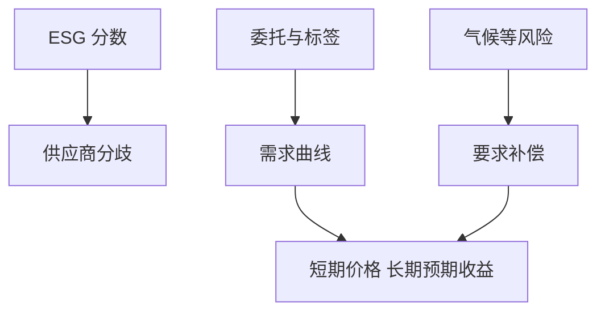

# ESG 因子争论

ESG 分数既可能是风险补偿、也可能是偏好导致的需求曲线，还可能只是数据供应商之间的噪声；三种机制要求三种完全不同的组合回应。

<footer>—— Pástor, Stambaugh and Taylor, Journal of Financial Economics, 2021；分数分歧见 Berg, Kölbel and Rigobon</footer>

[上一课](/quant/buyback-flows)把发行人买盘当成机械流。ESG 的缺口是**另一类非现金流转的需求**：委托、标签与基金章程把资本推向高分名字。金融栏有 ESG 理论，本课不重写伦理或福利。量化栏要决定：它是因子、是约束、还是数据。不要把绿色组合相对市场的超额再拿去跑一遍 [CAPM](/quant/capm) 当「发现」。

## 问题

Pástor–Stambaugh–Taylor 与 Pedersen–Fitzgibbons–Pomorski 给出均衡语言：若投资人偏好可持续资产，高 ESG 的预期收益可以更低（已付更高价格），气候风险暴露则要求补偿。实证上两股力量对谁占上风随样本变。Berg–Kölbel–Rigobon 记录评级商之间的「加总混乱」：同一公司在不同供应商处分差极大，于是「ESG 因子」不可复现。问题是产品层必须先选机制：当风险因子就该进 [基本面风险模型](/quant/fundamental-risk-model)；当偏好流就该当约束与拥挤；当噪声就不该进信号。

Hartzmark–Sussman 显示可持续标签引发资金流动。流可以制造短期超额，随后是更低的长期预期收益。这与被动纳入是同一类需求曲线，不是新的 HML。

### 分数不是会计

价值因子至少有账面、盈余等可复算投入。ESG 分数是供应商的黑盒加权。换商、换权重，多空组合几乎换一批名字。研究日志必须冻结供应商与版本，否则发表后的「失效」只是数据修订。

把排除清单（武器、煤炭）当成因子收益，会把行业赌注叫做 ESG alpha。应先行业中性，再看残差是否还值借券与跟踪误差。

## 方法

三种用法分开回测：风险暴露（气候、争议事件）、偏好约束（跟踪误差最小化加排除）、分数动量（流的代理）。对照：换评级商的稳健性；相对价值、质量、低波动的正交。容量：标签基金的申赎与指数纳入同步时，拥挤与 ESG 流合一。

## 机制

偏好移动需求曲线；风险补偿移动供给价格；测量误差增加残差。短期内流可以主导，长期内若偏好持续，高分资产的折现率可以更低。策略若两边都想赚，会自我矛盾。

## 边界

本课不评判可持续投资的规范价值。监管披露与漂绿是法律与产品问题，不是回测调参对象。金融栏理论课此处只链接。

## 小结

- ESG 要先选机制：风险、偏好流、或噪声，不能三者一起当 alpha。
- 评级分歧使因子不可复现，必须冻结数据版本。
- 标签流与纳入流同类，先中性行业与质量。
- 出处：Pástor, Stambaugh and Taylor, *JFE*, 2021；Pedersen, Fitzgibbons and Pomorski；Berg, Kölbel and Rigobon 对评级分歧。
