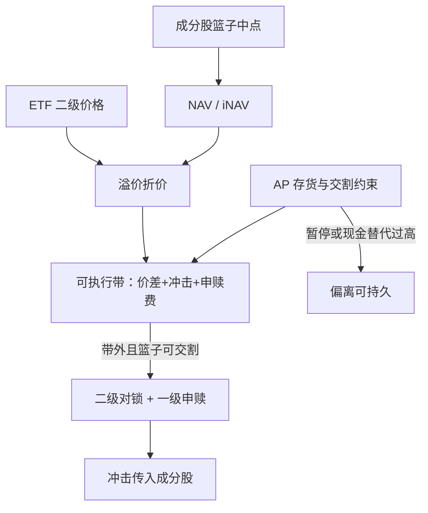

# ETF 与成分股

    
ETF 二级市场价格可以持续偏离净值；偏离的大小随资产类别、流动性与授权参与商（AP）的约束而变，并不能把每一分溢价都当成可锁的套利。

    <footer>—— Petajisto, Inefficiencies in the Pricing of Exchange-Traded Funds, Financial Analysts Journal, 2017</footer>

ETF 把一揽子证券包装成可在交易所连续交易的份额，并靠一级市场申赎把价格拉回净值（NAV）。Engle 与 Sarkar 较早测量溢价折价；Marshall、Nguyen 与 Visaltanachoti 提供日内可交易证据；Petajisto 系统比较不同类型 ETF 的偏离。Ben-David、Franzoni 与 Moussawi 则问反向问题：ETF 的二级市场交易是否把冲击传给成分股。套利在这里有两条腿——ETF 对 NAV、ETF 对期货或对相关 ETF——每一条都受 AP 资本、证券可交割性、日内 NAV 滞后与成分股停牌约束。没有这些机制，ETF 只是一只流动性更好或更差的封闭式基金。

## 问题

NAV 按成分股的最近价格计算，可以陈旧；ETF 成交价是即时的。于是「溢价」有一块是信息领先，有一块是需求冲击，有一块是计算口径（国际 ETF 的时区、债券 ETF 的矩阵定价）。套利者若用陈旧 NAV 去卖空溢价 ETF、买成分股，可能买在已经上涨的篮子上，锁住的是噪声。问题是如何定义可执行的公平价值：盘中 IOPV/iNAV、自建中点篮子、或对流动性差的成分用保守报价。

AP 不是无限弹性的管道。申赎需要交付指定篮子或现金替代，AP 有存货、融资与失败交割风险。Evans 等人讨论过 ETF 空头与失败交割；Pan 与 Zeng 一类工作强调流动性错配下 AP 会降低套利强度。二级市场看起来的偏离，一级市场可能无法成交。把 ETF 写成「永远贴着 NAV」，忽略了 AP 的期权式退出。

### 股票型、国际型与债券型不是同一套利

国内大盘股票 ETF 的篮子可借、成分股连续交易，偏离通常小，机会短、容量相对大，但竞争激烈。国际 ETF 的 NAV 用收盘汇率与外国收盘价，美股盘中价格反映的是期货与新闻，溢价可以整天存在而不被无风险地锁住——你无法在外国市场收盘后买到那些股票。债券 ETF 的成分没有连续可成交的中点，NAV 本身是模型价，折价在压力期可以很大，那是流动性折扣，不是免费的均值回归。Petajisto 把不同类型分开报告，正是为了阻止用股票 ETF 的紧盯去外推债券 ETF。

用收盘 NAV 与收盘 ETF 价算日频溢价，会把最后一笔 ETF 成交与篮子最后报价的时钟错位写成套利。日内研究应以同步时钟与可成交报价为准，见 Marshall–Nguyen–Visaltanachoti。

## 方法

一条可审计的日内流程。构造篮子中点（或保守的买一/卖一），加 ETF 有效价差与预估冲击，得到可执行公平价值带。仅当 ETF 买（卖）价相对带的下（上）沿仍有边缘时，才允许：买 ETF / 卖篮子，或反向，并同时向 AP 询价申赎。若申赎窗口已过或现金替代比例过高，只能做二级市场相对价值，收敛不再被一级市场保证。对国际产品，公平价值应改用当地期货或 ADR 代理，并承认隔夜缺口。

与[指数套利](/quant/index-arb)的对照：期货有到期结算，ETF 份额永续。收敛靠的是 AP 的申赎，而不是 $T$ 日的强制对齐。因此「持有到收敛」没有天然日历，时间止损必须外加。跟踪误差、抽样复制（对宽基或债券）、证券出借，都会让篮子与 NAV 的会计值与可买值不一致。

### 冲击从份额传到成分股

Ben-David 等认为，ETF 持股高的股票在 ETF 资金流冲击后波动更高：套利把二级市场需求翻译成成分股成交。这对统计套利有两层含义。第一，成分股的短端回归里有一块是 ETF 套利腿的库存逆转，不是个股特异信息。第二，当你自己在做成分股残差策略时，你可能与 ETF 套利者在同一方向抢流动性。Madhavan 对 2010 年闪电崩盘的讨论指出，ETF 停牌或定价失效时，套利管道会断，溢价折价跳开。

现金申赎比例高时，AP 买的是期货或代理，而不是你以为的那一揽子股票。此时「ETF–成分股」对锁会留下系统性跟踪误差，风险不是中性的。

## 机制

二级价格由 ETF 做市商的库存与订单流决定；一级价格由 NAV 与 AP 的边际成本决定。两者通过可申赎性耦合。耦合强时，溢价是短暂的做市库存；耦合弱时，ETF 像封闭式基金，折价可以持久。封闭式基金折价文献不能直接当 ETF 的期望回归：后者多了申赎期权，前者没有。

成分股停牌、涨跌停、公司行为使篮子不可复制，NAV 仍可能按规则更新（或暂停）。套利者在这些时点应把产品移出可交易集合，而不是加大阈值。证券出借使 ETF 的「持有」与「可交割」分离：你看到的权重是披露权重，AP 当日能拿到的证券取决于出借召回。失败交割与创设限制会让空头 ETF 的回补变得昂贵，溢价可以因借券而不是因 NAV 而存在。

### 容量与拥挤

大盘股票 ETF 的表面容量大，但边缘以基点计，真正约束是篮子里最差成分的深度以及 AP 的创建单位规模。小账户可以只做二级市场的 ETF–ETF 或 ETF–期货，不碰一揽子，但那是另一种基差，与成分股套利不是同一策略。拥挤时，人人按同一 iNAV 下单，ETF 自身的价差先走阔，信号在你成交前消失。债券与商品 ETF 的容量更受一级市场创设时间和底层 OTC 流动性约束，日频「折价回归」往往无法在不移动 NAV 的前提下执行。

## 边界与工程取舍

成本项：ETF 有效价差、篮子有效价差、创建/赎回费、现金替代惩罚、借券、以及部分成交。国际产品还有外汇对锁。不要用 NAV 的会计精度去暗示套利精度。监管与发行人可暂停申赎，收敛机制是或有的。

统计套利组合若用 ETF 当因子对冲，必须把 ETF 溢价当作额外残差来源，否则[PCA 统计套利](/quant/pca-stat-arb)的残差里会留下「ETF 需求冲击」。反向地，用成分股去套利 ETF 时，不要用收盘残差动量的月频逻辑去套日内溢价。频率、收敛机制、对手盘都不同。报告应分开：股票 ETF 国内产品的可执行命中率、国际产品的隔夜风险、债券产品的流动性折扣是否在压力期扩大而非回归。

Petajisto（2017）测量的是定价效率差异，不是一张可下单的策略表。把文中某类 ETF 的平均绝对溢价当成期望利润，忽略了不可锁的信息领先与执行失败。

## 小结

- ETF 套利依赖 AP 申赎把二级价格拉向可复制篮子；偏离含信息领先、需求冲击与口径陈旧，只有可执行带外的部分才值得评估。
- Petajisto 表明不同类型 ETF 的定价效率差很大；国际与债券产品不能用国内股票 ETF 的紧盯去外推。
- 日内证据见 Marshall–Nguyen–Visaltanachoti；冲击回传成分股见 Ben-David–Franzoni–Moussawi。
- AP 约束、停牌、现金替代与暂停申赎会使收敛变成或有事件，折价可以持久。
- 容量受最差成分深度与创建单位限制；会计 NAV 不是可成交价。
- 出处：Petajisto, *Financial Analysts Journal*, 2017；Engle and Sarkar, *Journal of Derivatives*, 2006；Marshall, Nguyen and Visaltanachoti, *Journal of Banking & Finance*, 2013；Ben-David, Franzoni and Moussawi, *Journal of Finance*, 2018。
