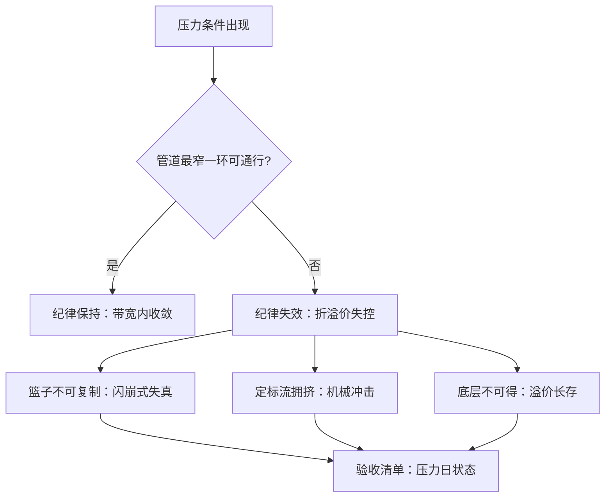

# ETF 工程案例与收束

三个市场的失败案例讲的是同一句话：价格纪律只在管道最宽的一环内有效，而管道的宽度由最窄的一环决定。

<footer>—— 案例机制据 Kirilenko, Kyle, Samadi and Tuzun, Journal of Finance, 2017 与 Cheng and Madhavan, Financial Analysts Journal, 2009 整理</footer>

[上一课](/quant/etf-portfolio-use)把 ETF 放进组合的实施流程。本课先看三个压力案例——机制在极端条件下如何失效，再按课程链条收束。本课是「ETF 与指数工程」的最后一课，前面的课默认申赎、误差、再平衡与载体选型都已读过；本课程到此收束。

## 问题

案例一，2010 年 5 月 6 日的闪崩。做市商避险撤单、部分成分停牌或报价失真，套利带宽的四壁同时加厚：篮子不再可复制、可比价，ETF 的成交价先于基本面失真，大量成交落在远离价值的价位上。事后统计里 ETF 占了当日的异常成交大头，见[2010 闪电崩盘](/quant/flash-crash-2010)。失效的不是申赎制度，而是它的前提——「篮子此刻可成交」。案例二，杠杆与反向 ETP 的每日再定标。规则要求每天收盘前把杠杆调回倍数，产生方向固定、时点公开的机械交易流；波动率高时这笔流自己推动市场，见[Vol ETP 每日再平衡流](/quant/vol-etp-rebalance-flow)。案例三，比特币现货 ETF 的溢价。币的托管与可得性约束使创建管道窄于股票 ETF，需求涌入时溢价长期存在，见[比特币现货 ETF 基差](/quant/btc-etf-basis)。

杠杆 ETP 的长期回报不等于杠杆乘指数回报：每日再定标在波动中产生路径损耗，$n$ 倍杠杆两日累计收益是 $\prod_t (1 + n r_t) - 1$ 而非 $n \sum_t r_t$。Cheng 与 Madhavan（2009）把这个复利项写成了标准分解——持有人把它当成「追踪失败」，其实是持有方式与产品设计的错配。

## 方法

三个案例用同一把尺读。先找管道：案例一的管道是可复制篮子，案例二的是收盘前定标的执行窗口，案例三的是创建单位的币源。再问谁被挤出：闪崩里是被强平与止损的单，ETP 里是与定标流对手的短线交易者，BTC ETF 里是买不到篮子的套利者。最后落到持有人：验收清单因此多出三行——压力日的申赎开放状态、再定标流的日历、底层资产的托管可得性。这三行在平静市场里全是一致通过，在压力日里才是真实的区别；把平静期的折溢价统计当风险证明，正是三个案例共同的起点。

## 机制

案例合起来给出本课程的收束命题。ETF 的一切价格纪律都由可执行性供给：指数规则决定需求，申赎管道决定供给弹性，带宽是两者的均衡价格。案例一的带宽被「篮子失真」撕开，案例二被「时点拥挤」顶穿，案例三被「底层不可得」长期垫高——同一机制的三种故障模式。因此ETF 工程不是产品说明书，而是一份前提清单：篮子可复制、申赎开放、结算可行、底层可得，每一项都要在压力状态下重验。机制透明是这套体系的优点也是它的代价：规则公开意味着需求可预测，可预测意味着拥挤与抢跑如影随形，这一点在[指数再平衡的效应](/quant/etf-rebalance-effects)里已经账面化。

## 小结

- 闪崩、杠杆 ETP 定标流、BTC ETF 溢价是同一机制的三种故障：管道最窄一环决定纪律边界。
- 案例一败在篮子可复制性，案例二败在定标时点拥挤，案例三败在底层可得性。
- 杠杆 ETP 的路径损耗是复利结构，不是追踪失败；长期持有前先读再定标条款。
- 验收清单要加压力日三行：申赎状态、定标日历、托管可得性。
- 课程链条收束：构建规则、申赎套利、误差分解、再平衡效应、因子产品化、衍生载体、组合应用，全部回到「可执行性供给价格纪律」这一句。
- 出处：Kirilenko, Kyle, Samadi and Tuzun, *Journal of Finance*, 2017；Cheng and Madhavan, *Financial Analysts Journal*, 2009；案例数据口径见[2010 闪电崩盘](/quant/flash-crash-2010)、[Vol ETP 每日再平衡流](/quant/vol-etp-rebalance-flow)与[比特币现货 ETF 基差](/quant/btc-etf-basis)。
