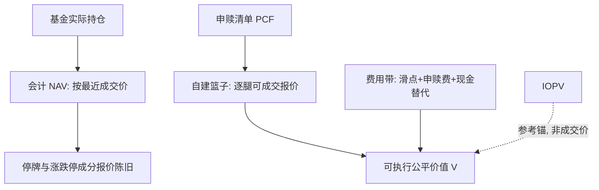
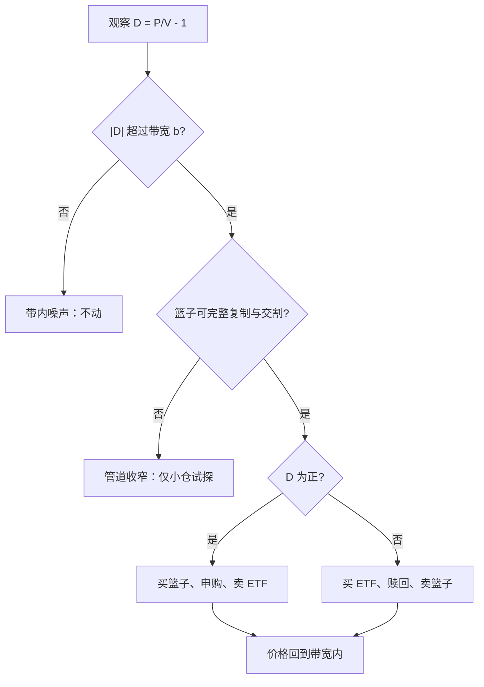

# 申赎与套利机制

ETF 的价格纪律不是交易所给的，而是那一篮子随时可以换进换出的股票给的：申赎管道开多宽，折溢价就只能走多远。

<footer>—— 据 ETF 发行人说明书与交易所申赎细则整理；证据见 Petajisto, Financial Analysts Journal, 2017</footer>

[上一课](/quant/etf-index-construction)把指数写成一份工程规格：样本、权重因子、缓冲带与日历。缺口是规格只有变成份额的供给，二级市场的价格才被钉住。本课写规则到份额的接口：申购赎回清单（PCF）、盘中参考净值（IOPV）、创建赎回与套利带。授权参与商的资产负债表与失败交割细节见[ETF 创建赎回套利](/quant/etf-create-redeem)，A 股申赎细则见[ETF 申赎与 IOPV](/quant/cn-etf-creation)，定价效率的证据见[ETF 与成分股](/quant/etf-arb)；本课程的角度是机制——申赎如何把指数规则翻译成供给弹性。后课都默认这条管道在。

## 问题

记折溢价 $D = P/V - 1$，$P$ 是二级市场价格，$V$ 是此刻可成交的篮子价值。缺口在于 $D$ 的分子好算、分母难算：会计 NAV 按最近成交价计，停牌与涨跌停的成分没有可买价；IOPV 实时但同样陈旧。可执行的公平价值只能是自建篮子：按 PCF 逐腿用可成交报价计价，再加费用带。于是问题变成：套利带的四壁各有多厚——篮子执行成本、申赎费用与最小单位、现金替代的不确定性、结算时滞。

数字实例：宽基股票 ETF 的四壁若是滑点 3bp、申赎费 1bp、现金替代折扣 2bp、隔夜资金 1bp，带宽约 7bp；跨境或债券产品同样的四壁可能是 30+10+20+10=70bp。同样看到「偏离 0.5%」，在前者是肥肉，在后者可能只是口径差。

PCF 是指数规则的衍生品：正常情况下按基金实际持仓给出（复制偏离使它不等于指数权重），停牌、外资受限的成分折成现金替代条目，事前收、事后退补。读不懂上一课的权重规则，就读不出哪些条目是例行、哪些是管道收窄的信号。

## 方法

套利动作是两腿的：溢价时买篮子、交信托、换份额、卖 ETF；折价时反向。触发条件是 $|D| \gt b$，带宽 $b$ 是四壁之和：篮子的滑点、申赎费、现金替代的保守折扣、资金占用与结算隔夜风险。$b$ 由最窄的一壁决定：成分流动性好的宽基股票 ETF，$b$ 可以小到几个基点；债券、跨境与小众产品，$b$ 宽一个数量级。IOPV 的角色是参考锚：它让带内的偏离可见，但用 IOPV 当 $V$ 去算套利，会在停牌与跨时区成分上把噪声当信号。

跨境 ETF 是带宽的极端样本：底层闭市时 $V$ 只能按隔夜收盘加汇率折算，日内的 $D$ 主要是口径而非错误定价；QDII 额度使申购随时可停，折溢价可以长期停在带外。用国内宽基 ETF 的紧盯去外推，会把口径差当套利空间。

## 机制

申赎把封闭式基金的固定份额变成有供给弹性的份额：带内的折溢价无人去收，因为它收不回成本；带外的偏离召唤 AP 开工，价格被拉回。纪律不在「套利者勤奋」，而在管道畅通——四壁中任何一壁加厚（停牌增多、现金替代比例上升、申赎暂停），带宽就变宽，纪律就变松。极端情形管道关死，ETF 退化成封闭式基金，折溢价不再收敛。

直觉类比：申赎管道像蓄水池的进出水管。带内折溢价是水面的小涟漪，没人管；带外偏离相当于水位超出水管口径，AP 立刻开闸把水位压回去。四壁加厚等于水管变细，水面波动更猛；管道焊死，ETF 就成了一口封死的缸（封闭式基金）。

这条机制把上一课与后课连起来：规则可预测，所以 PCF 的变化（现金替代条目增多）在生效前就预告申赎行为与被动需求；跟踪误差课要写的估值噪声，正是带宽内侧「看不见的交易」的痕迹。套利本身也有容量：AP 的资本、融资与交割额度是有限的，$D$ 持续偏大时先到者收走带外部分，后来者挤进带内——把历史偏离分布当成未来套利收益表，会高估可分到的份额。

## 边界

本课不写 AP 的做空渠道与失败交割细节，见[ETF 创建赎回套利](/quant/etf-create-redeem)；A 股单市场产品的回转安排与跨市场产品的 T+1 差异，见[ETF 申赎与 IOPV](/quant/cn-etf-creation)，它们改变的是结算壁的厚度。二级市场交易把冲击传回成分股的证据见[ETF 与成分股](/quant/etf-arb)。也不把套利带写成常数：它随市场状态、申赎开放状态与成分事件实时变化，任何回测都应把 $b$ 当状态变量而不是参数。

常见误区：把历史折溢价的分布当成未来的套利收益表。带外偏离会被先到的 AP 收走，你统计出的尾部早就是别人的利润；再把带宽设成常数回测，就双重高估了可执行机会。

## 小结

- 申赎管道把份额供给弹性化，折溢价被压在带宽 $b$ 内；$b$ 由篮子滑点、申赎费用、现金替代与结算四壁中最厚的一壁决定。
- 可执行的 $V$ 是自建篮子，不是会计 NAV；IOPV 是参考锚，跨时区与停牌成分上是口径而非价格。
- PCF 是指数规则的衍生品，现金替代条目是管道收窄的先行信号。
- 管道关死时 ETF 退化为封闭式基金；套利容量受 AP 资本与额度约束。
- 出处：Petajisto, *Financial Analysts Journal*, 2017；Marshall, Nguyen and Visaltanachoti, *Journal of Banking &amp; Finance*, 2013；机制口径据发行人说明书与沪深交易所申赎细则整理。
