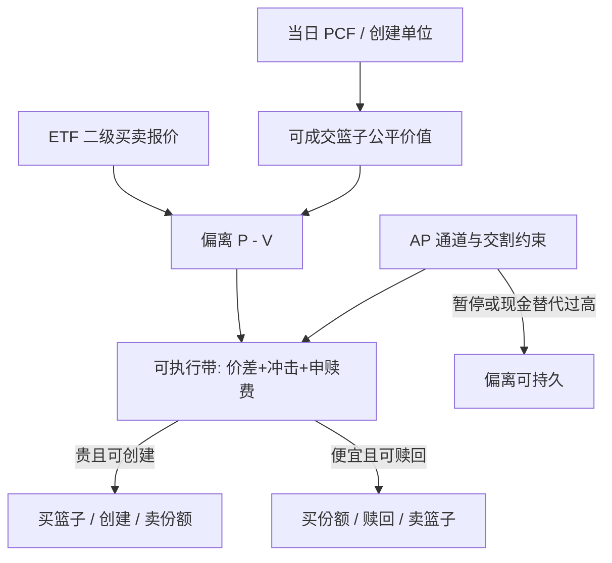

# ETF 创建赎回套利

授权参与商把一揽子证券交给信托、换出新份额，或把份额交回、换出篮子：一级市场的这一对期权，才是二级价格被钉在净值附近的机制。

<footer>—— 据 Petajisto, Financial Analysts Journal, 2017；创建赎回的制度描述见 ETF 发行人说明书与 DTCC/NSCC 实践</footer>

ETF 套利不是在图上把市价减净值。标准动作是：二级市场买便宜的那一侧，同时在一级市场创建或赎回一个创建单位（creation unit），把存货从份额变成篮子或反过来。Petajisto 测量的定价效率，前提正是这条管道开着；管道的微观结构——谁有权创建、交割是实物还是现金、单位有多大、结算要几天——决定偏离能被锁住多少。[ETF 与成分股](/quant/etf-arb) 写溢价的经济学与冲击回传；[A 股申赎与 IOPV](/quant/cn-etf-creation) 写沪深清单与现金替代。本篇写**创建赎回作为一笔可审计的多腿交易**：什么时候它是期现的近亲，什么时候它退化成单向的相对价值。

## 问题

二级价格 $P$ 相对公平价值 $V$（自建可成交篮子，而不是会计 NAV）出现偏离。创建方向：若 $P>V$ 且实物申购开放，授权参与商（AP）买入篮子、向信托交付、换出新份额并在二级卖出。赎回方向相反：买份额、交回信托、领出篮子并卖出。利润在成交价上锁住，不在 NAV 小数位上锁住。问题是 $V$ 必须是此刻可买可卖的篮子，创建单位通常是两万五千到十万份量级，且 AP 与普通投资者的准入不同。

实物交割把信托变成一个开放的仓库：份额供给有弹性。现金创建把仓库变成「基金经理代你买卖」：你锁住的是对执行质量的暴露，跟踪误差可以是系统性的。Evans 等人讨论过 AP 以失败交割的方式实质做空 ETF，管道在压力期会主动关小。把 ETF 写成「永续期货、随时收敛」，忽略了创建是或有期权。

### 创建单位、PCF 与结算日历

每日投资组合文件（PCF / portfolio composition file）给出当日创建赎回所要求的证券清单、现金差额与禁止替代项。清单在开盘前冻结，盘中权重漂移不会重算。AP 必须按清单备券或申请现金替代。结算跟随证券的周期（美股现为 T+1），份额与篮子不是瞬时互换：中间隔着信托确认与清算所。用 IOPV 的十五秒跳动去暗示你可以十五秒完成一级腿，是把行情时钟当成了交割时钟。

做市商可以不是 AP。许多人在二级提供买卖报价，一级腿外包给有参与协议的券商。回测若假设任何账户都能以创建单位成交，会把零售规模的折溢价当成机构利润。

## 方法

盘前读取当日 PCF、创建单位、现金差额估计、费用。盘中用买卖一档（或可成交量加权）重估篮子，加上 ETF 有效价差、两边冲击、创建/赎回费与预估现金差额误差，得到可执行带。仅当 $P$ 相对带的上沿仍贵（或相对下沿仍便宜），且一级窗口、借券与清单可交割时，才允许对锁并提交创建或赎回。若现金替代比例过高、成分停牌、或发行人已暂停申赎，则降级为二级相对价值，收敛不再被一级保证。

与[期现套利](/quant/cash-and-carry)对照：期货有到期与交割结算，ETF 份额永续，收敛靠 AP 行使创建赎回期权。因此没有天然的「持有到到期」日历，必须外加时间止损与库存限额。与[指数套利](/quant/index-arb)对照：期货腿是单一合约，ETF 腿是份额加一揽子，最差成分的深度决定容量。国际产品还要叠时区：外国成分已收盘时，美股盘中的 $V$ 是期货与汇率的代理，一级交割要等到外国开市，隔夜缺口留在账上。

### 现金替代与失败交割

现金替代把部分成分变成事后结算。替代金额按规则冻结，退补按基金经理实际成交。套利者若把 IOPV 里的中点当成已锁价格，等于卖出了一份执行质量的期权。失败交割（fail）曾被用作延后交付篮子的手段：空头 ETF 的回补可以比账面便宜，也可以在压力期突然变贵。工程上应把「一级腿已确认」与「一级腿仅口头可做」分成两个状态；只有前者能把溢价从风险账上抹掉。

A 股的跨市场现金替代、最小申赎单位与当日回转规则，使同一套创建赎回在单市场产品与沪深 300 产品上不是同一策略，细节见 IOPV 一文。本篇只强调：任何市场的一级腿都有自己的单位、日历与替代规则，不能用美股实物创建的直觉去填 A 股或债券 ETF。

会计 NAV 按收盘价与基金会计规则出，常在盘后才定稿。用盘后 NAV 去评估盘中创建的「真实利润」，会把成分股收盘跳写成你的 alpha 或亏损。应以提交时的可成交篮子计价。

## 机制

二级价格由做市库存与订单流决定；一级价格由篮子交割成本决定。创建赎回把份额供给变成弹性：溢价吸引创建增加供给，折价吸引赎回减少供给。Ben-David、Franzoni 与 Moussawi 指出，这条弹性会把 ETF 的二级冲击翻译成成分股成交。因此创建赎回不仅是 ETF 自己的定价机制，也是成分股短端流动性的一条需求来源。你在做成分股残差时，可能与 AP 的篮子腿对敲。

弹性不是无限的。AP 有资本、存货与风险管理限额；成分不可借、停牌、或发行人设下创建上限时，期权被拿走，ETF 暂时接近封闭式基金。Madhavan 对定价失效时段的讨论说明：管道一断，折溢价可以跳开。债券与商品 ETF 的篮子本身没有连续中点，一级往往是现金，机制更接近「申赎期权加模型净值」，回归不必发生。

### 拥挤与信号消失

宽基股票 ETF 的带外偏离往往只有几个基点，而且人人盯同一 iNAV。结果是：二级价差先走阔，你的市价单先把信号打没，一级还没来得及创建。真正能锁住的，常常是管道暂时变窄的时刻——停牌、再平衡日清单切换、外汇日历错位——那些时刻风险也不是中性的。容量报告应以创建单位的整数倍、最差成分深度、以及 AP 通道的日内限额来写，而不是以 ETF 的日均成交额来写。

## 边界与工程取舍

成本项：ETF 价差、篮子价差、创建赎回费、现金替代退补、借券、部分成交、外汇对锁。发行人可暂停申赎；清算所与托管行可延后确认。不要用 NAV 的会计精度暗示执行精度。不要在清单切换日用旧篮子对新 IOPV。统计套利若用 ETF 当对冲，应把未闭合的折溢价当作额外残差，否则 [PCA 统计套利](/quant/pca-stat-arb) 会把 AP 的库存逆转当成特异 alpha。

回测必须用当时的 PCF，而不是事后成分权重。创建赎回是事件：应以提交与确认为事件时间记账，而不是把每日折溢价当成独立标签。若在许多产品与阈值上搜索，评估应走 [purge](/quant/purge-embargo) 与 [CPCV](/quant/cpcv-lopez)，因为重叠持有的折溢价标签高度序列相关。

把 Petajisto 文中某类 ETF 的平均绝对溢价当成期望利润，忽略了不可锁的信息领先与一级失败。平均偏离是定价效率的描述统计，不是创建赎回策略的期望 PnL。

## 小结

- 创建赎回是一级市场的供给期权：AP 用篮子换份额或反向，把二级价格钉向可复制公平价值。
- 可执行对象是自建篮子加费用带，不是会计 NAV；创建单位、PCF 与结算日历是一等约束。
- 现金替代与失败交割把「无风险」锁成对执行与交割的暴露；暂停申赎则使 ETF 接近封闭式基金。
- 冲击会回传到成分股；容量由最差成分与通道限额决定，不是由 ETF 成交额决定。
- 出处：Petajisto, *FAJ*, 2017；Ben-David, Franzoni and Moussawi, *JF*, 2018；Marshall, Nguyen and Visaltanachoti, *JBF*, 2013；发行人说明书与 DTCC/NSCC 创建赎回实践；A 股对照 [ETF 申赎与 IOPV](/quant/cn-etf-creation)。
