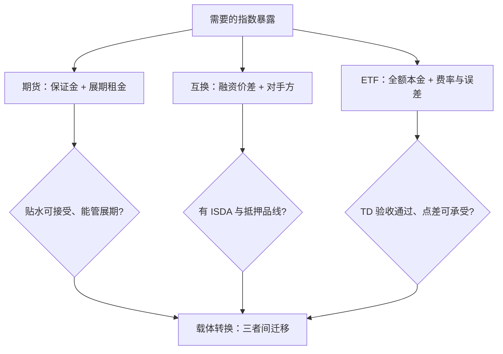
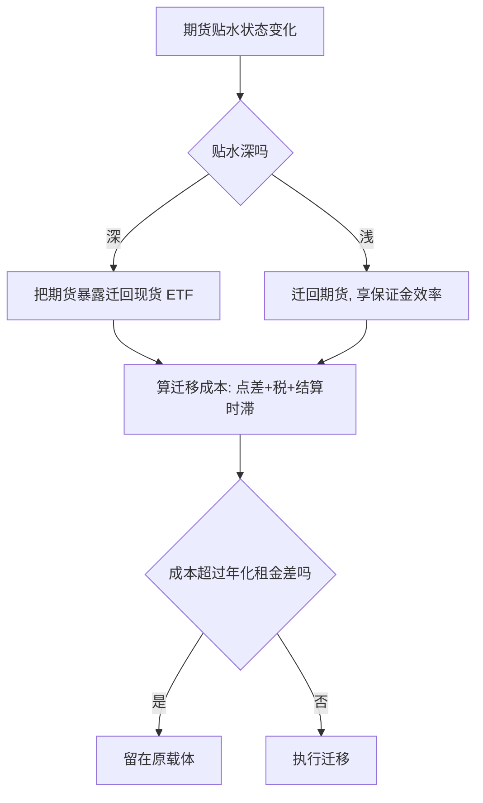

# 指数衍生品

同一份指数暴露，期货用保证金记、互换用融资价差记、ETF 用全额本金记；载体的区别不在风险，在成本放哪一栏、约束长什么样子。

<footer>—— 持有成本定价见 Cornell and French, 1983；Modest and Sundaresan, Journal of Financial Economics, 1983；合约规格据 CME、CBOE 与中金所规则整理</footer>

[上一课](/quant/etf-smart-beta)把因子写成了产品，但暴露的载体不止现货份额一种。指数期货、总收益互换与 ETF 是同一个标的的三种记账方式。缺口是选型：持有期多长、资金占多少、空头与杠杆怎么做、对手方风险谁担。基差的定价基础——持有成本与期现套利——已在[即期、远期与折现](/quant/spot-forward-df)立起；A 股期货贴水的对冲成本核算见[股指期货基差与对冲成本](/quant/cn-index-basis-hedge-cost)与[股指期货保证金与贴水](/quant/cn-index-fut-basis)。本课写三张载体的对照表与转换机制。

## 问题

三种载体各付一种成本。期货：占少量保证金，但要管展期，贴水是对冲者每年确定要付的租金，且有空头便利与杠杆。互换：按「指数收益减融资价差」交换，无展期，但要管对手方与 ISDA 文档、支付抵押品保证金。ETF：全额本金、无对手方（基金结构隔离），但付费率、承担跟踪误差，进出有点差与折溢价。同一个指数，三条路径的总成本可以差出几十个基点，且随利率环境与贴水结构移动。只比费率选载体，等于把展期租金和抵押品占用当成免费。

术语翻译：「贴水」就是期货价格比指数现货便宜的那一块，年化看是多头每年固定付出的租金——做空指数的人（对冲与替代需求）愿意折价卖，多头买便宜合约、到期按更高的现货价交割，差价就是成本。

指数期权与 ETF 期权的差别常被当成细节：股指期权现金交割、按开盘价（或专门结算价）定损益，仓位大时不需要在到期日卖出一篮子股票；ETF 期权实物交割、行权即交股票，流动性与保证金结构也不同。对冲同一名义暴露，两张合约的展期日历与隐含波动率曲面并不重合，见[ETF 期权市场](/quant/cn-etf-options)。

## 方法

选型写成四问。持有多长：期货按展期次数计成本，越长越要跟贴水结构谈判；互换适合一年以上、议价能力强的机构。资金与杠杆：期货的保证金效率换来现金流管理义务；ETF 全额占用但免盯市。空头来向：做空指数暴露，期货与互换天然，ETF 要融券或反向产品。对手方与文档：互换把信用风险换成融资价差，清算中央化程度决定保证金模型。四问答完，载体基本自选；剩下的差异是税、会计与偿付能力资本的处理。

数字实例：同样持有 1000 万指数暴露一年——ETF 全额占用 1000 万、付 15bp 费率；期货只占约 12% 保证金即 120 万，但若年化贴水 40bp，租金 4 万；互换按融资价差 20bp 记账。三条路径总成本能差几十个基点，且随利率与贴水移动。

## 机制

三条价格被一条套利链钉住：期货偏离持有成本、ETF 偏离可复制篮子、互换价差偏离融资成本，任一缺口过大都会召唤资本搬平——机制与[第二课](/quant/etf-create-redeem-arb)的申赎套利同构，只是腿换成了期货与抵押品。贴水不是偏差而是价格：空头需求（对冲与替代）压低期货价格，滚动展期的损失就是多头付给空头的租金，[股指期货基差与对冲成本](/quant/cn-index-basis-hedge-cost)把它算成了年化数字。载体转换因此是机构的标准动作：贴水深时把期货暴露迁回现货 ETF，贴水浅时反向；迁移成本（点差、税、结算时滞）决定阈值，不决定方向。

## 边界

展期执行的专门技术——移仓节奏、价差单、到期日历——属于期货课程的执行专题，本课只把贴水记为成本项。期权的波动率面与波动率衍生品（VIX、方差互换）是波动率课程的对象；本课只指出指数期权与 ETF 期权的合约差异会影响对冲的展期日历，见[ETF 期权市场](/quant/cn-etf-options)。也不把三载体写成可完全替代：清算资质、跨境限制与合规口径会把某一条路径直接关掉，选型表的第一列永远是「可行」，第二列才是「便宜」。

常见误区：只比管理费选载体。ETF 表面 15bp 费率可能比期货 40bp 贴水便宜，但全额占用 1000 万现金的机会成本与再投资约束没算进去；反过来，期货的保证金效率在急跌追保时可能变成强平风险。先问可行，再算全成本。

## 小结

- 期货、互换、ETF 是同一暴露的三种记账：保证金加展期租金、融资价差加对手方、全额本金加费率与误差。
- 贴水是对冲的年化租金，不是市场失效；选载体先问可行再问便宜。
- 三条价格被套利链钉住，载体转换的阈值由迁移成本决定。
- 指数期权现金交割、ETF 期权实物交割，展期日历与波动率面不重合。
- 出处：Cornell and French（1983）；Modest and Sundaresan, *Journal of Financial Economics*, 1983；合约规格据 CME、CBOE 与中金所规则；A 股贴水核算见[股指期货基差与对冲成本](/quant/cn-index-basis-hedge-cost)。
