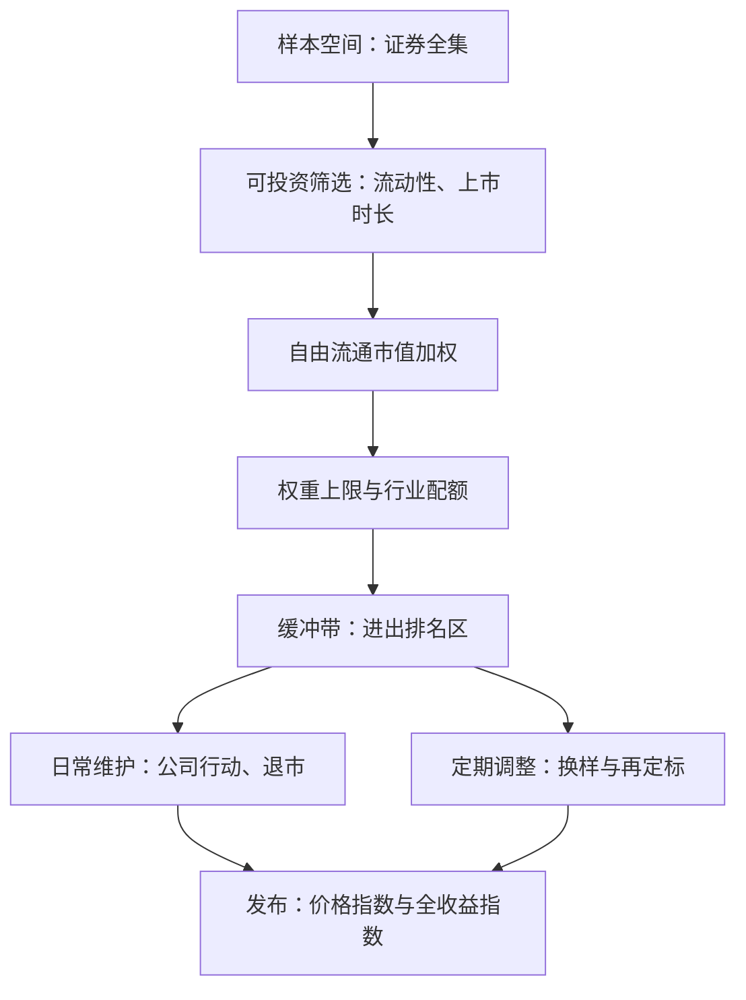
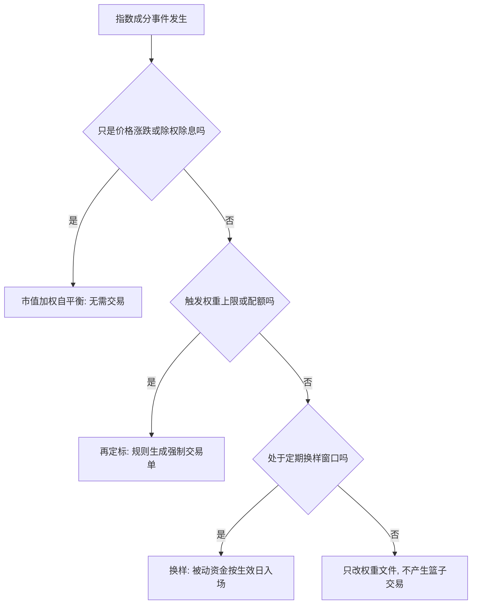

# 指数的构建规则

指数不是市场的照片，而是一份预先公开的配方：样本、权重、上限与日历都写在生效之前；被动资金的每一笔交易，都是这份配方的影子。

<footer>—— 据 S&amp;P Dow Jones Indices 指数方法论与中证指数公司编制规则整理</footer>

[上一课](/quant/bm2-map)把指数调仓套利写成对公开规则的交易：宣布日与生效日之间可预测的被动需求。它留下了本课程的缺口：被交易的那个「规则」本身还没有被拆开——权重从哪来、缓冲带怎么留、分红进不进指数、日历怎么排，这些决定被动需求的形状与规模。本课是「ETF 与指数工程」的第一课，把指数当成一份可执行的工程规格来读；后课默认已经读完本课。

## 问题

一个指数由三层东西构成：样本空间、加权规则、维护日历，每条规则事后留下可审计的痕迹、事前留下可预测的交易。把指数当成「收盘市值排个序」，至少在四处出错：自由流通调整让权重不等于总市值；外资持股上限把受限成分权重机械压低；个股权重上限与行业配额截断大市值成分；价格指数与全收益指数的分红处理让「基准」一年差出两到三个百分点。规则的自由度同样重要：名单事前不完全可知时，「当时可知的门槛与概率」就要打折扣，抢跑窗口随之变窄。

数字实例：某巨无霸占自由流通市值 12%，而规则上限是 8%——超出的 4 个百分点按比例摊给其他成分。从这一刻起，编制文件里的权重与你自己按市值算的对不上；这就是复制必须拿官方权重文件、不能自己重算的原因。

缓冲带（buffer rule）是换手工程的核心：例如「进入前 90 名者保留、跌出 120 名以外者剔除」，中间 30 名的排名噪声不再触发换样。据主要指数公司方法论，这能把定期调整的换手削减约三到五成，代价是响应变慢。

## 方法

写规则先写权重公式。自由流通市值加权是 $w_i = p_i f_i s_i / \sum_j p_j f_j s_j$，其中 $p_i$ 是价格、$f_i$ 是自由流通比例、$s_i$ 是权重因子——外资上限、权重上限、分档加权都折进 $s_i$。复制权重要拿编制机构发布的权重文件，不要用总市值重算：$s_i$ 不等于一时，受限成分的权重会系统性偏大。上限规则写成再定标：超限成分压回 $\bar{w}$，超额按比例摊给未触限成分。

术语翻译：「自由流通市值」是「能在市场上自由买卖的那部分股份」的市值，剔除国资、战略持股、交叉持股等锁定筹码。用总市值加权，等于把根本不流通的大股东也算进指数影响力，所以指数公司统一改用自由流通口径。

筛选层写可投资性：上市时长、流动性门槛、风险警示剔除、全球指数的可投资国家分类。日历层分两条线：定期调整（宽基半年或一季一次，因子指数更频）负责换样与再定标；日常维护负责公司行动、退市与停牌，只改权重文件不产生篮子交易——市值加权在分红送股上自平衡。最后钉住口径：ETF 业绩对比的对象应是全收益指数，用价格指数当基准会高估跟踪误差。

## 机制

规则决定工程属性的第一条通道是自平衡：纯市值加权下，价格变动与多数公司行动不需要任何人交易，这是它成为被动默认选择的原因；一旦引入上限、配额或非市值加权，「再定标」就变成规则直接生成的交易单，第四课的再平衡效应由此而来。第二条通道是缓冲带：把「排名噪声」与换手解耦，换来低换手与高滞后。第三条通道是裁量权：委员会可以在规则外做例外处理，透明度与被动需求的可预测性一起下降。

复制决策（全复制、抽样、优化）是基金层而不是指数层的规则，留给后面两课；本课只钉住：指数文件是基金持仓的母本，PCF 与持仓偏离都要对着它审计。

## 边界

本课不写申赎与套利（下一课），不推再平衡的执行与冲击（上一课与第四课），也不把编制规则当成估值观点。历史研究必须用当时的规则与当时的成分重建权重：用今天的权重回填过去，就是[指数调入调出](/quant/index-rebalance)警告的指数版幸存者偏差；成分与规则变更史见[指数成分历史](/quant/index-constituents-history)，规则版本在某天生效，回测里当成恒定参数同样引入前视。

直觉类比：用今天的成分名单回测过去，像用今天的毕业名单去评价当年的招生水平——当年落选的公司里可能藏着后来的巨头，把它们从历史里「提前毕业」，指数的历史收益就会好看得不像话。

## 小结

- 指数是样本空间、加权规则与维护日历三层的工程规格；权重按 $w_i = p_i f_i s_i / \sum_j p_j f_j s_j$ 给出，不得用总市值重算。
- 上限与配额把再定标变成强制交易单；缓冲带用滞后换低换手；裁量权降低可预测性。
- 市值加权自平衡，是被动基准的默认；偏离它的每一步都要付换手。
- 出处：据 S&amp;P Dow Jones Indices《Index Methodology》与中证指数公司编制规则整理；纳入效应的经验见 Shleifer, *Journal of Finance*, 1986。
