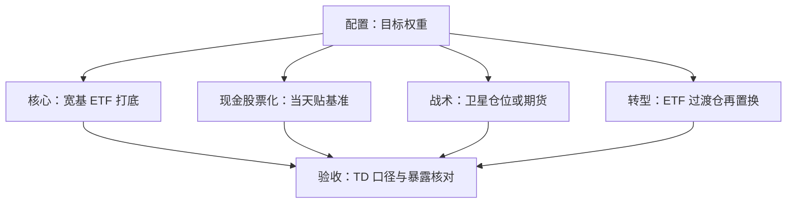
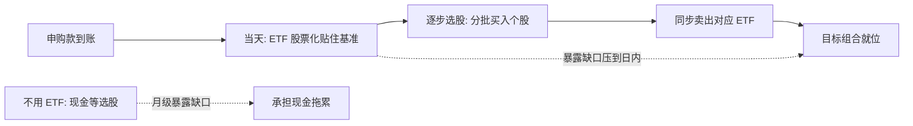

# 组合中的 ETF 应用

配置委员会产出的是权重，持有人拿到的是成交；两者之间隔着工具选择、执行与日复一日的现金流管理，ETF 是这条缝里最快的针脚。

<footer>—— 动态策略与组合维护的框架见 Perold and Sharpe, Financial Analysts Journal, 1988；实施细节据机构转型管理实务整理</footer>

[上一课](/quant/etf-derivatives)给出暴露载体的选型表。缺口在组合层：从「目标权重」到「实际持仓」，中间有工具选择、执行、现金流与维护四道工序。组合层面的再平衡纪律见[再平衡策略学](/quant/pf-rebalancing)，税务约束见[税负敏感的组合](/quant/pf-tax-aware)；本课写 ETF 在这四道工序里的位置——它改变的不是配置结论，而是实施的时间轴。

## 问题

配置的产出是权重向量，实施的问题是四个。核心暴露怎么持有：全主动则费用高、暴露漂移，全被动则放弃超额。现金怎么处理：申购款、分红、卖出主动头寸的过渡期现金，在牛市里是负 alpha——[上一课](/quant/etf-tracking-error)的现金拖累项在组合层被放大成产品层问题。临时观点怎么表达：直接调核心仓位则换手与税负巨大。转型怎么落地：从主动经理迁往新配置，空仓期与集中成交都是成本。四个问题的共同背景是：实施的每一步都要求「先有暴露、再谈优化」。

术语翻译：「现金拖累」就是「钱躺在账上没买股票」的代价——牛市里现金涨 0 而基准在涨，差额每天从相对收益里扣。一笔 1000 万的申购款晚投资一个月、期间基准涨 3%，就白丢约 30 万。

ETF 的二级成交额不是容量：大单的对手盘在一级申赎与成分股市场，机构建仓按「点差 + 折溢价 + 篮子滑点」合计询价——这正是[第二课](/quant/etf-create-redeem-arb)带宽的镜像。按屏幕成交量估算可建仓规模，会把十亿级的订单错判成不可执行。

## 方法

四类应用对应四个问题。核心持有：宽基 ETF 做打底，验收用 TD 口径，多只叠加时核对因子与行业重复暴露。现金股票化：新现金用宽基 ETF 或股指期货当天贴住基准，主动选股在其上逐步展开，把「未投资现金」从月级压到日内。战术叠加：观点用卫星仓位或期货表达，核心不动，换手与税负被隔离在外。转型管理：用 ETF 先建目标暴露，再按日历与税损节奏换成目标经理；ETF 在这里当「过渡仓」，其点差与折溢价成本要计入转型预算。

数字实例：2 亿申购款，用宽基 ETF 当天股票化，付约 3–5bp 点差加微幅折溢价，合计 6–10 万；若等主动选股一个月、期间基准涨 2%，现金拖累约 400 万，是点差成本的几十倍。先贴基准、再慢慢挑，是机构的标准顺序。

## 机制

ETF 改变的是时间轴。暴露可以日内建立与拆除，于是再平衡从「季度事件」变成「随时可做的成本核算题」——做不做由[再平衡策略学](/quant/pf-rebalancing)的带宽逻辑决定，能不能做由工具决定；现金流管理同理，股票化把现金拖累从被动接受变成主动选择。时间的压缩也改变了主动与被动的分工：核心暴露越便宜、越可及时，主动预算越能集中在真正有观点的地方。反面同样成立：叠加的每只 ETF 都自带费率、误差与点差，五只产品的「分散」可能是三个因子的重复付费——暴露核对是应用层的必修，不是选型后的附带动作。

## 边界

本课不重写组合优化与风险预算，[Markowitz](/quant/markowitz) 与暴露约束的通用框架见[因子暴露的管理](/quant/fz-exposure-management)；税务敏感与亏损收割的细节属[税负敏感的组合](/quant/pf-tax-aware)。期货与 ETF 的选择沿用[上一课](/quant/etf-derivatives)的四问，本课不重复。还要钉住一条边界：ETF 解决的是实施速度与成本，不解决标的选择的差错——把错的核心暴露快速建立，只是更快地持有错误。

常见误区：以为「分散到五只 ETF」就分散了风险。若五只都是大盘成长风格，可能只是同一个因子重复付费五次。核对办法是把各只 ETF 的因子与行业暴露加总，看真实合计暴露，而不是数产品个数。

## 小结

- 四类应用：核心持有、现金股票化、战术叠加、转型管理；ETF 的贡献是压缩实施时间轴。
- 现金拖累在组合层是产品级问题，股票化把它变成日内成本核算。
- 大单容量在一级申赎与篮子，不在二级成交额；询价按点差加折溢价加滑点合计。
- 多只 ETF 叠加必须核对因子与行业重复暴露，避免同因子重复付费。
- 出处：Perold and Sharpe, *Financial Analysts Journal*, 1988；实施口径据机构转型管理与执行实务整理；工具对照见[指数衍生品](/quant/etf-derivatives)。
