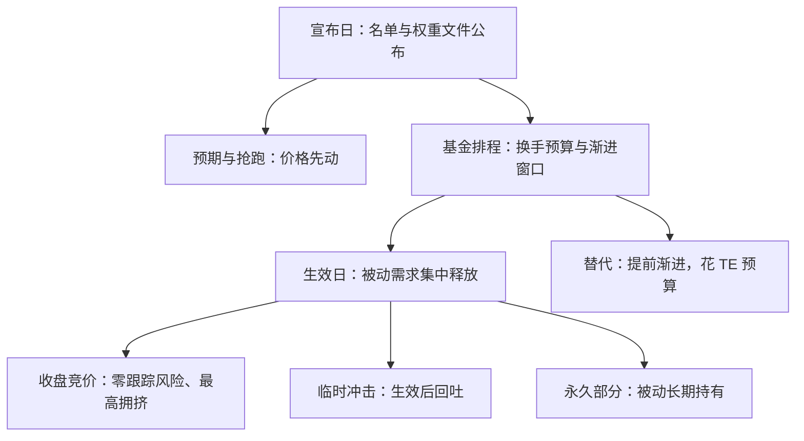

# 指数再平衡的效应

指数基金一年里最大的一笔交易，不是任何投资决策，而是编制规则在半年前就写好的那一行日历。

<footer>—— 据 Madhavan, Financial Analysts Journal, 2003（罗素重构）与指数公司调整公告口径整理</footer>

[上一课](/quant/etf-tracking-error)把事件成本列为跟踪差异的一项；最大、且生效前一年就可预告的事件，是指数自己的定期调整。缺口是持有人视角：这笔强制交易由谁执行、按什么价、成本落在谁的净值里。调整作为套利对象的一面——宣布日到生效日的抢跑与冲击——[指数调仓套利](/quant/index-rebalance-arb)与[指数纳入与被动流](/quant/index-inclusion-passive-flow)已经写透；本课写产品这一侧的账。

## 问题

定期调整生成两类强制订单。换样：买入调入、卖出调出。再定标：权重上限、行业配额、自由流通口径调整触发的加减仓，不换样也发生。基金的义务在生效日收盘前把持仓对齐新权重，目标完全公开：$\sum_i |w_i^{\mathrm{new}} - w_i^{\mathrm{old}}|$ 就是单边换手的下限，缓冲带（[第一课](/quant/etf-index-construction)）决定了它比「全体排名重排」小多少。效应分三段：宣布日，套利者与预期者建仓，价格先动；生效日，被动产品的需求集中在收盘竞价释放；生效后，临时冲击回吐，对应基金将长期持有的永久部分留下。问题在于：这两段的分界不在公告里，而在稀缺性——弹性资本的供给决定回吐多少。

罗素 2000 重构是这一现象的标准样本：Madhavan（2003）记录了生效日收盘竞价中成交量的极端集中与价格的暂时性跳动；Chen、Noronha 与 Singal（2004）用标普调整证明调入效应中有一块不回吐。两篇合起来就是「临时 vs 永久」分解的出处。

## 方法

基金的执行是一条谱。端点一：生效日收盘全额成交——跟踪风险为零，但与全部被动同行挤同一个竞价，冲击成本最高。端点二：提前数日渐进完成——执行价更好，但对新权重的偏离构成主动风险，吃的是 TE 预算。实务取中间：换样腿提前渐进，竞价腿留在生效日收盘。预算怎么分，取决于基金规模对成分 ADV 的占比与 TE 合同的松紧。再定标腿（capping 触发的减持）常被忽略，它的规模可以从新旧权重文件直接算出，是提前可排程的流水线作业。

## 机制

效应的强度由被动规模与需求刚性决定：跟踪误差约束把需求弹性压到接近零，被动买盘不看价格，弹性全靠套利资本供给。这也解释了效应为什么不消失——被动份额仍在增长——以及为什么早年的冲击系数不能直接外推：拥挤使抢跑者互相吃利润，观察到的宣布日效应里预期部分越来越大、可交易部分越来越小。对持有人，真正的账是执行缺口：成交价相对生效日收盘基准的差，加上市场冲击中由基金自己买单的那部分。把「指数没输、基金输了」的年度落后归因到管理能力，是再平衡研究里最常见的归因错误。

## 边界

本课不设计抢跑策略，那是[指数调仓套利](/quant/index-rebalance-arb)的主题；因子宇宙与回填偏差见[指数调入调出](/quant/index-rebalance)。也不把效应写成常数：临时与永久的比例随被动规模、衍生品对冲可得性与借券市场变化，事件研究必须分期重估。ETF 层面还有一条间接通道：申赎流把调整需求分散到生效前的数日（PCF 提前变更），使二级市场的冲击形态与基金持仓的执行时点不完全重合——把生效日当成唯一事件日的研究，会漏掉这一段。

## 小结

- 定期调整生成换样与再定标两类强制订单，单边换手下限是 $\sum_i |w_i^{\mathrm{new}} - w_i^{\mathrm{old}}|$。
- 效应三段：宣布日预期、生效日集中释放、生效后临时回吐与永久保留；分界由弹性资本供给决定。
- 执行是一条谱：生效日收盘零跟踪风险但最拥挤，提前渐进省钱但花 TE 预算。
- 对持有人的真实账是执行缺口；把「指数赢、基金输」归因于管理能力是常见错误。
- 出处：Madhavan, *Financial Analysts Journal*, 2003；Chen, Noronha and Singal, *Journal of Finance*, 2004；Petajisto, *Financial Analysts Journal*, 2011；策略面见[指数调仓套利](/quant/index-rebalance-arb)。
