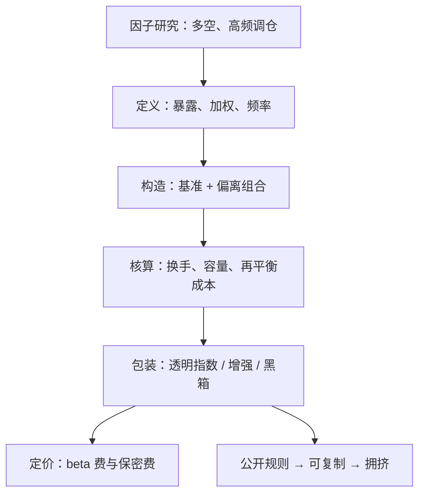

# Smart Beta 的产品化

因子一旦写成指数，论文里的夏普就被换成了费用表：产品化的每一道工序——限定做多、降低频率、公开规则——都在往溢价里扣钱。

<footer>—— 据 Arnott, Hsu and Moore, Financial Analysts Journal, 2005 与 Frazzini and Pedersen, Journal of Financial Economics, 2014 的产品化版本整理</footer>

[上一课](/quant/etf-rebalance-effects)写到，上限、配额与任何偏离市值加权的规则都会把再定标变成强制交易；当加权规则本身就是因子时，再平衡成了产品的主要成本与主要风险源。缺口是：因子研究怎么变成可购买、可审计的规则产品。学术溢价的证据见[另类风险溢价 ARP](/quant/alternative-risk-premia) 与[低波动 / BAB](/quant/low-vol-bab)；本课写从论文到指数再到产品的三道工序，以及每一道扣掉什么。

## 问题

研究组合与产品不是同一个东西。论文里的因子多是多空、月度调仓、按账面值无限融资；产品是限定做多、季度或年度调仓、有费用与跟踪要求。直接把论文数字当产品预期，错在两处：多空腿的空头溢价在限定做多的版本里被稀释成「基准加偏离」；再平衡降频后，因子暴露的时变性被引进来。深一层的问题是合同：透明指数把规则公开，买方可以审计、也可以绕过——拥挤因此可见，抢跑因此可行。透明度是卖点也是折价的来源，这是产品设计绕不开的权衡。

基本面指数（Arnott-Hsu-Moore, 2005）把权重从市值换成基本面规模，本质是系统性反向再平衡：定期把涨多的减下来。它的换手与「再平衡收益」正是[上一课](/quant/etf-rebalance-effects)再定标机制在因子维度的版本——只是这一次，交易规则本身就是卖点。

## 方法

第一道工序是定义：目标暴露、加权方式、样本筛选与再平衡频率，全部写成可复现的规则，与[第一课](/quant/etf-index-construction)的编制规格同构。第二道是构造：限定做多的因子指数可以写成「基准 + 偏离组合」，偏离组合的换手、成本与容量用上一课的工具核算；频率是第一杠杆——月度调仓保暴露、年度调保卫成本，产品要明说选了哪头。第三道是包装与定价：透明指数、半透明增强与黑箱主动共享同一批因子源，费用从几个基点排到上百，买方付的钱里一部分是暴露、一部分是防止别人免费搭车的保密性。

## 机制

产品化压缩溢价有三条通道。费用与执行是线性扣除，容易算；暴露稀释是结构性的，限定做多把空头腿的价值变成手续费与融资成本付给券商；拥挤是动态的——规则公开意味着所有人同时抢同一批排序，溢价在产品大规模发行后衰减，见[因子拥挤与拥挤崩](/quant/factor-crowding)。不同因子的产品化损耗差别很大：低波与质量类容量大、损耗小，动量与微小市值类换手高、容量小。因此「Smart Beta 是便宜的 alpha」这句宣传要拆开读：便宜的是暴露，衰减的是溢价，两者都不是常数。

## 边界

本课不重新证明任何因子溢价，证据与多空构造见[另类风险溢价 ARP](/quant/alternative-risk-premia)；能否按估值择时买入因子产品，见[因子择时的可行性](/quant/factor-timing-feasibility)。透明增强与主动管理的边界是费用换保密的连续谱，本课不划硬线。因子指数的跟踪误差分解与[上一课](/quant/etf-tracking-error)完全同构，只是事件成本一栏换成因子再平衡；多因子混合的暴露管理见[因子暴露的管理](/quant/fz-exposure-management)。

## 小结

- 研究组合与产品隔着三道工序：定义、构造、包装定价；每道都扣钱，费用只是其中线性的一项。
- 限定做多因子指数等于基准加偏离组合，其换手与再平衡成本继承指数再平衡的机制。
- 透明度使产品可审计，也使拥挤与抢跑可见；溢价衰减是产品化的内生结果。
- 产品化损耗随因子而异：低波与质量容量大损耗小，动量与小市值换手高容量小。
- 出处：Arnott, Hsu and Moore, *Financial Analysts Journal*, 2005；Frazzini and Pedersen, *Journal of Financial Economics*, 2014；Baker, Bradley and Wurgler, *Financial Analysts Journal*, 2011。
