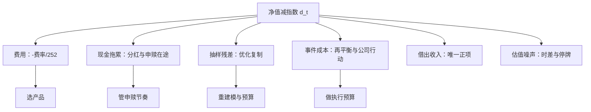

# 跟踪误差的分解

跟踪差异是账，跟踪误差是波；只报波动率的验收书，藏得住一笔每年确定发生的亏欠。

<footer>—— 口径据 Roll, Journal of Portfolio Management, 1992 与发行人年报的「跟踪差异 vs 跟踪误差」披露整理</footer>

[上一课](/quant/etf-create-redeem-arb)写清了申赎管道如何把二级价格钉在可复制篮子附近；它钉住的是价格对篮子，没有钉住净值对指数。缺口就在这里：即便折溢价为零，基金净值仍可以稳定地落后于指数。本课把「净值减指数」拆成有名字的项，给出每一项的修正动作。TE 约束下的主动组合见[基准与跟踪误差](/quant/benchmark-tracking-error)，本课只写被动产品的误差谱系。

## 问题

先分清两个量。跟踪差异 TD 是 $\sum_t (r_{f,t} - r_{I,t})$，有符号，回答「落在指数后面多少」；跟踪误差 TE 是 $r_f - r_I$ 的标准差，无符号，回答「贴得稳不稳」。费率是每天 $-\phi/252$ 的确定性项，全部进了 TD、几乎不进 TE；只验收 TE 的合同，允许管理人用「波动很小但系统性落后」的产品过关。反过来只看 TD，会把一次事件冲击的运气当成能力。两个量回答两个问题，验收必须都要。

跨境与债券 ETF 的日频 TE 会被陈旧价格压低：底层闭市时，基金净值停在昨日，指数仍按模型或矩阵定价走动，日收益差的波动被系统性低估。比较产品要用同时区重估或更长周期，日频 TE 排行榜不可直接比。

## 方法

把每日差 $d_t = r_{f,t} - r_{I,t}$ 按来源记账：

$$d_t \approx -\phi/252 + \delta_{\mathrm{cash},t} + \epsilon_{\mathrm{samp},t} - c_{\mathrm{trade},t} + \ell_t + \eta_t$$

五项各有定义与修法。费用项由费率决定，修正动作是选产品。现金拖累 $\delta$ 来自分红在途、申赎现金在途与未投资头寸——现金在牛市里就是负alpha，修正动作是管申赎节奏与股票化，[指数调入调出](/quant/index-rebalance)一课的口径同样适用。抽样残差 $\epsilon$ 是优化复制的代价：成分多、流动性差的指数不做全复制，残差要用事前协方差预算。交易成本 $c$ 集中在再平衡、换样与公司行动日，是可以预告的事件。借出收入 $\ell$ 是唯一的正项：宽基 ETF 把篮子借给空头，收入可以覆盖费率，这是许多产品 TD 接近零甚至为正的机制。

## 机制

分解之所以重要，是因为各项的修正动作互不可替代。费用选错产品，再好的申赎管理也补不回一百个基点；申赎节奏混乱，换零费率产品也留不住现金拖累。混着报一个总 TE，等于把五种病因开一种药。借出收入尤其要单独看：它解释了为什么两只同指数、同费率的产品 TD 可以差出十个基点以上——差别不在管理，在借贷需求与返还分成。

事前与事后的分工同样清楚：事前 TE 用权重差与协方差算，服务于风险预算与复制方式选择；事后 TD 用净值与指数的真实差算，服务于验收与选型。把事前模型当成验收依据，模型里没有的事件成本——下一课要写的指数再平衡——会变成意外的落后；把事后数字直接外推，事件的年度节奏变了，落后也会变。

## 边界

TE 作为合同约束下的优化对象，是[基准与跟踪误差](/quant/benchmark-tracking-error)的主题，本课不重推 Roll 的结论。指数增强产品的超额与衰减是另一条线，见[指增产品超额衰减](/quant/index-enhancement-decay)。本课的分解表也不声称完备：杠杆与期货化产品有展期项，合成复制有掉期融资项，它们是同一方法多加两列。最后，TD 与 TE 都要用全收益口径的指数来算——[第一课](/quant/etf-index-construction)钉过的口径错误，在这里会直接变成虚假的「跟踪差距」。

## 小结

- TD 有符号、TE 无符号；费率进 TD 不进 TE，验收必须两个量都要。
- 每日差可拆成费用、现金拖累、抽样残差、事件成本、借出收入与估值噪声，各项的修正动作互不可替代。
- 借出收入是宽基 ETF TD 接近零的机制；同指数同费率的产品可因此差出十个基点级。
- 事前 TE 用于预算，事后 TD 用于验收；日频 TE 在跨时区产品上被陈旧价格压低，不可直接比较。
- 出处：Roll, *Journal of Portfolio Management*, 1992；Frino and Gallagher（2001）对指数基金跟踪成本的分解；分项口径据发行人年报与基金说明书整理。
