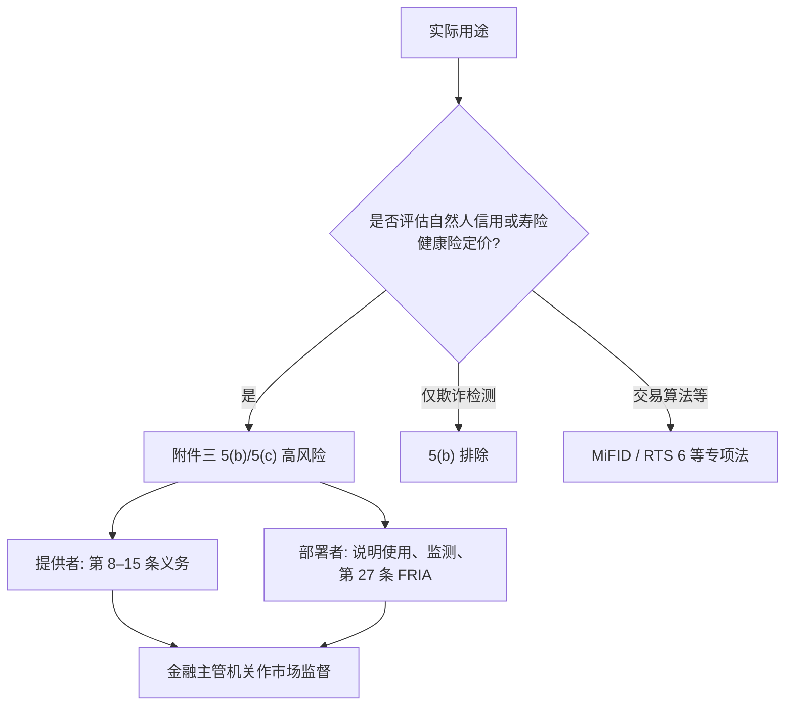

# EU AI Act 的金融条款

    
拟用于评估自然人信用状况或建立其信用评分的人工智能系统属高风险，但用于检测金融欺诈的系统除外；拟用于对自然人进行寿险与健康险风险评估与定价的系统亦属高风险。

    <footer>—— Regulation (EU) 2024/1689 附件三第 5 点 (b)(c)；高风险认定衔接第 6 条第 2 款</footer>

《人工智能法案》即欧洲议会与理事会 2024 年 6 月 13 日的 (EU) 2024/1689，2024 年 7 月 12 日刊于官方公报，8 月 1 日生效。它按风险分层：禁止实践、高风险系统、有限风险的透明度、通用目的模型。金融业最常被点到的，不是交易算法，而是附件三第 5 点里与**自然人获得基本私人服务**有关的两类：信用评估 / 信用评分，以及寿险与健康险的风险评估与定价。算法交易、投资建议、多数反洗钱工具并不自动因为「在银行里」就变成附件三高风险；它们继续受 MiFID、DORA、AML 指令等专项法约束。本篇只把公开文本里真正写给金融用途的条款读成约束：哪些系统进入高风险义务、部署者何时做基本权利影响评估、金融主管机关如何监督。

## 问题

银行与保险长期使用评分卡、定价引擎与反欺诈模型。AI Act 并不为金融单独立法，而是用附件三把若干**用途**列为高风险。第 6 条第 2 款规定：附件三列出的系统是高风险，除非它们不构成对健康、安全或基本权利的显著风险（第 6 条第 3 款的限缩须按文本严格解读，不能把信贷拒绝解释成「不显著」）。第 5 点 (b) 抓住的是对自然人的信用状况评估或信用评分；(c) 抓住的是对自然人的寿险与健康险风险评估与定价。(b) 明文排除「用于检测金融欺诈」的系统。于是同一家机构的模型清单必须按**用途**切开：决定是否放贷的评分是高风险；只用来标记盗刷的模型，不因 5(b) 自动高风险。双重用途——欺诈分也拿去调额度——会把系统拖回 5(b)。

时间线按第 113 条：生效后 6 个月禁止实践适用，12 个月通用目的模型与部分治理适用，24 个月附件三高风险义务适用（即 2026 年 8 月 2 日前后，以官方文本的起算为准）。提供者和部署者的义务不同。提供者（把系统投放市场或以自己名义投入使用）承担风险管理、数据治理、技术文件、日志、透明度、人工监督、准确性与网络安全、符合性评估与注册等第 8–15 条义务。部署者（在职业活动中使用）要按说明使用、监控、保留日志，并在第 27 条情形下做基本权利影响评估（FRIA）。信贷与寿险健康险的部署者，无论公私，都被第 27 条点名。

### 欺诈排除不是「风控模型全体豁免」

5(b) 的排除限于以检测金融欺诈为用途的系统。信用额度、抵押贷款准入、先买后付的支付能力评估，属于评估信用状况。若系统输出同时进入欺诈决策与信贷决策，应按较严的用途管理。AML 交易监测、制裁名单筛查并不写在附件三第 5 点；它们可能落入其他法律或——若使用生物识别——附件三其他点。把「银行内部模型」一律标成高风险，或一律标成豁免，都与附件三的列举式结构不符。

第 27 条 FRIA 是部署者义务，不是提供者义务。公共机构或提供公共服务的私人部署任何附件三系统（关键基础设施那一类有排除），以及任何部署 5(b) 或 5(c) 系统的人，须在首次使用前评估对基本权利的影响，情况变化时更新，并向市场监督机关通报结果。私营银行做零售信贷评分，因 5(b) 而进入 FRIA，不因其不是公共机构而豁免。

## 方法

对落入 5(b) 或 5(c) 的系统，高风险义务应映射到模型生命周期，并与已有的模型治理对齐，而不是另起一套不可审计的平行文档。

数据与记录（第 10、12 条）：训练、验证、测试数据须相关、足够代表、尽可能无错误，并处理可能影响基本权利的偏见；自动日志应能追溯运行。技术文件（第 11 条与附件四）须使主管机关理解系统逻辑、用途、监测。人工监督（第 14 条）要求设计使自然人能理解、能介入、能停下；信贷与保险场景里，「模型说了算、柜员只盖章」与这条紧张。准确性、稳健性、网络安全（第 15 条）是持续义务，不是上线前一次回测。符合性评估与欧盟数据库注册，按高风险路径走；金融部门由第 74 条第 6 款把市场监督指派给金融监管机关——同一机关既看审慎与行为，也看 AI Act 项下的技术文件。

与 [SR 11-7](/quant/sr-11-7-model-risk) 的对照有用：美国指引用「模型」定义加有效挑战；AI Act 用用途清单加提供者 / 部署者法律义务。一份信贷评分引擎在美国银行要进模型清单并验证，在欧盟若评估自然人信用还要满足高风险条款与 FRIA。文档可以共用数据谱系与监测指标，法律基础不能互相替代。DORA 管 ICT 与第三方风险，对事件报告与外包登记是特别法；AI Act 的符合性与基本权利评估仍在。量化团队若只把交易信号当「研究」，却把同一套学习器接到零售信贷，用途一变，法律类别跟着变。

$$
\mathrm{Class}(f)=\begin{cases}
\text{高风险} & f\text{ 用于 5(b) 或 5(c) 且不适用第 6 条限缩}\\
\text{不因 5(b) 高风险} & f\text{ 仅用于检测金融欺诈}\\
\text{专项法} & f\text{ 为算法交易、一般投资工具等未列入附件三者}.
\end{cases}
$$

分类是法律问题，应由合规与法律对照现行合并文本完成；本式只是把附件三的分叉写成约束输入。

### 通用目的模型嵌入高风险系统

通用目的 AI 模型（第 51 条及以下）有自己的透明与版权义务；具系统风险的模型义务更重。若银行把通用模型当作高风险信贷系统的加工组件，高风险系统的提供者义务并不消失：嵌入不能把附件三系统变成「只是聊天机器人」。第 50 条的有限风险透明度——与自然人交互时表明为 AI——可能叠在客服与投顾问答上，即使这些用途未列附件三。交易台用生成式工具写研究报告，通常不是 5(b)；用它自动拒绝贷款申请，则是。

## 机制

AI Act 改变的是市场准入与使用条件，不是收益率公式。高风险系统未满足义务不得依法投放或使用；罚则按第 99 条分级，禁止实践最重，高风险义务次之。对量化与风险系统的机制是：模型清单必须多一列「AI Act 类别」，用途描述必须具体到是否评估自然人信用或为寿险健康险定价。用途蔓延——实验性模型悄悄接到审批流——会在未做符合性评估时构成违法使用。这与 RTS 6 把未测试算法送进生产同类：公开规则把上线条件写成法律，而不是最佳实践。

金融监管机关身兼市场监督，意味着现场检查可以同时要资本模型的验证包和 AI 系统的技术文件。第 13 条对部署者与受影响的自然人提供信息，与信贷领域已有的解释权、公平信贷要求叠加。人工监督不是「有一个邮箱」：第 14 条强调有效介入。压力来自基本权利——歧视性拒绝信贷或差别保险定价——而不是来自交易损益。因此本篇对象是零售信用与特定保险定价，不是做市价差。

附件三第 5 点 (c) 限于寿险与健康险对自然人的风险评估与定价。车险、财产险不因这一项自动高风险。第 5 点 (a) 是公共当局对基本公共补助的资格评估，与私人银行信贷是不同条目。分类时应读现行附件，而不是读咨询文章的对照表。

### 算法交易为什么通常不走附件三

附件三没有列举投资公司的执行算法或做市引擎。它们的组织要求在 MiFID II 第 17 条与 [RTS 6](/quant/mifid-ii-rts6)。AI Act 仍可能以其他方式碰到交易系统：若使用被第 5 条禁止的实践、若对员工做附件三第 4 点的招聘与用工评估、若客户交互触发第 50 条。把交易 RL 政策登记成 5(b) 高风险，是类别错误；完全不登记算法交易控制，则是忽略 RTS 6。正确的约束分配是：交易算法走市场结构与操守规则，自然人信贷与寿险健康险定价走 AI Act 高风险。

## 边界与工程取舍

本篇不构成法律意见。合并文本、实施法规与各国市场监督实践会更新；后续立法修订若改变适用日期，以官方公报为准。域外效力按第 2 条：向欧盟投放或部署、或输出在欧盟使用的系统，可能被抓住，即使提供者在境外。英国与其他司法区有自己的 AI 与消费者信贷规则，不能用欧盟附件三替代。

不要为了「去掉高风险标签」去改产品文案却保留信贷决策用途——认定看意图用途与实际使用。不要把欺诈模型的排除理解成可以在欺诈分上叠信用拒绝而不评估。研究用、不进入决策的原型，仍可能在投入使用时被重新分类。与 SR 11-7 一样，清单、用途限制与独立挑战是可执行的工程动作；符合性评估与 FRIA 必须由承担法律义务的职能完成。

罚则与民事责任之外，受影响的自然人还有投诉与司法途径。高风险信贷系统的文档应假设会被监管与申请人两侧阅读。把模型说成完全不可解释然后继续自动拒绝，与第 13、14 条的方向相反。

## 小结

- (EU) 2024/1689 附件三第 5 点 (b)(c) 把自然人信贷评分与寿险健康险定价列为高风险，欺诈检测有明文排除。
- 高风险义务落在提供者；信贷与寿险健康险的部署者另有第 27 条 FRIA。
- 金融监管机关依第 74 条第 6 款担任市场监督，与审慎、行为监管叠加。
- 算法交易一般不因附件三自动高风险，仍受 RTS 6 约束；用途蔓延会改变分类。
- 通用模型嵌入高风险系统不能洗掉附件三义务。
- 分类看实际用途，不看营销名称；本篇是对公开规则的约束解读，不是规避指南。
- 出处：Regulation (EU) 2024/1689（OJ L 2024/1689），尤其第 6、8–15、27、50、51、74、99、113 条与附件三第 5 点。
