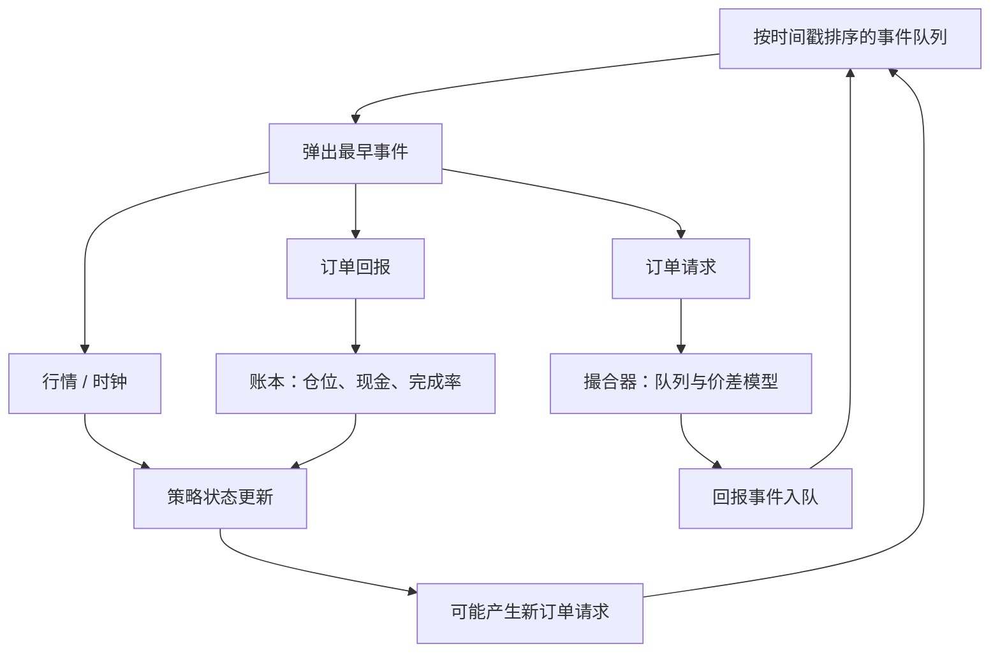

# 事件驱动回测引擎

金融决策发生在订单、报价与成交这些带时间戳的事件上。把收益向量一次性乘上权重，会跳过路径依赖的成交、拒单与队列，得到一条无法在模拟里复现的权益曲线。

<footer>—— 据 López de Prado, Advances in Financial Machine Learning 对回测与数据结构化的论述；Harris, Trading and Exchanges 对连续市场事件的描述</footer>

向量化回测把价格对齐成矩阵，用一次线性代数得到持仓与损益。它对日频、满仓、假定中点成交的因子研究往往够用。一旦策略的损益依赖「当时能否排到队头、部分成交如何累积、撤单是否成功、下一笔行情是否已经看见这张单」，矩阵乘法就丢掉了状态。事件驱动引擎把市场数据、信号、订单请求与回报当成时间有序的事件队列，策略是状态机上的回调。Pardo 把仿真当作评估交易系统的核心步骤；Aldridge 对高频系统的描述也是事件处理循环。本篇写回测架构：为什么需要事件循环、事件里必须有什么、以及它如何与向量化分工。不涉及把事件流设计成误导其他参与者的交易手法。

## 问题

路径依赖来自三处。第一，成交是库存与队列的函数：同样的目标仓位，先到的限价单与后到的市价单产生不同的均价与剩余风险，见[订单类型](/quant/order-types) 与[队列位置](/quant/cancel-queue-position)。第二，信号若在事件频率上更新，向量化常用的「用当日收盘算信号、用次日开盘成交」会漏掉日内的可交易窗口，也会在 bar 内制造前视。第三，风控与资金是状态：打到限额之后后续事件必须被拒绝，而不是在事后把超限持仓从矩阵里裁掉并假装当天没有那些交易。

López de Prado 强调金融数据的结构是非均匀的时间戳与重叠的标签。事件驱动是这种结构在工程上的对应物：引擎的时钟由事件戳推进，而不是由等间隔格子推进。O'Hara 的价格形成发生在序贯交易上；把序贯过程压成日频矩阵，等于改写过程。向量化仍然有用——它快，适合在研究环境里扫数千个候选——但其输出必须被理解为「在一组成交假设下的近似」，晋级到模拟时应换事件引擎，见[环境隔离](/quant/research-sim-prod)。

### 事件时间与因果

事件循环的不变量是：处理戳为 $t$ 的事件时，策略只能看见 $\le t$ 且已经到达的信息。迟到的包应带着到达戳，而不是带着交易所戳直接进入「当前簿」，否则回测会用当时尚未收到的最优价成交，这是前视。因果还要求订单回报作为事件插回队列：你不能在同一瞬间既假设成交完成又用成交后的簿去算下一个信号，除非交易所的撮合语义确实如此。这些细节在日频向量化里被「次日开盘」一笔勾销，在日内则决定夏普能否复制。

用 `for t in bars: position[t] = f(close[t])` 再 `pnl = position.shift(1)*return` 是向量化的最小因果修补。它仍假设在 bar 结束时无条件成交。事件引擎要显式模拟「下单、等待、部分成交、取消」这一段，而不是用 shift 假装延迟。

## 方法

核心是一条按 `(timestamp, sequence)` 排序的优先队列。事件类型至少包括：行情（成交、报价、簿更新）、时钟（定时再平衡、拍卖、清盘）、订单请求、订单回报（确认、拒绝、成交、取消）、以及数据修订。策略订阅行情与时钟，输出订单请求；撮合器订阅请求与行情，输出回报；账本订阅回报，更新仓位与现金。Harris 对连续市场的描述可以直接翻译成这张图：指令进入簿，撮合产生成交，成交与取消改写簿，参与者在下一事件上反应。

撮合器是回测保真度的上限。最低档：按下一笔成交价或中点加上价差成交，忽略队列。中档：维护简化的价位队列，用历史成交消耗队头，见队列位置一文。高档：回放 L3 或订单日志。档位必须声明，因为[容量](/quant/capacity-participation) 与滑点敏感性都依赖它。无论哪一档，撮合器不得看见策略的未来订单，也不得把未到达的行情用于当前撮合。

### 与向量化的混合

实践中常用两层。研究层：向量化生成信号与目标仓位路径，成本用解析冲击函数快速扣。模拟层：把同一目标仓位喂给事件引擎，看完成率与短fall。两层差异过大时，以事件层为准，并回写研究层的成本参数，而不是以向量化夏普为准去「修」事件层。CPCV 与网格搜索应发生在便宜的一层，但候选集合冻结后必须全部经过事件层；否则过拟合发生在成交假设上，统计调整看不见。

事件引擎的随机性（如队列消耗的随机模型）必须可种子化。不可重复的回测不能进 CPCV，也不能进监管审计。种子是试验定义的一部分，与代码哈希并列。

## 机制

事件循环把全局状态的更新变成确定性的单线程语义（逻辑上单线程；实现上可以并行独立品种，但品种内仍需有序）。这避免了向量化里隐式的「所有名字在同一 bar 同时成交、现金无限、拒单不存在」。现金与保证金在每一笔成交事件后更新，后续订单若资金不足则拒绝——拒绝本身是事件，策略必须处理，否则模拟会静默丢单而研究以为满仓。

性能上，事件引擎比矩阵慢几个数量级。这是保真度的价格。优化应发生在数据结构（按品种分区的簿、批量行情编码），而不是发生在「先算完所有信号再一次性撮合」——后者会重新引入前视，除非信号严格只用当时状态。Aldridge 讨论的低延迟系统在生产上关心微秒；回测关心的是语义一致：同一事件流、同一状态机，研究评估与模拟账户不应因循环实现不同而分叉。

### 公司行动、停牌与拍卖

这些是必须进入队列的特殊事件，而不是收盘价里已经被复权掉的注释。停牌期间订单应被拒绝或冻结，复牌时的集合竞价有自己的撮合规则。向量化常把停牌日的收益写成零并继续调仓，等于在不可交易时成交。事件引擎若没有这些事件类型，日内保真度再高，日界上仍会造假。它们与[迟到数据](/quant/late-data-recon) 的修订事件一起，构成「非价格」的因果来源。

## 边界与工程取舍

事件驱动不能修复错误的数据或错误的试验次数。它只是把成交假设从隐含变成显式。若 L2 深度是聚合的，队列模型仍是猜测；应把猜测写成情景，做[成本敏感性](/quant/cost-sensitivity)，而不是把模型成交当成交易所真相。回放历史簿还有幸存者与协议变更问题：旧的撮合规则与今日不同，引擎必须按历史规则分支，或声明无法重现某段制度。

不要在事件引擎里实现「保证成交」的捷径来让曲线好看。未成交、部分成交、拒单是信息：它们降低换手、改变风险，也降低纸面夏普。把它们抹掉，等于回到向量化的无摩擦世界，同时保留了事件引擎的计算成本。与实盘隔离的接口是：同一订单状态机、同一事件类型名，只是网关从撮合器换成真交易所。

Pardo 强调仿真参数（滑点、成交率）应保守。事件引擎让这些参数有了着落，但不自动使它们保守。默认中点仍是激进假设，只是实现得更精致。

## 小结

- 事件驱动回测用有序事件推进状态，用来保留成交、拒单与风控的路径依赖；向量化是研究层的快速近似。
- 因果不变量是：只使用已到达的信息，订单回报必须作为事件插回队列。
- 撮合器档位决定滑点与容量结论的上限，必须声明并做敏感性。
- 停牌、拍卖、公司行动与修订都是事件；把它们埋进复权收盘价会在日界上前视或假成交。
- 引擎必须可重复；晋级到模拟应与实盘共享状态机语义。
- 出处：López de Prado, *Advances in Financial Machine Learning*, 2018；Harris, *Trading and Exchanges*；Pardo, *The Evaluation and Optimization of Trading Strategies*；Aldridge, *High-Frequency Trading*；O'Hara, *Market Microstructure Theory*。
