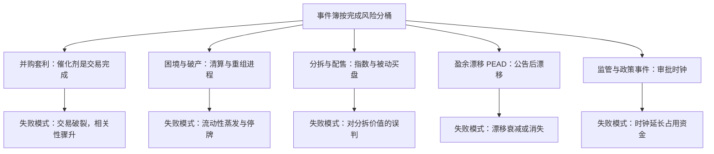
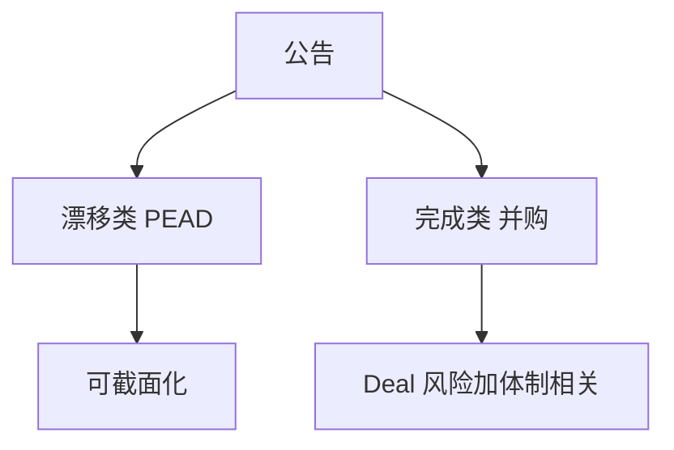

# 事件驱动全景

事件驱动吃的是公告后的不完备定价与交易摩擦，不是截面因子的慢溢价；每类事件有自己的失败模式。

<footer>—— 并购套利见 Mitchell and Pulvino；对照事件研究法的识别，本课只做策略地图</footer>

[上一课](/quant/one-thirty-thirty)把 130/30 写成带有限卖空的增强指数：净暴露约 100%，不是市场中性，评价用 TE 与超额。缺口是日历：多空与 130/30 仍是截面组合，并购、分拆、重组、破产的完成时点由公司事件驱动，不能收成同一个「事件因子」。本课给事件驱动地图：公告、完成不确定性、资金占用，按完成风险对漂移风险分桶。不重讲 30% 借券。具体一类见 [事件研究](/quant/event-study) 与 [并购套利](/quant/merger-arbitrage)；后课全球宏观默认事件簿的平静期夏普不能当容量。

## 问题

130/30 仍按截面日历再平衡；并购与破产的完成日不是月末。[PEAD](/quant/pead-sue) 是盈余公告后的漂移，偏系统、可做截面。并购套利是 deal 完成的二元风险，偏特异、相关在监管否决时会突然升。分拆、毒丸、指数事件（后课纳入）又不同。问题是资金与风险预算：事件簿的「夏普」在平静期高，在 2008 年并购破裂期一起爆。地图要按**完成风险 vs 漂移风险**分桶，而不是按彭博行业标签。

并购价差的数字例子：收购方报价 50 元，目标现价 47 元，价差 3 元约 6.4%；若交易预计 4 个月完成，年化约 19%。这 19% 不是无风险收益，是对「交易破裂」的定价——一旦破裂，目标股价通常跌回收购前水平之下，单笔亏损可吞掉许多笔积累的价差。

共同零件：公告日流动性空洞、借券、法律文件、完成日不确定。回测若用公告后收盘价当成交，会高估，见 [事件研究](/quant/event-study) 的时间戳。

### 不要用因子模型解释掉事件

事件收益对 HML/动量有暴露，但残差才是策略。强行行业中性可能对冲掉并购价差本身。风险模型应用于剩余，并对单笔 deal 设集中限额。

SPAC、PIPEs、困境债各有法律与流动性结构，不能从现金并购公式类推。地图只点名，细节留给专门产品课。

## 方法

分类：并购套利、分拆/配售、困境/破产、盈余漂移、监管/政策事件。每类写：催化剂、失败模式、对冲（行业、指数、期权）、容量。组合：低相关的事件之间分散，但承认体制相关（信贷紧缩）。执行：公告后冲击模型单独校准。

```mermaid
flowchart TD
  MAP["事件簿按完成风险分桶"] --> A["并购套利：催化剂是交易完成"]
  MAP --> B["困境与破产：清算与重组进程"]
  MAP --> C["分拆与配售：指数与被动买盘"]
  MAP --> D["盈余漂移 PEAD：公告后漂移"]
  MAP --> E["监管与政策事件：审批时钟"]
  A --> F["失败模式：交易破裂，相关性骤升"]
  B --> G["失败模式：流动性蒸发与停牌"]
  C --> H["失败模式：对分拆价值的误判"]
  D --> I["失败模式：漂移衰减或消失"]
  E --> J["失败模式：时钟延长占用资金"]
```

## 机制

事件把信息集中释放，市场在完成概率上交易。策略卖的是「概率被标错」或「有人要流动性」。因子策略卖的是长期风险补偿。时钟不同，拥挤模式也不同：并购套利的拥挤是 spread 过窄，因子拥挤是估值压缩。

平静期与破裂期可以类比晴天与台风天：平时各条航线独立延误，组合波动很小；台风一来所有航班一起停飞，相关性逼近 1。Mitchell and Pulvino 的发现正是并购套利在市场大跌、交易密集破裂时与市场同步下跌——用平静期夏普定容量与杠杆，等于按晴天订机队。

```mermaid
flowchart TD
  Ann["公告"] --> Drift["漂移类 PEAD"]
  Ann --> Bin["完成类 并购"]
  Drift --> Sys["可截面化"]
  Bin --> Idio["Deal 风险加体制相关"]
```

## 边界

内幕与重大非公开信息是法律边界，本课只处理公开公告后的交易。跨境并购的监管时钟更长。不要把未公告谣言当事件驱动回测。

常见误区：把并购套利当「类固定收益」。它的日度波动确实小，但收益结构是卖出尾部保险：多数月份收小额价差，少数月份一次破裂亏掉多年积累。评价要看最差月份与破裂情景回测，而不是月度胜率。

## 小结

- 事件驱动按完成风险与漂移风险分桶，不是一个因子。
- 平静期夏普不可外推到破裂期的相关 1。
- 时间戳与冲击决定回测是否可交易。
- 出处：Mitchell and Pulvino, *Journal of Finance*, 2001（并购套利）；盈余漂移见 PEAD 课文献。
