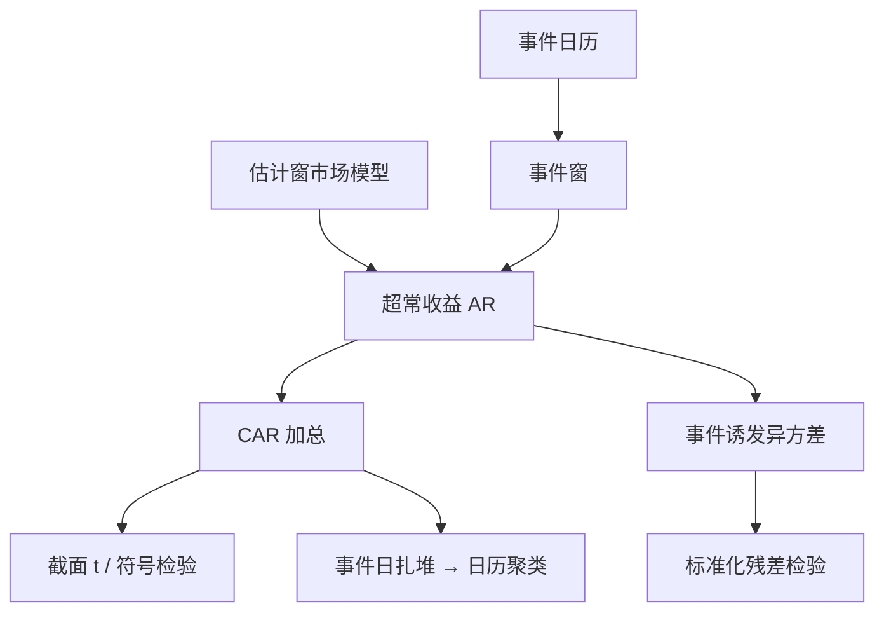

# 事件研究法

把公告附近的超常收益加总，是在问市场是否在短窗内把那条消息写进价格；识别来自时间上的集中，而不是来自一个排除限制漂亮的工具。

<footer>—— Fama, Fisher, Jensen and Roll, The Adjustment of Stock Prices to New Information, International Economic Review, 1969；方法综述见 MacKinlay, Journal of Economic Literature, 1997</footer>

[工具变量](/quant/iv-finance) 用 $z$ 制造 $x$ 的外生变动。事件研究反过来：处理是「某日发生了公告」，结果是短窗收益。Fama、Fisher、Jensen 与 Roll 用拆股附近的残差看调整速度；Brown–Warner、MacKinlay 把估计窗、事件窗、市场模型写成标准作业。本课缺口是：**短窗把许多内生变成可忽略的慢变量**，但方差必须按事件日的截面相关来算，不能把每只股票每天当独立观测。后课 Stambaugh 处理的是预测回归的另一类偏误，对象从事件窗转回持续回归元。

## 问题

对事件 $i$，估计窗上估市场模型 $R_{it}=\alpha_i+\beta_i R_{mt}+\varepsilon_{it}$，事件窗上超常收益 $AR_{it}=R_{it}-\hat\alpha_i-\hat\beta_i R_{mt}$，累积 $CAR_i=\sum_{t\in W}AR_{it}$。平均 CAR 是否异于零，回答「这类事件有没有价格效应」。问题是：正常收益模型够不够、事件是否在日历上扎堆、薄股票的非同步如何抬高噪声。

短窗（1–3 日）的好处：折现率、投资机会等慢变量几乎不动，省略它们不像长期 CAR 那么致命。坏处：事件日波动升、跳跃、买卖弹跳，AR 的方差大于估计窗。Boehmer、Musumeci 与 Poulsen 的标准化残差检验针对事件诱发的异方差。

### 扎堆与截面相关

并购浪潮、宏观公告、行业监管，事件日重叠。此时 $\{CAR_i\}$ 同期相关，把 $N$ 只股票当独立会过度拒绝。应按日历日聚类、用组合日历时间检验，或把同一日事件合成一个组合。这是 [聚类](/quant/clustered-se) 在事件上的具体化，不是新发明。

「显著 CAR」不等于「可交易」。公告当时已实现的价格跳，事后样本外未必能做。事件研究先回答信息含量与半强有效的描述，交易含义要另加可执行时点与成本。

## 方法

**正常收益。** 市场模型是默认；均值调整、三因子、行业指数视事件是否与风格共变。估计窗通常 200–250 个交易日，与事件窗隔开以免污染。薄股票 $\beta$ 噪，可用 Scholes–Williams 或 Dimson 滞后，或改用指数收益当正常。

**推断。** 截面 $t$、标准化残差、符号检验（对肥尾稳健）、以及按事件日聚类的回归 $R_{it}=\gamma D_{it}+\cdots$。长窗 CAR（数月）几乎变成长期收益重叠问题，应接到 [长期收益与重叠观测](/quant/long-horizon-overlap)，不要用短窗公式硬套。

**与 IV。** 指数纳入既是事件（纳入日 CAR）也可以被写成工具（纳入改变机构持仓）。短窗 CAR 测需求冲击的价格压力；IV 用纳入解释事后一年的投资行为。两套设计不要用同一排除故事互相背书而不写时点。

### 窗口与泄漏

事件日定义：公告日还是生效日、时区、盘后新闻算不算 $t=0$。泄漏使 $t=-1$ 已有 drift，应从更早起累积并报告。多事件同一公司（重复再融资）要把事件当聚类原子。A 股停牌使事件窗空洞，CAR 不可比，应改用停牌期间的市场模型插值并声明。

## 机制

市场模型把共同因子从 $R_{it}$ 里抽走，剩下的 $\varepsilon_{it}$ 在无事件原假设下均值为零。事件把一个均值跳加进短窗。检验的功效来自：跳相对于残差波动够大、事件够同质。异质事件（有的正有的负）会把平均 CAR 洗成零，应预分组或看绝对值/符号检验。

方差机制：事件日 $\sigma$ 上升，用估计窗 $\hat\sigma$ 会过度拒绝。标准化用事件窗自身的截面离散，或允许事件日异方差。共同跳（宏观）使所有 AR 同号，截面 $t$ 的分母应变为共同因子的暴露，而不是假装正交。

FFJR 的对象是调整速度：拆股信息是否已被提前写入。今天用 CAR 测「ESG 新闻的 alpha」，对象已经换成平均效应，必须处理选择（什么公司会发这类新闻）——短窗减轻但不是消灭选择。

### 长期事件研究是另一门课

买回、IPO 三年超额，正常收益模型误设会被累积放大。Lyon、Barber 与 Tsai 讨论匹配公司与偏斜。那是长期异常收益，不是本课短窗 CAR 的线性延长。本课停在短窗识别的好处与方差修正。

## 边界与工程取舍

小样本事件（$N=20$）应用符号检验或自助（抽事件）。非同步上市、ADR 时差会把 $t=0$ 对错。用成交价还是中点：跳与弹跳不同，见微观结构；事件日应用成交收益，因为那是可交易路径。

工程：预登记事件定义与窗口；报告 $t=-1,0,+1$ 分解；扎堆则日历组合。不要用一年 CAR 加市场模型宣称治理改革的因果。不要把事件虚拟塞进日面板再只用 White——须按日聚类。下一课起回到持续回归元的偏误，不再依赖「那一天」。

## 小结

- 短窗事件研究用时间集中识别信息含量，正常收益用估计窗的市场模型。
- 推断要处理事件日异方差与日历扎堆，不能把 $N\times$ 窗长当独立观测。
- 长窗 CAR 会退化成长期收益与模型误设，不应套短窗公式。
- 与 IV 分工：一个靠时点，一个靠排除；纳入一类设计两者都可能用到，须写清时点。
- 出处：Fama, Fisher, Jensen and Roll, *International Economic Review*, 1969；综述 MacKinlay, *JEL*, 1997；事件异方差见 Boehmer, Musumeci and Poulsen, *Journal of Financial Economics*, 1991。
