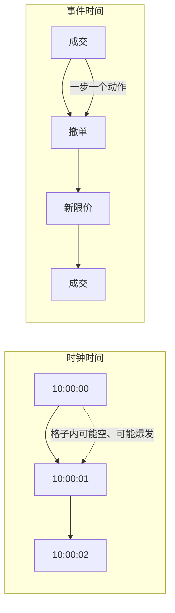

# 事件时间 vs 时钟时间

价格形成发生在指令到达、撮合与撤销的那一串时刻上，而不是发生在墙上时钟的每一秒。把不规则的事件强行填进等间隔格子，是在改写过程本身。

<footer>—— 据 O'Hara, Market Microstructure Theory 对序贯交易与价格调整时机的论述整理</footer>

微观结构的数据天生是点过程：成交、报价修订、增减订单都在不规则的时刻发生，密集时段一毫秒内可以有一串消息，清淡时段十几秒没有任何事。时钟时间（calendar / clock time）把一天切成等长的一秒、一分钟，在格子里取最后一刻的价格或中间价。事件时间（event time）则让「下一步」等于下一条消息、下一笔成交或下一次簿的更新，物理时长可以差几个数量级。O'Hara 的序贯交易模型按交易次序更新信念，而不是按墙上的秒；Harris 对连续市场的描述也是由订单流驱动。选错时间轴，后面的 [盘口不平衡](/quant/order-imbalance)、价差与冲击估计都会把活跃与沉寂当成同一种噪声。

## 问题

等间隔采样是为了迁就时间序列工具：ARMA、波动率的日内估计、与日历公告对齐。微观结构要问的却是：这一笔主动单之后价格改了没有、这一次撤单有没有把 BBO 拉开。这些问题的自然下标是事件计数 $n=1,2,\ldots$，不是 $t=9{:}30,9{:}31,\ldots$。若在一分钟格子里只留下最后中间价，格子内可能已经发生上百次排队与成交，信息早被中间价吸收；若格子里什么都没发生，你仍会记下一个「收益」为零的样本，仿佛市场又经历了一步。

更细的冲突来自混频。成交可能很稀，报价修订极密；若用时钟去对齐两者，会出现大量「有报价无成交」的空步，也会把一串爆发的成交压成一个格子里的一根 OHLC。O'Hara 指出价格对信息的调整是交易过程的函数；交易过程在日历上不是均匀的。于是问题变成：为了哪一个问题，应该用哪一种时钟——成交时钟、订单消息时钟、还是成交量时钟——以及何时必须回到日历，去对齐宏观公告与隔夜。

### 空步与爆发如何扭曲相关

在时钟网格上，低活跃样本会把自相关、协方差向零拉，因为许多 $\Delta p$ 真的是「什么都没发生」。高活跃样本则把许多方向相同的微小更新叠成一个大收益，看起来像一次跳。Roll 模型需要成交价的一阶差分协方差；若你用一分钟收盘价去算，回跳可能已经被格子内的多次成交平均掉，估计的价差会偏小。反过来，若把每一笔报价修订都当成一步，买卖价来回修订会造成虚假的高频负相关。时间轴选择就是在选择哪一种序列相关被当成信号。

事件时间不是把时间戳丢掉。每条事件仍带着交易所时间，用于排序、对延迟和监管。丢掉的是「等间隔」这一约束。时间戳用来排次序，下标用来定义一步。

## 方法

先为「事件」下操作性定义，再决定是否对时钟重采样。成交事件时间：每笔成交一步，价格取成交价，方向若可知则一并保留；适合 Roll 式回跳、成交方向不平衡。簿事件时间：L2 或 L3 的每一条使状态变化的消息一步，包括不成交的增撤；适合盘口不平衡与队列。报价事件时间：仅 BBO 变化才一步，过滤掉深层无关更新。成交量时间：每累积 $v$ 个成交量算一步，用于把「同等经济活跃」对齐，格子长度在时钟上仍不规则。

从事件时间回到时钟时间，常见操作是取格子内最后状态（last）、或格子内均价、或格子内是否发生过成交。last 对连续决策最常用，但会把格子右端点的微观结构噪声留给下一格。也可以在事件序列上定义持续期：相邻两笔成交的时钟间隔，作为活跃度的测度；持续期变短，往往与信息到达或算法切片加密有关。方法上不要混用：模型若按 $n$ 下标写贝叶斯更新，估计就应在同样的 $n$ 上做；只有要把系数解释成「每分钟」时才插值回时钟。

### 对齐多通道

成交、BBO、深度、公开新闻不在同一点过程上。对齐的老实办法是：选定主时钟（例如成交），在每一笔成交时刻读取当时已发生的最新簿状态，而不是把簿先 resample 成一秒再向前填充。向前填充在时钟网格上制造大量重复状态，看起来像极高的自相关，其实是插值伪影。滞后若用「上一秒」，在事件爆发期可能隔了几十笔成交；滞后应用「上 $k$ 笔事件」或「上 $v$ 量」，再单独报告这些步对应的中位毫秒数，以便别人用时钟直觉阅读。

## 机制

序贯交易模型的机制本来就是事件驱动的。Glosten-Milgrom 里，做市商在每一笔到达时用买卖方向更新对价值的信念，买卖报价是条件期望；没有到达时，信念不必为了墙上的秒而更新。Kyle 的批量拍卖按轮次而不是按分钟。把这些模型估计在等间隔收益上，等于假设每一秒都发生了一次结构相同的交易轮次，这与数据生成过程不一致。事件时间让「一步」等于「一次可能携带方向信息的动作」，与机制对齐。

时钟时间并非没有机制含义。公告、开收盘、午休是日历现象；存货过夜、融资与指数再平衡也按日历走。波动率的日内 U 形、隔夜跳空，用事件下标会把开盘的密集成交看成「很多步」而不是「同一段时钟里的高活跃」。机制上应分开：信息通过订单流进入价格，用事件时间；风险补偿、持有成本、制度时段用时钟时间。Harris 对交易日结构的讨论，正是在提醒连续撮合嵌在日历制度里，两套时钟同时存在。

### 抽样定理式的损失

从密集的事件流抽到稀疏的时钟网格，损失的不只是方差。格子内部的路径依赖被抹平：先向上打穿再回撤，与先向下再回撤，last 价格可以相同。对限价单执行而言，路径决定有没有被成交、有没有被逆向选择；对 last 收益而言，这些路径是不可见的。事件时间保留路径上的每一步，代价是序列不再等间隔，常规的谱分析、GARCH 的日历解释要改写。也可以两者都保留：在事件序列上估计微观结构参数，再把拟合的强度过程放到时钟上，去谈单位时间的到达率。这是点过程的思路，不是把事件硬塞进 K 线。

「tick 时间」有时指成交时钟，有时指任何行情更新。写清楚计数器是成交、BBO 变化还是全部消息，否则同样叫事件时间，样本长度能差一个数量级，自相关不可比。

## 边界

事件定义依赖于 [数据层次](/quant/l2-l3-data)。只有 L1 成交时，你没有真正的簿事件时间；用报价修订充数，会把做市商的存货调整和信息交易混在一起。消息馈送若含心跳、状态校验、隐含更新，必须过滤，否则事件时钟会被技术消息拉长。多市场时，各交易所的事件时钟不同步，合并成一条「全球事件时间」会把延迟当成领先。合法的做法是锁一本市场的撮合时间，其他市场的数据打上到达本市场的时间，而不是假装存在统一的物理同时性。

统计上，事件时间的样本容量被活跃度驱动：热门合约步数多，冷门合约步数少，截面比较会对热门过度加权。按时钟抽样则相反，冷门格子充满空步。两种偏都要在论文里写明。隔夜、停牌、集合竞价应切断事件计数，不要把收盘最后一笔与开盘第一笔连成一步差分——那一步跨越了制度，不是连续簿上的一步。Roll、Glosten-Milgrom、Kyle 的公式都不自动告诉你该用哪一种时间；那是识别选择，不是模型内生的一阶条件。

把毫秒时间戳四舍五入到秒再分析，既不是事件时间也不是干净的时钟时间，而是把同一秒内的次序打乱。微观结构里次序就是因果，舍入是破坏识别。

## 小结

- 时钟时间等间隔切日历，便于宏观对齐与传统时序；事件时间按下标计数指令与成交，对齐价格形成机制。
- 空步稀释相关，爆发把多笔路径压成一个格子；Roll 类回跳对抽样方式敏感。
- 先定义事件（成交 / BBO / 全部消息 / 成交量），再决定是否回到时钟；多通道应对齐到主事件上的最新状态。
- 序贯信息模型按到达更新，用事件时间；制度时段与持有成本按日历，用时钟时间。
- 网格抽样抹平格子内路径，而路径对限价单执行是实质。
- 层次、心跳、跨市场延迟与隔夜切断，都限制「一条事件时间」能走多远。
- 出处：O'Hara, *Market Microstructure Theory*；连续市场中订单流对时间的填充见 Harris, *Trading and Exchanges*。
