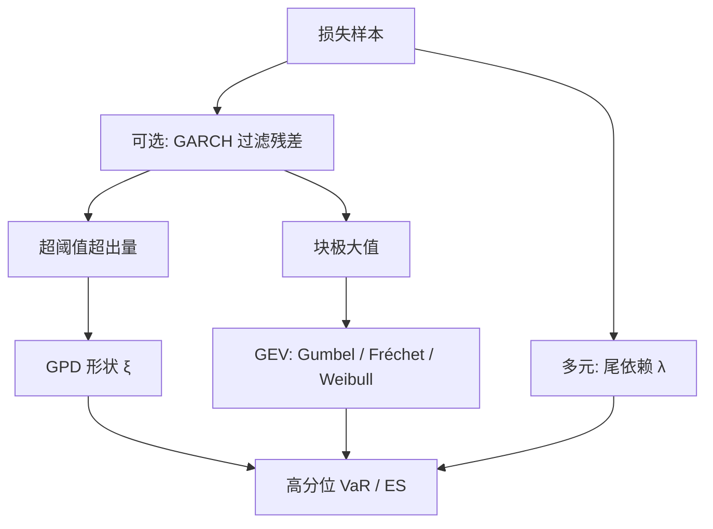

# 极值理论 EVT

保险与金融里真正贵的是尾巴，不是中心；用正态或历史分位数外推「还没见过的损失」，需要极值理论给出的极限律，而不是把样本最大值当答案。

<footer>—— Embrechts, Klüppelberg and Mikosch, Modelling Extremal Events for Insurance and Finance, Springer 1997</footer>

[上一课](/quant/iv-vs-rv)把无模型隐含方差与已实现积分方差对齐，差额含预测误差与方差风险溢价；VIX 不是对未来波动的无偏点预测。缺口转到尾部：平均亏损与隐含–已实现差都不管「超过高阈值之后还长什么样」。Fisher–Tippett–Gnedenko 给块极大值广义极值极限；Pickands–Balkema–de Haan 给超阈值超出量广义帕累托极限。本课写 EVT 作为尾部的渐近模型：估什么、阈值怎么选、以及为何相关为零仍可能同爆。不重推方差互换复制。

## 问题

隐含与已实现对齐之后，差额是预测误差加方差风险溢价；两边都不管超过高阈值之后损失还长什么样。设日损失 $X$ 有分布 $F$。VaR 是 $F$ 的高分位数，Expected Shortfall 是超过 VaR 的条件期望。样本里超过 99.5% 的点很少，经验分位数方差极大；用全样本拟合的正态或 $t$ 又把中心的拟合误差带进尾巴。问题是找一种只使用尾巴形状的极限，而不是把整个 $F$ 估对。

两个操作定义。**块极大值**：把样本切成 $m$ 块，每块取最大，$M_n$ 经中心化、尺度化后，若有非退化极限，则必为广义极值（GEV）——Gumbel、Fréchet 或 Weibull 三型。**超阈值（POT）**：给定高阈值 $u$，超出量 $X-u\mid X>u$ 在 $u\to$ 端点时逼近广义帕累托（GPD），形状参数 $\xi$ 与 GEV 是同一个尾指数。金融日损失通常属 Fréchet 域：$\xi>0$，尾像幂律，矩是否存在取决于 $\xi$。

### 正则变化与「均值可能不存在」

若 $\bar F(x)=1-F(x)$ 正则变化指数 $-\alpha$，则 $\xi=1/\alpha$。$\alpha\le 2$ 时方差无穷，$\alpha\le 1$ 时均值无穷。保险里的大赔付、某些资产的日损失，经验 Hill 图会把 $\alpha$ 画到 2 附近，是否小于 2 对组合分散化是否成立是一等结论：方差有限才能谈 Markowitz；方差无限时，线性相关与方差贡献都没有定义。EVT 要先回答「几阶矩存在」，再谈 VaR 数字。

把「极端」理解成「样本里最大的那几天」是循环的。EVT 的极端是渐近：阈值升高时超出量的形状稳定到 GPD。阈值太低，中心污染；太高，点太少。诊断靠平均超出函数是否近似线性，而不是靠业务上「我觉得 3σ 以外都算极端」。

## 方法

**GEV 拟合块极大。** 年极大或月极大样本小，适合再保险的「一年最大赔付」，对交易账簿的日 VaR 浪费数据。形状、位置、尺度可用极大似然或概率加权矩；分位数由 GEV 反函数给出。块长是带宽：太短则块内极值不像极大值，太长则样本更少。

**GPD 拟合 POT。** 这是市场风险更常用的一条。选 $u$，对 $\{X_i-u:X_i>u\}$ 拟合

$$
G_{\xi,\beta}(x)=1-\left(1+\xi x/\beta\right)^{-1/\xi},\qquad x\ge 0,\ \ 1+\xi x/\beta>0.
$$

$\xi=0$ 时退回指数。超过 $u$ 的 VaR、ES 有闭式。阈值选择用平均超出图、Hill 图、参数对 $u$ 的稳定性。McNeil 与 Frey 建议先用 GARCH 去条件异方差，再对标准化残差做 EVT，避免把波动聚类当成厚尾。

Hill 估计对正尾、$\xi>0$ 常用：$\hat\xi=k^{-1}\sum_{j=1}^k \ln X_{(j)}-\ln X_{(k+1)}$，其中 $X_{(j)}$ 为降序统计量。$k$ 同样是带宽。Hill 图应在某段 $k$ 上大致平台；没有平台就不要报一个 $\alpha$。

### 从单尾到多元极值

组合损失不是单资产损失之和那么简单：尾部依赖决定是否「一起爆」。多元 EVT 用极值 Copula、Pickands 依赖函数、或经验上的尾依赖系数

$$
\lambda=\lim_{u\to 1}\Pr(F_2(X_2)>u\mid F_1(X_1)>u).
$$

高斯 Copula 的 $\lambda=0$（除非完全相关）；$t$ Copula 与 Clayton 可以有正的下尾依赖。Embrechts、McNeil 与 Straumann 强调：线性相关低，不等于极端同向概率低。EVT 与 [Copula](/quant/copula) 在这里交接：边缘用 GPD，依赖用能产生尾依赖的 Copula。

## 机制

块极大值的极限来自独立同分布的极值吸引域：只有三种非退化极限，形状参数决定尾巴是指数级还是幂律。POT 的机制是：高阈值之上，超出量的条件分布被「记忆消去」到只剩 $\xi$ 与一个尺度。这解释了为何可以用短样本谈「未见过的分位数」——你外推的是极限族，不是经验分布的最后一个点。

次指数族给出另一句机制性的话：大损失往往由**单笔**主导，而不是许多中等损失相加。这对操作风险、信用组合的大额违约、以及厚尾资产的「分散化幻觉」都成立：把独立次指数变量相加，和的尾由最大项的尾决定。正态世界里平方根 $n$ 的分散化，在 $\xi$ 较大时会失效。

波动聚类会让「独立同分布」的块极大值假设作假。连续多日大损失是条件方差升高，不一定是无条件尾巴变厚。先过滤 GARCH 或已实现波动，再对残差做 EVT，是为了把两种现象拆开；把生收益直接套 GPD，会把聚类算进 $\xi$。

### 诊断先于数字

平均超出函数 $e(u)=\mathbb{E}[X-u\mid X>u]$：GPD 下它对 $u$ 线性，斜率 $\xi/(1-\xi)$。图上弯、折，说明单一 GPD 不够，或阈值区内有体制切换。Hill 图若单调下降而无平台，$\alpha$ 不可识别。这些图比报一个 99.9% VaR 更重要。回测高分位数需要很长的样本，Kupiec 在极端水平上几乎没有功效——EVT 的外推不能用常规 VaR 回测「证实」。

## 边界与工程取舍

EVT 是渐近论，不是保证小样本分位数无偏。十年日数据，99.9% 仍是外推。结构突变（交易所规则、涨跌停、货币危机）会让吸引域在样本中途改变。有限上界（Weibull 域）在有涨跌停的市场可能更贴切，却常被默认成 Fréchet。

阈值与 $k$ 是主观带宽，应报告敏感区间而不是一个点估计。序列依赖未过滤时，有效样本小于 $n$，标准误会假窄。多元时，成分不同步、缺失与[微观结构](/quant/microstructure-noise)会污染极高分位的「联合超阈」。

不要用 EVT 去拟合收益的中心；不要把 GEV 的位置参数解释成「平均极端损失」。不要在组合层面套一元 GPD 却用高斯相关去加总——尾依赖才是加总误差的主项。监管乘数与内部模型若宣称「EVT 已覆盖未知未知」，只是把外推风险换了个名字。

Embrechts 等人反复写的不是「请用 GPD」，而是「厚尾下均值、相关、分散化这些中心极限直觉会坏」。先检查矩是否存在、尾依赖是否为零，再决定 VaR 加总与风险预算有没有定义。

## 小结

- 块极大值极限是 GEV，超阈值超出量极限是 GPD，形状参数同一，决定尾是幂律还是更薄。
- 金融损失常落在 Fréchet 域；$\xi$ 足够大时方差甚至均值不存在，相关与方差分散化没有定义。
- POT 加平均超出图、Hill 图是实务主路径；波动聚类应先过滤再估尾。
- 线性不相关可以有尾依赖；组合极端要用多元 EVT 或带尾依赖的 Copula。
- 阈值是带宽，高分位是外推，常规回测几乎验不出对错。
- 出处：Embrechts, Klüppelberg, Mikosch, *Modelling Extremal Events*, 1997；吸引域与 GPD 见 Pickands、Balkema–de Haan；风险管线见 McNeil, Frey, Embrechts, *Quantitative Risk Management*；GARCH 残差上的 EVT 见 McNeil and Frey, 2000。
