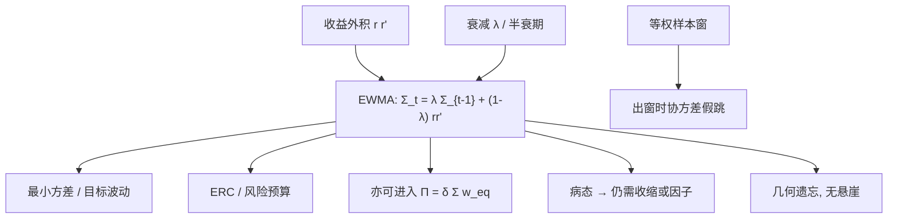

# EWMA 协方差

    
对更近的平方收益给更大权重，协方差就会跟着波动体制走；衰减因子把「多长的历史还算当前风险」收成一个数，而不必每次重切窗口。

    <footer>—— J.P. Morgan / Reuters, RiskMetrics — Technical Document, 1996</footer>

[Markowitz](/quant/markowitz) 的二次型需要一张 $\Sigma$，却不规定 $\Sigma$ 从哪来。等权样本协方差把五年前的平静期与昨天的急跌当成同一票；滚动窗口则在观测跌出窗口的那天制造一次假跳跃。RiskMetrics 的指数加权移动平均（EWMA）用单个衰减因子 $\lambda$ 给历史平方收益与交叉乘积赋权，使协方差平滑地跟踪局部波动，同时保持正定、递推、可在开盘前更新。它是组合构建里最常见的时变 $\Sigma$ 之一：最小方差、[风险平价](/quant/risk-parity)、保证金与限额，都可以把前一日的 EWMA 矩阵直接塞进二次型。本篇写递推、半衰期、与样本协方差 / [收缩](/quant/cov-shrinkage) / [DCC](/quant/dcc) 的分工，以及它为什么仍然不是一个相关模型。

## 问题

日收益的方差不是常数。1987、1998、2008、2020 的共同形状是：波动在几天内翻倍，资产间的实现相关也升高，等权五年窗却几乎不动——旧观测太多，新冲击被稀释。若优化器拿这张过时的 $\Sigma$ 去配最小方差或等风险贡献，事前风险会被系统性低估，权重来不及从高波动名字上撤下来。反过来，太短的窗口让 $\hat\Sigma$ 的特征值乱跳，[误差最大化](/quant/cov-shrinkage) 原样出现，只是噪声的频率更高。

需要一种估计器：对最近的 $r_t r_t^\top$ 敏感，对遥远历史遗忘，每期更新是 $O(N^2)$ 的秩一修正而不是重新扫一遍样本，并且输出保持对称正定，以便 $\Sigma^{-1}$ 与欧拉贡献有定义。EWMA 用几何权重回答这件事。它不估计均值的期限结构，不分离「方差动」与「相关动」，也不声称找到了数据生成过程——它是风险系统的工程默认，后来才被组合优化当成 $\Sigma_t$ 的来源。

### 等权窗口的两种失败

固定窗长 $T$ 的样本协方差有两条硬伤。第一，权重是矩形：今天与 $T$ 天前的外积贡献相同，$T+1$ 天前突然变成零。一次大跌在窗内会把 $\hat\Sigma$ 抬高很久，在它滑出窗口的那天又突然掉下来，风险报告出现无交易意义的跳。第二，$T$ 的选择把偏差与方差绑死：要跟踪体制就得缩短 $T$，要稳定特征值就得加长 $T$，没有第三个旋钮。EWMA 把矩形换成几何，遗忘是连续的，半衰期替代窗长，成为那个旋钮。

RiskMetrics 对日度建议 $\lambda=0.94$，月度 $\lambda=0.97$。对应半衰期大约 $11$ 个交易日与 $22$ 个月。这不是估计出来的「最优 $\lambda$」，是一套全球风险系统的公约数。组合优化若照搬 $0.94$，等于声明「我们只在乎最近两周的二阶结构」——对慢因子再平衡往往过短，对日内风险限额往往过长。

## 方法

零均值（日度上 RiskMetrics 的默认）的递推是

$$
\hat\Sigma_t=\lambda\hat\Sigma_{t-1}+(1-\lambda)\,r_{t-1}r_{t-1}^\top.
$$

展开即无限历史的加权和：权重 $(1-\lambda)\lambda^{k}$ 打在 $k$ 期以前的外积上，和为 $1$。若从正定的 $\hat\Sigma_0$ 出发且 $\lambda\in(0,1)$，则每一步都正定（只要尚未遇到完全共线的样本路径把质量堆进低维）。实现上 $\hat\Sigma_0$ 常用一段预热样本协方差，或单位阵乘以先验方差；预热太短，前几十天的组合权重会被初始化支配。

对角元就是各资产自己的 EWMA 方差；非对角是交叉乘积的同一套 $\lambda$。因此**所有方差与所有协方差共用一个衰减**。这比给每对相关单独建模型便宜，也比 DCC 少一次「先标准化再驱动 $R_t$」的步骤。相关由

$$
\hat\rho_{ij,t}=\frac{\hat\Sigma_{ij,t}}{\sqrt{\hat\Sigma_{ii,t}\hat\Sigma_{jj,t}}}
$$

事后读出，不是独立状态变量。波动同升时，即使交叉乘积没变，相关也会被分母拉低或拉高——EWMA 不保证你读到的 $\hat\rho_t$ 是「纯相关」。

### 半衰期、预热与缺失

半衰期 $h=\ln 2/\ln(1/\lambda)$ 是权重降到一半所需期数。报告 $\hat\Sigma_t$ 时应同时报告 $h$ 与预热长度。停牌、涨跌停、假日使 $r_{i,t}$ 缺失：用零填充会把该资产的方差向下偏，用上次收益会人为制造序列相关。较干净的做法是对该资产暂时不做秩一更新、或用同期指数收益做 beta 填充，并在文档里写清。多频率混用（美股与 A 股、期货夜盘）时，同期外积被不同步成交压低，EWMA 会低估短期交叉风险，这是 Epps 效应，不是 $\lambda$ 选错。

组合侧的用法是把 $\hat\Sigma_t$ 当作当期 [Markowitz](/quant/markowitz) 或 [ERC](/quant/erc) 的输入，而不是把 EWMA 本身当成一种配置规则。最小方差 $w_t\propto\hat\Sigma_t^{-1}\mathbf{1}$、风险平价的欧拉贡献、杠杆目标波动 $w\leftarrow w\cdot\sigma^\star/\sqrt{w^\top\hat\Sigma_t w}$，都只是下游。$\lambda$ 一改，下游权重全改；应把 $\lambda$ 当成策略参数做样本外，而不是在全样本上搜夏普。

## 机制

几何权重的机制是指数遗忘：冲击以速率 $\lambda$ 留在矩阵里，大约 $3h$ 之后对 $\hat\Sigma$ 的贡献已经很小。与等权窗相比，没有「跌出窗口」的悬崖；与 GARCH 相比，没有向无条件方差的均值回复——若波动永远不回来，EWMA 也不会把 $\hat\Sigma$ 拉回长期均值，它只是越来越信最近的外积。这在压力刚结束、真实波动已经回落时，会把风险维持在偏高水平一段时间，表现为「幽灵效应」：危机还在协方差里，市场已经平静。GARCH 的 $\omega+(a+b)$ 结构有锚，EWMA 没有锚。

对组合的影响经过 $\Sigma^{-1}$ 与贡献函数放大。$\lambda$ 较小则 $\hat\Sigma_t$ 跟着每日外积跳，最小方差权重换手大，[换手惩罚](/quant/turnover-penalty) 几乎必然要叠上去。$\lambda$ 较大则接近长窗样本协方差，跟踪体制变慢，危机中的低估回来。RiskMetrics 选 $0.94$，是在全球 VaR 系统里偏向「宁肯多报近期风险」；战略配置若用同一个 $\lambda$，会把战略权重变成战术波动目标，这通常不是投委会想要的。

EWMA 不收缩特征值。$N$ 相对有效样本（约 $1/(1-\lambda)$ 量级）仍然太大时，最小特征值可以接近零，优化器照样爆炸。正确的栈往往是：EWMA 或因子模型给出时变结构，再对 $\hat\Sigma_t$ 做 Ledoit–Wolf 一类收缩，或只把对角用 EWMA、相关用压缩后的均值。时变与收缩回答的是不同病：前者是体制，后者是维度。

### 与 DCC、已实现协方差的边界

[DCC](/quant/dcc) 先除以各自的条件波动，再让标准化残差的相关做两参数回复，因此能区分「大家都在抖」与「标准化之后更一起动」。EWMA 不能。若组合问题的关键是危机相关升高，用 EWMA 当 $\Sigma_t$ 会把波动聚类部分算进相关，最小方差可能过度远离高波动资产，却仍低估尾部同跌。[DCC 入组合](/quant/dcc-portfolio) 是下一步；EWMA 的优点是稳健、无两步准似然、停牌处理简单，适合作为风险引擎的底板。

已实现协方差用日内高频外积，信息量大于日收益 EWMA，但对微观结构噪声与不同步更敏感。日频组合、日频再平衡，EWMA 通常够用；把再平衡频率推到小时，应换已实现核或子采样，而不是把 $\lambda$ 调到 $0.5$ 假装变成高频模型。

## 边界与工程取舍

不要把 RiskMetrics 的 $\lambda=0.94$ 写成「学术最优」。不要在 $N=500$、$T$ 有效只有十几天时直接逆 EWMA 矩阵。不要用 EWMA 方差去定 CVaR 限额还假设正态：对角跟得上波动，尾巴形状它不管。均值若不用零，应先对 $r_t$ 减一个慢速均值，否则漂移会泄漏进「风险」。多空组合里，空头的收益符号要与持仓一致地进入外积，不能把价格收益的 $\Sigma$ 直接套到主动权重上而不声明是哪一套。

与 [Black-Litterman](/quant/black-litterman) 衔接时，$\Pi=\delta\Sigma w_{\mathrm{eq}}$ 里的 $\Sigma$ 若每天用 EWMA 替换，隐含超额会跟着波动跳，$\tau$ 与观点的相对权重也会被带着走。战略 BL 更常见的是用慢速风险模型；EWMA 留给战术风险预算与杠杆。两者混用必须写清哪一层用哪一张矩阵。

「EWMA 比样本协方差新」不等于「更适合优化」。优化器讨厌的是病态与换手，不是陈旧本身。一张收缩过的月度样本协方差，往往比未收缩的日度 EWMA 更适合季度再平衡的战略组合。对象是组合，不是风险报表的新鲜度。

## 小结

- RiskMetrics EWMA 用 $\hat\Sigma_t=\lambda\hat\Sigma_{t-1}+(1-\lambda)r_{t-1}r_{t-1}^\top$ 给组合提供时变协方差，几何权重替代矩形窗。
- $\lambda$ 决定半衰期；日度 $0.94$ 是风险系统公约，不是优化目标的定理最优。
- 所有方差与协方差共用衰减，不分离相关动态；危机相关升高应对照 DCC。
- 正定递推不自动解决维度病态，仍要收缩或因子结构。
- 下游是 Markowitz / ERC / 杠杆，EWMA 本身不是配置规则；$\lambda$ 要按再平衡频率做样本外。
- 出处：J.P. Morgan, *RiskMetrics — Technical Document*, 1994/1996；指数加权方差的风险实践亦见 Longerstaey 与 Zangari 同期技术说明。
