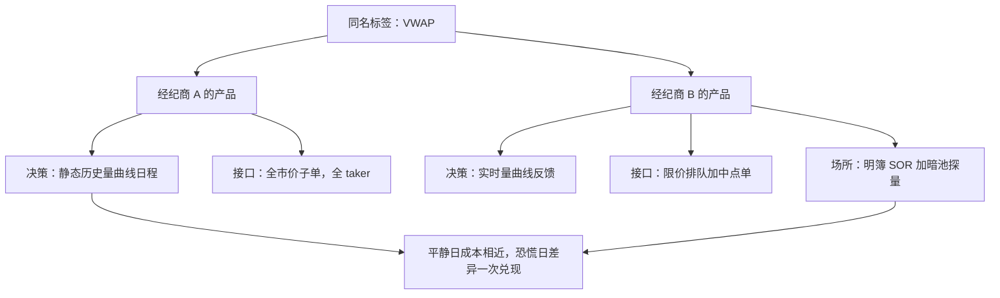
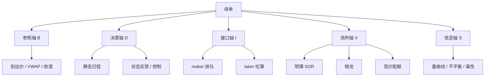

# 执行算法的谱系深钻

算法名称是销售标签，谱系是维度空间：先把「参照什么、按什么走、用什么单、去哪些场所、看哪些状态」写清楚，评价与复现才有可能。

<footer>—— 据 Harris, *Trading and Exchanges* 对执行方式与经纪商选择的论述；Kissell, *The Science of Algorithmic Trading and Portfolio Management* 整理</footer>

[上一课](/quant/mm-regulation-map)以监管义务收束做市课程：义务与限额共用引擎接口，撤单流要同时回答风险管理与监管两套语言。做市在簿的对面供给流动性；本课程换到需求侧——一张母单如何在限价簿、暗池与竞价里换成头寸而不多付钱。主干已逐个写过 [TWAP / VWAP / POV](/quant/twap-vwap-pov)、[自适应 POV](/quant/adaptive-pov)、[到达价格算法](/quant/arrival-price)与 [Cont–Kukanov–Stoikov 最优挂单](/quant/cks-optimal-placement)；缺口是谱系：经纪商名单上几十个名字，区分它们的是哪几个维度。本课立五根轴，后课沿轴深入；它不回答「哪个算法最好」。

## 问题

同一个「VWAP」标签，在两家经纪商处可以是两种产品：一家用历史量曲线加全市价子单，另一家用实时量曲线、限价排队加暗池探量。名字只覆盖其中一小段。比较 [成交后分析 TCA](/quant/tca)、审规格时，缺的不是更多名字，而是一组不变维度：任何执行算法都能被唯一定位，任何规格变更都能说成「沿哪根轴动了哪一格」。没有这组轴，算法比较的对象是标签而不是机制。

### 五根轴

参照轴：算法对什么负责——到达中点、窗口 VWAP、收盘价、或只对内部进度负责。参照决定激励：对 VWAP 负责的算法会被训练去贴量曲线，对到达价负责的算法才真正削减 [实施缺口](/quant/implementation-shortfall)。

「参照轴」翻译成小白话：算法考试用的评分标准。到达价算法的考卷是「你比下单那一刻的市场价省了多少」；VWAP 算法的考卷是「你的均价有没有跑赢全市场按成交量加权的均价」。评分标准不同，行为就不同——算法总会朝着讨好考卷的方向优化。

决策轴：速率 $v_t$ 怎么产生——静态日程、状态反馈、还是滚动最优控制。TWAP 在最左端，[Almgren–Chriss 最优执行](/quant/almgren-chriss)的闭式轨迹居中，自适应规则靠右。

接口轴：每片子单用 taker、maker 还是混合，用不用冰山与中点单。接口决定排队风险与半价差由谁承担。

场所轴：量可以到达的集合——单所明簿、多所 [智能订单路由 SOR](/quant/smart-order-routing)、加暗池、加竞价配额。

信息轴：条件集——只有量曲线；加盘口不平衡；加毒性或 [订单流不平衡 OFI](/quant/ofi-cont)；加自己的成交史。

五根轴并不正交：信息轴升级常逼着决策轴升级（有了实时毒性就得有反馈通道），接口轴又限制场所轴（中点单只在部分场所存在）。按轴逐一冻结规格，比起第五个名字有用。

## 方法

把任何算法写成五元组 $(B,\mathcal{D},\mathcal{I},\mathcal{V},\mathcal{S})$：参照 $B$、决策律 $\mathcal{D}$、接口 $\mathcal{I}$、场所集 $\mathcal{V}$、状态集 $\mathcal{S}$。成本会计给五元组配权重：参照轴决定「好」的定义与被对齐的方向；接口轴主要打半价差与排队成本，见 [买卖价差成本](/quant/spread-cost)；场所轴打展示冲击与填成概率；信息轴与决策轴合起来打时机风险——决定算法能把缺口分布收窄到什么分辨率。

主干各课是轴上的段落：TWAP / VWAP 的 $\mathcal{D}$ 是日程、$\mathcal{S}$ 只有量曲线；自适应 POV 把 $\mathcal{S}$ 扩到进度、价差与毒性，$\mathcal{D}$ 变成规则表；到达价算法改 $B$ 为 $M_0$；CKS 把 $\mathcal{I}$ 写成静态分割；SOR 展开 $\mathcal{V}$。后课分别是轴的深入：调度深化决策轴，暗池与竞价深化场所轴，TCA 深化回到参照轴与度量。

## 机制

谱系能预测行为，是因为每根轴对应一个经济对象。接口轴决定风险转移：全 taker 锁数量付价差，全 maker 省价差把完成交给队列；场所轴在「脚印」与「填成」之间换；信息轴决定条件期望的分辨率，不足时反馈会把噪声当状态。两家产品名同而轴位不同，平静日看不出差别，体制切换时分化被放大——恐慌日价差翻倍、深度撤走，接口与场所轴的差异一次兑现。轴位决定算法在极端状态下先坏在哪一格。

maker 与 taker 的分工可以类比摆摊与扫货：挂单排队像在集市摆摊等客，省下价差但要承担「客人不来」的风险——价格跑掉、单子没成；吃单像按标价立刻买走，确定性高但要付价差。接口轴就是在「等多便宜」与「立刻拿到」之间替母单做权衡。

## 边界

五根轴是描述性的，不是最优性证明；真实产品是多轴混合体，且随版本漂移。缺的轴还有：费用与返佣（maker-taker 的符号直接影响接口轴）、tick 与最小申报单位、合规硬约束（报备、撤单率上限）——应写成轴的外部条件，而不是算法参数。跨经纪商比较时，五元组必须连同版本号一起审：标签不可迁移，规格才可迁移。后续各课默认五元组已冻结在规格文档里。

常见误区：以为「VWAP 算法都差不多，挑费率便宜的就行」。同名产品可以一个用静态历史量曲线、一个用实时反馈加暗池，恐慌日的成交质量能差出一个数量级。审规格要按五元组逐轴对齐并记录版本号，而不是比价格表。

## 小结

- 执行算法的差异写成五根轴：参照、决策、接口、场所、信息；名字只覆盖标签，不覆盖行为。
- 每根轴对应一个成本对象：参照对激励，接口对价差与排队，场所对冲击与填成，信息加决策对时机风险。
- 主干各算法是轴上的段落；后课沿轴深入：调度、暗池、竞价、波动、多资产，直到度量与最优控制。
- 名字相同而轴位不同的产品在体制切换时分化最大；规格与版本必须进审计文档。
- 费用、tick 与合规约束是轴外的硬边界。
- 出处：Harris, *Trading and Exchanges*；Kissell, *The Science of Algorithmic Trading and Portfolio Management*；对照 Perold, *Journal of Portfolio Management*, 1988。
