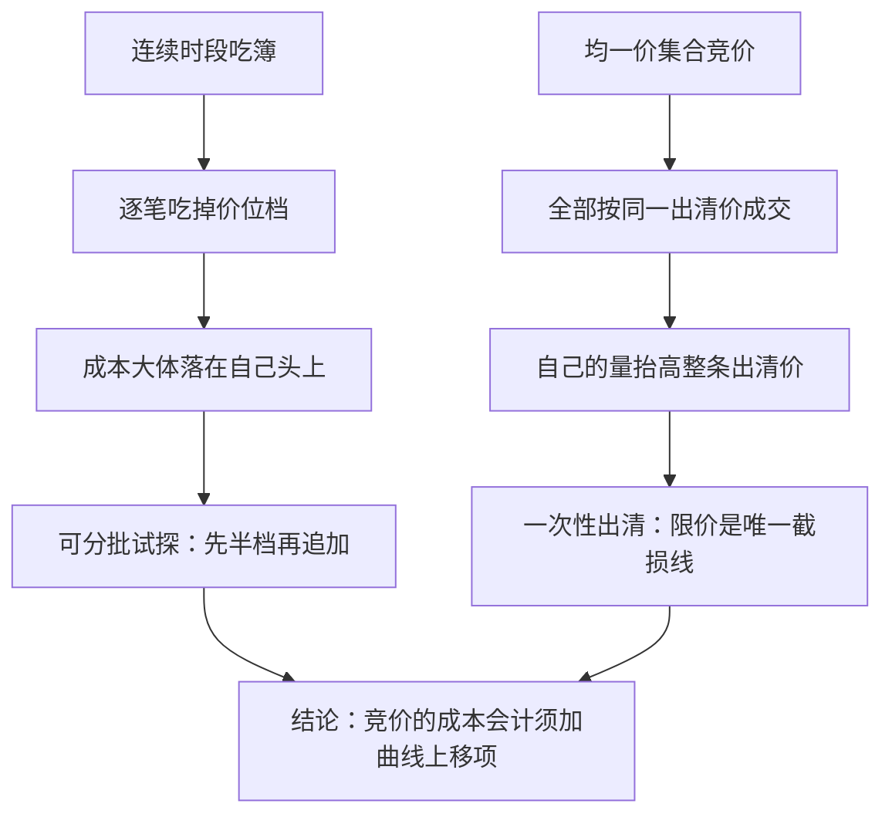
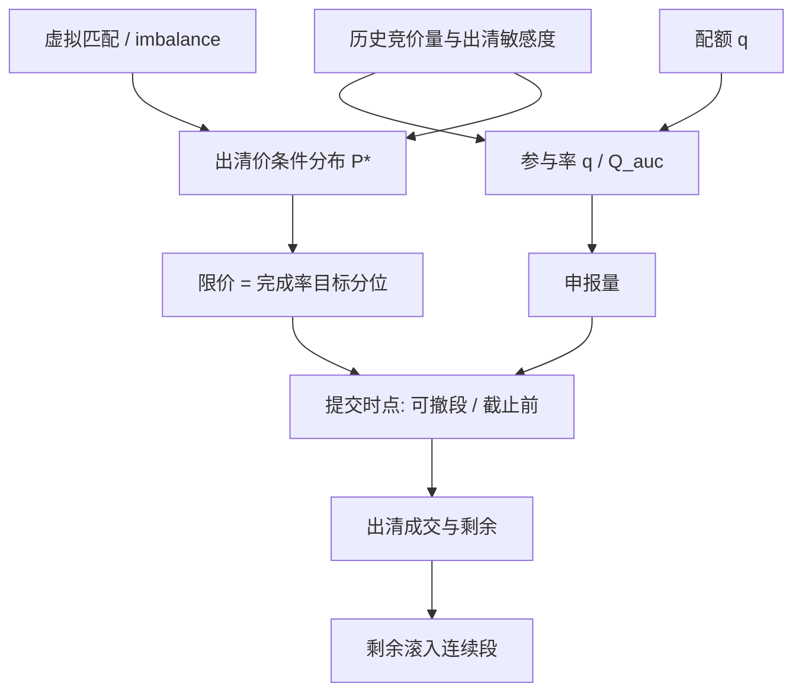

# 竞价执行

集合竞价把速率换成一份申报：量与限价在同一次出清里同时定价，执行者在一条看不见的对手曲线上选点，多买的每一单位都抬高原有单位的成交价。

<footer>—— 据《上海证券交易所交易规则（2026 年修订）》；均一价拍卖的需求削减见 Ausubel and Cramton, Demand Reduction and Inefficiency in Multi-Unit Auctions, 2002</footer>

[上一课](/quant/ex-dark-execution)处理连续时段的场所选择；集合竞价没有连续的 $v_t$，只有一次性出清。主干 [开盘/收盘竞价执行](/quant/auction-execution)写了配额——多少进开盘、连续、收盘；本课深入配额给定之后的问题：申报的**量、限价与时点**怎么定。

## 问题

配额 $q$ 给定，申报三元组待定。量：足额申报，还是留一部分视虚拟匹配追加。限价：保护价落在哪，过紧则出清价未触及而剩量，过松则为所有人抬价。时点：可撤段早报（占参考价形成的先机、也暴露意图）还是临近截止报（信息更全、但有截止拥堵）。三者共享同一个对象：对手方的累积申报曲线 $D(p)$——它决定你的边际价格。

与连续执行的根本差别是外部性结构。连续吃簿逐笔付走档，成本大体落在自己头上；均一价出清里，你的每一单位都按同一条出清价成交，而你的存在推高这条线。把竞价当「免费收盘深度」，成本会计就漏了曲线上移的项。

均一价竞价的外部性可以类比拼车计价：所有人按同一辆车价分摊，你临时多带一件大行李，整车的价钱就被抬高，先上车的人也要跟着多付。连续吃簿则是按件买——多买的每件只影响自己。所以「多申报一单位」的真实成本在竞价里是全量的价格上移，不只是边际那一件。

### 从虚拟匹配到曲线估计

A 股开盘可撤段与收盘竞价披露虚拟匹配价与匹配量；美股开盘、收盘拍卖有 imbalance feed。这些是曲线的粗观测：少数几个价位，且可被申报操纵。执行者估的不是完整 $D(p)$，而是两个标量：预期竞价量 $Q_{\mathrm{auc}}$（把配额换算成真实参与率）与出清价对量的敏感度 $\lambda_{\mathrm{auc}}$——用历史竞价的量价变化回归，指数调整日单独分层，见 [指数调入调出](/quant/index-rebalance) 与 [竞价阶段的微观结构](/quant/obd-auction-microstructure)。

均一价拍卖不是真实披露机制：虚报不影响成交价时可抑制竞争，需求削减文献因此建议压低申报。执行端不玩这个博弈，但须知自己的限价既是价格保护，也是出清价的形成输入。

## 方法

量的决定：配额换算成占预期竞价量的比例 $q/Q_{\mathrm{auc}}$，与连续 [参与率封顶](/quant/participation-cap) 分开设限；被动流占高的日子对手曲线陡，应下调。限价的决定：对买入，限价 $L$ 的期望成本是「出清价 $\le L$ 的条件成本」加「未成交滚入连续段的机会成本」；选 $L$ 是在完成率分布上取分位：给出清价建条件分布 $P(P^*\le L\mid \text{虚拟匹配}, \text{当日状态})$，把 $L$ 定在目标完成率的分位上，而不是习惯性贴涨停或市价。

数字感受限价分位：若出清价条件分布显示中位数 20.08 元、90% 分位 20.15 元，买单限价设在 20.15 意味着十次里约九次全额成交，偶尔为最后 10% 的完成率付偏贵的出清价；贴到 20.08 则约一半概率剩量滚入连续段补齐。限价就是把完成率与价格保护各放在哪个分位的选择。

时点的决定：可撤段早报参与参考价形成、信号价值高，但暴露后可被后至申报针对；临近截止报吃截止拥堵。规则化：固定提交时点或分批比例，写进规格，不许盘中临时改。收盘腿的量若因不平衡调整，只作用于**尚未承诺**的量。

## 机制

为什么限价保护在竞价里比连续里更重要：出清是一次性事件，没有「先试探半档」的机会，限价是唯一的截损线；限价过紧的代价以出清价分布左尾出现——出清价恰好越过保护价时，你整段错过那次出清，剩余量在连续段以更差条件补齐。完成率与价格保护是同一分布的两个分位。

拥挤改变曲线斜率：指数纳入日、期货交割日，对手曲线由被动与申赎流构成，弹性低，$\lambda_{\mathrm{auc}}$ 数倍于平常日；校准于普通日的规则会低估成本。这也是参与率要用当日预测量做分母的原因。

## 边界

各市场出清规则不同：A 股分段可撤与价格笼子、美股 MOC/LOC 的截止窗口、随机结束的拍卖，参数不可复制。虚拟匹配是可被操纵的公开信号，押注「不平衡持续到出清」是博弈而非执行。涨跌停锁定日对手曲线可能整体消失，应允许放弃并记录制度未完成。多数标的一日只有两次竞价观测，曲线估计方差极大；申报与成交日志是唯一可回放的凭证。

常见误区：把 imbalance feed 的不平衡量当成可靠的对手曲线。这个公开信号可被申报者故意做大来诱导对手，收盘前还会合法变动。直接拿它当 $Q_{\mathrm{auc}}$ 用，等于按对手希望你看到的地图开车；正确用法是回归校准 $\lambda_{\mathrm{auc}}$ 并对信号打折。

## 小结

- 配额给定后，竞价执行是申报三元组：量、限价、时点，对象是对手方申报曲线。
- 均一价出清的边际成本含外部性：你的量抬高所有人的成交价。
- 限价是完成率分布上的分位选择；出清价条件分布靠虚拟匹配与历史分层估计。
- 参与率用当日预测竞价量做分母；被动流占高的日子曲线更陡，配额下调。
- 提交时点规则化，信息调整只作用于未承诺的量。
- 出处：《上海证券交易所交易规则（2026 年修订）》；Ausubel and Cramton, 2002；竞价微观结构见 Cont 等对拍卖阶段的实证。
