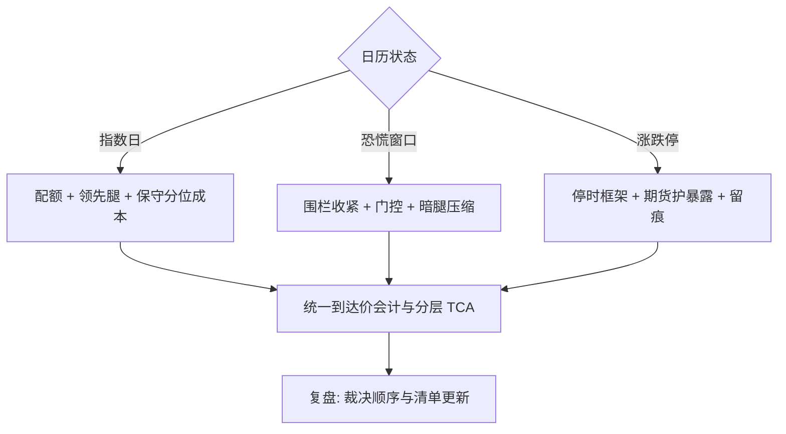

# 执行案例与收束

案例是把参数表放回日历里：同一个算法，在指数日、恐慌日与涨跌停日是三种产品；执行的学问不在公式的深度，而在状态识别与规则的前置。

<footer>—— 据 Harris, *Trading and Exchanges* 对执行实务的论述与本课程各课口径整理</footer>

[上一课](/quant/ex-optimal-conversion-deep)把最优转换收在「最优只对声明的目标与约束成立」；本课程到此收束。收束前用三个案例把各课的维度放回日历——每个案例都是前面若干课的一次合演，也是一张可自查的清单。

## 问题

单看任何一课的规则，落地时都会遇到「多条规则同时触发」的时刻：调度要加速、毒性门控要减速、风险预算要前倾、合规要留痕。案例的价值不在故事，在冲突的裁决顺序：两条规则指向相反动作时，哪条让路。三个案例代表三类常见冲突——收益与拥挤、速度与恐惧、制度与模型。

### 案例一：指数纳入日

公告后两周，纳入生效日的收盘竞价集中了跟踪组合的强制买盘。合演的各课：配额提前锁定，收盘腿按 [竞价执行](/quant/ex-auction-execution) 用预测竞价量做分母，虚拟匹配只调整未承诺量；期货做领先腿拿到暴露，再按 [多资产执行](/quant/ex-multiasset) 的兑换节奏换回篮子，基差偏离持有成本时放缓；成分股的连续段用 [到达价格算法](/quant/arrival-price) 前倾但封参与率——所有人都知道这天有同向流，[成本预测模型](/quant/ex-cost-forecast) 校准于普通日的 $\eta$ 会低估，保守分位上调。事后 TCA 按「指数日」单独成层，不进常规均值。

### 案例二：宏观数据日的恐慌窗口

CPI 或议息公布后五分钟，价差翻倍、深度撤走。合演：[波动执行的专门问题](/quant/ex-vol-execution) 的状态触发切到预登记参数——价差围栏收紧、参与上限下调；[子单调度的深化](/quant/ex-slice-scheduling-deep) 的毒性门控压住追赶冲动，deadline 策略接管剩余量；暗腿按 [暗池执行](/quant/ex-dark-execution) 的漂移传感器压缩份额，避免把暴露留给柠檬时刻。裁决顺序在此显形：完成率让位于价格保护——恐慌日少完成的部分是机会成本，穿过五档的部分是永久成本。

### 案例三：A 股涨跌停与撤单率

持仓组合里的名字封板，卖不出；程序化报备与撤单率监控约束改单频率。合演：触板是吸收态，[最优转换的深化](/quant/ex-optimal-conversion-deep) 的带停时框架接管——排队等开板或顺延次日，不可执行记成制度未完成而不是算法失败，见 [涨跌停与流动性黑洞](/quant/cn-limit-liquidity-hole)；防御性撤单按 [差异化收费与撤单率监控](/quant/cn-fee-cancel-ratio) 留痕；对冲腿走期货维持 [多资产执行](/quant/ex-multiasset) 的暴露带，现货腿等开板。硬件层保证状态机不因行情风暴丢回执，见 [硬件与执行](/quant/ex-hardware)。

三个案例共用一张裁决表：价格保护优先于完成率，制度约束优先于模型最优，留痕义务优先于参数自由。顺序写进状态机，而不是留给临场判断。

## 方法

把案例沉淀为清单，交接与复盘都过一遍：参照价与锁定时点；完成政策与放弃权限；分层口径（体制、日期类型）；参数的冻结清单与触发清单；对冲与同步约束；合规留痕。清单对应本课程的轴：谱系给维度，调度给修正，暗池与竞价给场所，波动与多资产给状态，TCA 给度量，硬件给预算，成本模型给事前，最优转换给控制。十一个课名就是清单的十一个格子。

## 机制

这套案例方法为什么有效：三个案例把「多条规则同时触发」的冲突提前搬上桌面，裁决顺序写成事前合同而不是临场判断——压力状态下执行者不缺规则，缺的是哪条让路的既定答案。清单能沉淀，是因为每个格子都挂着一门课的验收口径，案例只是把这些口径放进日历里互相牵制；复盘遇到裁决不了的新冲突，说明清单缺格，补格的动作本身构成课程与实战之间的反馈回路。

## 边界

案例不可复制为参数：换市场、换品种、换规模，数字全部重估，可迁移的只有裁决顺序与清单结构。案例复盘存在幸存者偏差——写下来的多是处理成功的，失败案例按研究复盘的同模板归档才可检索。重申全课程的边界：执行是成本的工程，不是收益的来源；它把 alpha 完整地从决策送到持仓，而不是制造 alpha。把 TCA 的负滑点当策略，是把度量噪声当生产函数。
## 小结

- 案例的价值在冲突裁决顺序：价格保护优先于完成率，制度约束优先于模型最优，留痕优先于参数自由。
- 指数日：配额、领先腿与保守分位成本合演；事后按日期类型单独分层。
- 恐慌窗口：预登记触发、毒性门控、暗腿压缩；少完成是机会成本，穿五档是永久成本。
- 涨跌停：吸收态加带停时的转换，期货护暴露，不可执行记成制度未完成。
- 沉淀物是一张十一个格子的清单：谱系、调度、场所、状态、度量、硬件、事前、控制。
- 执行把 alpha 完整地从决策送到持仓，不制造 alpha；本课程到此收束。
- 出处：Harris, *Trading and Exchanges*；Perold, *Journal of Portfolio Management*, 1988；各课口径见本课程对应链接。
