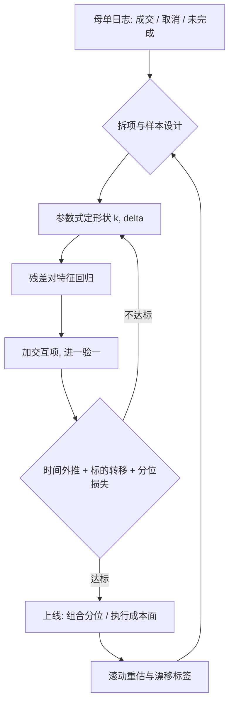

# 成本预测模型

事前成本模型是一张条件期望表：给定单与市场的特征，预测缺口的分布；它回答参数怎么设、该不该交易，不保证市场配合。

<footer>—— 据 Almgren, Thum, Hauptmann and Li, Direct Estimation of Equity Market Impact, Risk, 2005；Kissell and Glantz, Optimal Trading Strategies 整理</footer>

[上一课](/quant/ex-hardware)给了执行栈的预算表；回到模型侧。主干 [执行成本预测](/quant/execution-cost-forecast-cap)写了模型与组合层的接口：边际 alpha 对边际成本、保守分位进决策。本课深入模型本身的构造：特征怎么选、样本怎么定、怎么验证、怎么跟着体制更新——当一个要维护的计量产品来写。

## 问题

单一 $\eta$ 太粗。成本在截面上随价差、波动、市值、参与率变化，在时序上随体制、费用、tick 规则变化；同一条「大单」在恐慌日与平静日是不同的成本对象。用途也决定规格：给组合层，要期望与上分位；给执行层，要条件于当日状态的成本面，选 $\kappa$ 与参与率上限；给容量研究，要外推可控。一个规格服务三个用途必然失真——先问模型为谁而建。

数据侧的坑：样本只有自己的成交（幸存于「当初愿意交易」）；已取消母单缺席；冲击与时机在实现缺口里混在一起，见 [滑点归因](/quant/slippage-attribution) 与 [成交后分析 TCA](/quant/tca) 的拆项。

### 规格：从参数式到特征式

参数式基准：每股成本 $= s/2 + k\,\sigma\,(q/\mathrm{ADV})^{\delta}$ 加调整项，形状来自 [线性与平方根冲击](/quant/sqrt-impact) 的理论，参数用横截面回归估——Almgren 等人 2005 的做法：对大量母单的已实现每股缺口，就事前特征（参与率、波动、价差、动量、日内位置）回归，$k$ 与 $\delta$ 由数据说话。特征式延伸：树模型或加交互项的线性模型，捕捉「价差宽且动量逆向」的联合效应。参数式外推可解释、可进优化器；特征式拟合好但外推危险，校准域边界要记录。

成本分布右偏且被涨跌停截断：均值受少数大缺口主导，最小二乘拟合均值会被尾部牵着走。常用做法是对数或分位回归，报告的中位数与 95 分位比均值更接近各用途的真实需要。

## 方法

样本设计：按事前特征分层抽样并保留取消母单的记录（未成交损失按对照收益定价）；制度日（指数日、涨跌停日）剔除或单独建模。估计：先用参数式定形状，再用残差对特征回归找遗漏；交互项一次只加一组，进一个、验一个。验证：按时间外推（截止前拟合、其后检验），按标的转移（小市值上学的规则去中盘股检验）；损失用分位损失而非仅 RMSE。监控：滚动重估，$k$、$\delta$ 与截距的漂移单独画图，费用与 tick 规则变更日打标签。

## 机制

为什么形状是 $\sigma\,(q/\mathrm{ADV})^{\delta}$：提供流动性的一方承担存货与逆向选择风险，补偿随波动与所需时间放大；$\delta\approx 1/2$ 的凹性来自冲击随参与率次线性增长的经验规律。均值拟合为什么不够：调度层的 $\lambda$ 映射方差与分位（[子单调度的深化](/quant/ex-slice-scheduling-deep) 的增益、[波动执行的专门问题](/quant/ex-vol-execution) 的体制触发），组合层用保守分位——消费的都是分布。

反馈回路是维护的核心机制：模型进了优化器，流量随之改变（贵名字被回避、参与率被压平），下一期校准样本不再是市场代表性样本，而是被自己策略过滤后的样本；$\eta$ 的漂移有两个来源——市场变了、自己变了。区分办法是留一部分不经模型干预的对照流量。

## 边界

外推是边界的第一条：校准域内插值可信，参与率或市值超出样本后，平方根外推只是低估值而非保证，容量结论要走 [容量与参与率](/quant/capacity-participation) 的分层 TCA。制度截断是第二条：涨跌停使分布被截断而不是延长，把不可执行当昂贵会误判。永久与临时的拆分依赖事后窗口选择，见 [瞬时冲击与永久冲击](/quant/temp-perm-impact)，窗口规则不冻结则不可复现。分工上：模型管事前；事后归因走 [成交后分析 TCA](/quant/tca) 的口径——两套数字必须同源校准，否则「模型说 5、实绩 12」吵不出是模型错还是执行错。

## 小结

- 模型先问用途：组合层要分位、执行层要条件成本面、容量研究要可控外推。
- 参数式定形状、特征式补残差；交互项进一验一，校准域边界要记录。
- 成本分布右偏且被涨跌停截断：对数或分位回归，报告中位数与高分位。
- 验证按时间外推、按标的转移，损失用分位损失；规则变更日打标。
- 模型进优化器会改变流量，校准样本被自己过滤；区分市场变了与自己变了。
- 与 TCA 同源校准、口径互补：模型管事前，TCA 管事后。
- 出处：Almgren, Thum, Hauptmann and Li, *Risk*, 2005；Kissell and Glantz, *Optimal Trading Strategies*；冲击形状见主干冲击课程。
