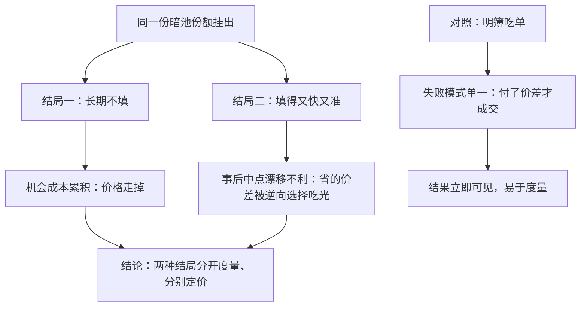
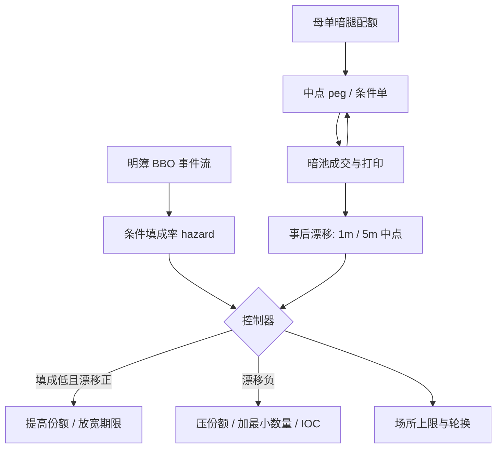

# 暗池执行

暗处的成交省下展示的脚印，代价是把成交时机交给别人定价：填成概率与事后漂移是暗腿的两个传感器，缺一个，暗池只是信仰。

<footer>—— 据 Zhu, Do Dark Pools Harm Price Discovery?, Review of Financial Studies, 2014；Buti, Rindi and Werner 对暗池流动性的研究整理</footer>

[上一课](/quant/ex-slice-scheduling-deep)把调度写成闭环控制，但状态变量全部来自明簿。主干 [暗池、ATS 与中点单](/quant/dark-pool-midpoint)讲了匹配协议，[暗池路由](/quant/dark-pool-routing)讲了分多少比例去暗处；本课深入执行端的暗腿工程：中点单怎么挂、填成怎么预测、毒性怎么按场所测、何时撤。

## 问题

暗腿与明腿的误差结构不同。明簿的失败模式是「付了价差才成交」，结果立即可见；暗池的失败模式是「没成交」或「成交即被逆向选择」：中点单只在公开对侧报价被吃掉时成交，成交事件与对手方的信息优势相关——你买到的，常是明市即将下跌前卖给你的人。同一份暗池份额于是呈现两种极端：长期不填，机会成本累积；或填得又快又准，事后中点漂移把价差节省吃光。问题是怎么把两种结局分开度量、分别定价。

中点单还有一层时变性：它锚在公开 BBO 上，价差每一跳、每次刷新都在改写你的实际挂价与队列位置。挂出去不动，不等于价格不动。

「中点单」翻译成小白话：把单子藏起来，价格定成公开市场买一卖一的正中间，不展示在任何人可见的盘口上，等对面有人愿意按这个价成交时再匿名配对。好处是不暴露意图、省半个价差；代价是只能等，而且不知道谁在跟你成交。

### 暗腿的规格维度

单型：中点 peg、对侧最优 peg、参考价改善；可加最小数量与有效期。条件性：IOC 条件单在多场所同时试探、任一处成交即撤其余，用即时性换暴露时间。撤单策略：peg 需跟随 BBO 重挂，跟随延迟就是过期报价窗口。配额：场所级上限与轮换，见 [暗池路由](/quant/dark-pool-routing) 的质量表。

暗池填成概率不是场所常数，而是明簿状态的函数：价差收窄、买盘堆积时，对侧被吃的概率与你的逆向选择概率同升。把暗池成交率当成场所固有的「流动性评分」，会在体制切换时选错场所。

## 方法

两个传感器，一个控制器。传感器一，条件填成率：对每个场所估计 hazard——给定明簿事件（价差触及、对侧挂量消耗、不平衡），暗单成交的条件概率，方法与 [成交概率](/quant/fill-probability) 同族，事件来自对侧明簿。传感器二，事后漂移：成交后 1 分钟、5 分钟的中点相对成交价的运动，买入后下跌说明省下的价差被逆向选择吃掉；这是 [有效价差与实现价差](/quant/effective-realized-spread) 在单场所上的应用。

控制器：暗腿份额由两个传感器在线修正——填成率低于基准且漂移为正，提高份额；漂移为负，压份额、缩有效期、加最小数量门槛。波动升高或临近事件时，无条件挂单的暴露时间变贵，改用 IOC 条件单或回明簿。阈值进规格文档，与 [滑点归因](/quant/slippage-attribution) 的场所科目对齐。

常见误区：按历史成交率给暗池排名。填成率是明簿状态的函数：平静日价差窄、暗池填得多；恐慌日对手撤回明簿，暗池先干涸。排名靠前的场所在你最需要流动性的时候恰恰最不可靠，应按「条件于当日状态」的 hazard 动态分配，而不是按场所固定评分。

## 机制

中点协议的经济：省半价差、零展示，付出等待与柠檬折价。Zhu 的模型指出知情者偏好暗处，暗池份额上升会侵蚀价格发现；对执行者的含义是柠檬折价随份额与信息事件密度上升，常数折价假设失效。条件单改变期权结构：无条件中点单相当于送给对手方一份「按你方向成交」的期权；IOC 加最小数量抬高行权门槛，用暴露时间换信息保护。探测（对手方在明簿交替挂撤以试探暗池存量）之所以有效，正因为无条件 peg 存在；防御靠随机化尺寸、最小数量与条件标记，而不是反向对敲——后者越过红线。

「无条件挂单等于送出方向性期权」可以类比：在旧货市场挂一块「愿按均价整批收购」的牌子——只有认为自己手里的货不值这个价的人才来找你，知情交易者正是这样挑暗池下单的。IOC 加最小数量相当于把牌子改成「整批才收、限时有效」，把捡漏者挡在门外。

暗腿与调度层的接口：暗池成交的打印延迟使 [进度误差](/quant/ex-slice-scheduling-deep) 被高估；控制器应把暗腿在途量单独建账。

## 边界

A 股没有美股式 ATS：对应的大宗交易与盘后固定价格交易在时段、价格限制与披露上都不同，参数不可翻译。暗池数据自报、打印滞后，场所间比较必须同时窗口化。份额过高会反噬中点锚本身——公开簿变薄，锚的质量下降，见 [暗池、ATS 与中点单](/quant/dark-pool-midpoint)。最优执行义务要求暗腿规则可解释：为什么此处、为何此时、省了多少，答不出就退回明簿。

## 小结

- 暗腿的两个传感器是条件填成率与事后漂移；只看成交率会选错场所。
- 中点单锚在 BBO 上，peg 跟随延迟就是过期报价窗口。
- 无条件挂单等于送出方向性期权；IOC 与最小数量用暴露时间换保护。
- 暗池折价随份额与信息事件密度上升，常数折价假设失效。
- 暗腿打印延迟会低估调度进度，须单独建账保守计入。
- A 股无 ATS，对应机制是大宗与盘后固定价格，参数不可翻译。
- 出处：Zhu, *RFS*, 2014；Buti, Rindi and Werner 的暗池研究；价差口径见 Hasbrouck 的微观结构计量。
