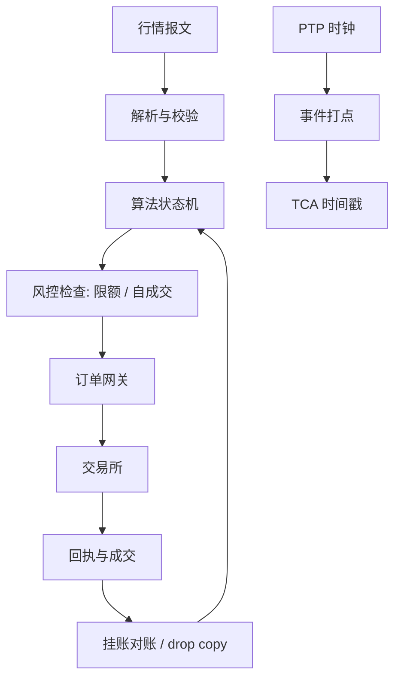

# 硬件与执行

执行栈的延迟不是竞赛成绩，是预算表：每个算法按状态更新周期领取毫秒与微秒；超预算的后果不是慢，是决策用了过期的状态。

<footer>—— 据 Budish, Cramton and Shim, The High-Frequency Trading Arms Race, Quarterly Journal of Economics, 2015；交易系统实务整理</footer>

[上一课](/quant/ex-tca-deep-pitfalls)的结论是度量分辨率受时间戳与时钟同步限制；镜头再往里推一层就是执行栈本身。主干 [主机托管与微波](/quant/colocation-microwave)写了物理层，[延迟预算](/quant/latency-budget)写了通用分解；本课从执行算法的视角写硬件：哪些环节要预算、多少、可靠性为何比速度重要。A 股托管受公平接入约束。

## 问题

执行算法是状态机：状态来自行情事件，动作用于订单事件。状态过期，决策就错——用上一拍的 BBO 决定是否吃簿，可能在价格移走后把单送进薄簿；中点 peg 的重挂延迟，让暗池里挂着按旧中点成交的单。延迟的执行学定义是：**事件发生到动作生效之间，状态变化未被计入的概率**。可靠性更硬：重复下单、丢单、且回执，任何一次都是事故。问题是怎么给流水线分配预算并让故障有界。

### 预算分配与算法类型挂钩

预算跟着算法的状态更新周期走。跑几小时的 VWAP 日程，决策周期是秒到分钟，几百毫秒的栈延迟无关紧要；流动性寻求类算法要抢盘口事件先行权，毫秒级；排队敏感的 maker 执行要微秒级。把 FPGA 与内核旁路（见 [低延迟工程：内核旁路与 FPGA](/quant/low-latency-engineering)）装到不需要它的算法上是错配。分解沿用 [延迟预算](/quant/latency-budget) 的口径：行情解析、策略、风控、网关、线路，每段设 p99 目标——尾延迟才是丢队位的来源。

评估延迟改善要用算法语言：maker 执行的期望损失近似为「队位丢失概率 × 半价差节省」。延迟从 5 毫秒降到 1 毫秒，只在丢队位概率对延迟敏感的标的与时段有价值；平静的大盘股上收益常常不到十分之一基点。

## 方法

可靠性设计先于提速。订单状态机单写者、全量序号，回执与订单一一挂账；定时对账 drop copy，未确认订单限时重查；断线即撤与速率上限是交易所侧的最后防线；杀单开关按母单、账户两级预设。行情侧：解析与业务逻辑分离，坏包丢弃并计数。时钟：全网 PTP 同步，打点统一到网关出口，保证 [成交后分析 TCA](/quant/tca) 时间戳可比。测试：延迟回归进 CI，用录制行情与回执回放，报告 p50/p99/p999。

预算的经济学：把预算花在「状态最容易过期」的段——通常是行情解析与网关排队。队列堆积的丢包与乱序比稳态延迟更伤，按恐慌日峰值流量设计。

## 机制

延迟转化为成本的核心机制是逆向选择：你反应慢，先看到信息的人已经动了价格，被动单被挑走或主动单吃在旧价上；[延迟套利](/quant/latency-arbitrage) 描述的正是把他人延迟变成利润的一侧。执行端关心镜像：延迟让执行算法站在被挑走的一边。Budish 等人把速度军备竞赛写成对高频信息的租金竞争，执行算法不必参赛，但必须知道自己交了多少「过时税」。可靠性机制则是尾部：重复下单的损失是库存错误量级，风控检查段不可裁剪——那是把尾部从执行账搬进风险账。

A 股的制度层压缩了速度竞争：[托管清退与整改](/quant/cn-colocation-rectify)后，公平接入是硬约束，参数空间里没有「用微秒换利润」的维度，工程重点是稳定性、报备与撤单率可控，见 [差异化收费与撤单率监控](/quant/cn-fee-cancel-ratio)。

## 边界

延迟测量只在生产上有意义：回放的栈延迟与生产的热身状态、中断聚合、队列竞争不同，跨环境比较要声明条件。收益估计依赖队位模型，模型错则方向错。不要把硬件升级当执行质量的替代：日程、路由、价格保护做错，提速只是更快地执行错误。合规是硬边界：报备的接口与撤单率约束限制高频改单能力，A 股尤其如此。成本核算：托管与专用硬件是固定成本，说不清回报的延迟投资按治理规则否决。

## 小结

- 延迟的执行学定义是状态过期概率：预算按状态更新周期分配，看 p99 不看均值。
- VWAP 日程要秒级，流动性寻求要毫秒级，排队敏感要微秒级；错配是浪费或事故。
- 可靠性先于速度：单写者状态机、drop copy 对账、断线即撤、杀单开关是底线。
- 延迟转化为成本的机制是被逆向选择的一侧；风控检查段不可裁剪。
- A 股公平接入约束压缩了速度竞争，工程重点转向稳定与合规。
- 出处：Budish, Cramton and Shim, *QJE*, 2015；延迟预算与低延迟工程见主干对应课程。
