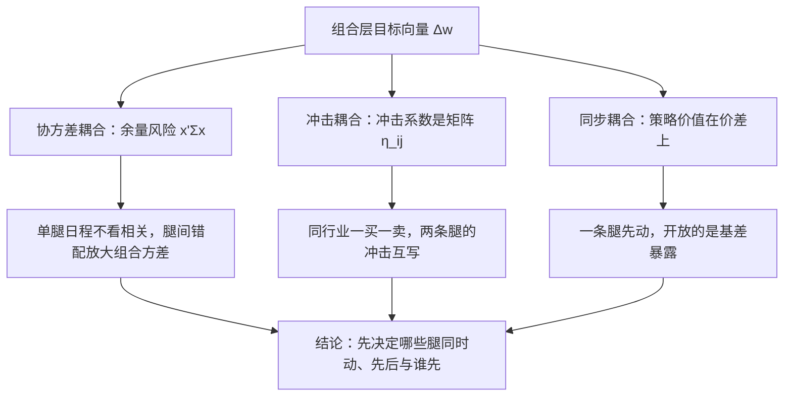
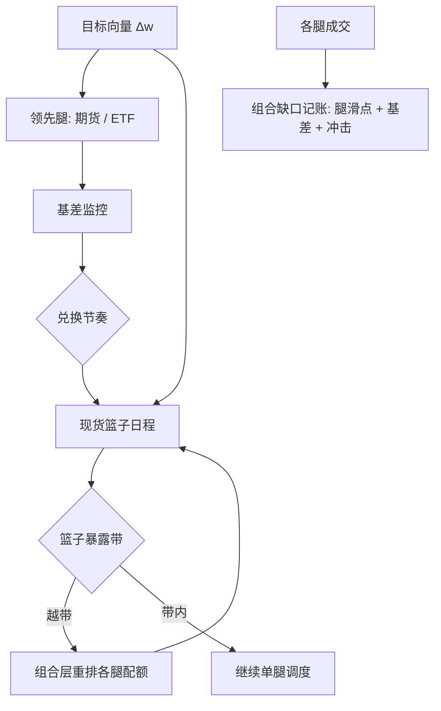

# 多资产执行

篮子执行把速度问题变成同步问题：每条腿各自最优的轨迹加总，可以比一条次优但同步的轨迹贵得多。

<footer>—— 据 Almgren and Chriss, Optimal Execution of Portfolio Transactions, Journal of Risk, 2000/2001 多资产扩展；指数再平衡与 ETF 实务整理</footer>

[上一课](/quant/ex-vol-execution)把体制切换写进单标的算法；组合的世界里母单不是数而是向量：调仓篮子、对冲腿、货币腿与展期。主干各执行课都隐含「其他腿给定」，本课解开来：腿间怎么排程、怎么记账、风险怎么换形。

## 问题

组合层给出目标向量 $\Delta w$，执行层面对三重耦合。协方差耦合：余量风险是 $x_t^\top \Sigma x_t$，单标的日程不看相关性，组合方差被腿间错配放大。冲击耦合：冲击系数是矩阵 $\eta_{ij}$，卖 A 的同时买同行业的 B，两条腿的冲击互写；对角近似在相关腿上算错。同步耦合：多腿策略（配对、指数套利、期现替换）的价值在价差上，一条腿先动，开放的是基差暴露而非单边暴露，见 [指数套利](/quant/index-arb)。

第一句话是：哪些腿必须同时动、哪些可以先后动、先动哪条。这不是调度细节，是风险在价格、基差、冲击之间的分配决定。

### 领先腿与兑换

流动性组合常用领先腿策略：先用流动性最好的工具（股指期货、ETF）拿到方向暴露，再把期货头寸逐步「兑换」成现金篮子。期货腿即时完成，付基差与展期成本，见 [股指期货基差与对冲成本](/quant/cn-index-basis-hedge-cost)；现货篮子按日程摊开，付冲击。兑换节奏由基差与冲击的相对价格决定：基差偏离持有成本时放缓，冲击便宜时加快。ETF 申赎是另一条通道：用成分股篮子换份额，几百条腿的执行换成一次创建，代价是篮子清单、现金差额与费用。

同步约束应写成余量暴露的容忍带，而不是「腿必须同秒完成」：例如篮子剩余净暴露不超过目标的 $x\%$ 且存活不超过 $n$ 分钟。带宽由基差波动与均值回复定，不由愿望定。

领先腿与兑换可以类比搬家：先租一个小仓库，当天把全部家具放进去（期货先拿方向暴露），之后一个月分批搬进新家（现货篮子摊开执行）。仓库费是基差与展期成本，搬运的折腾是冲击成本——租多久、搬多快，看两种费用的相对价格。

## 方法

状态向量 $x_t$（各腿剩余库存）与组合层控制：每周期解一个小型多资产 AC——目标含 $x^\top \Sigma x$ 与冲击项，约束含每腿参与率与篮子暴露带。工程上是分层：组合层管暴露带与兑换节奏（分钟到小时），单腿层沿用已写的调度与接口，两层用同一份 [到达价](/quant/arrival-price) 会计。记账规则事先写死：对冲腿滑点记入**组合缺口**，不许藏进「股票腿执行得很好」；兑换中的基差损益单独列，见 [滑点归因](/quant/slippage-attribution) 的科目表。

特殊腿：货币腿先轧差再执行残余；展期按 [展期成交量与持仓](/quant/roll-volume-oi) 的集中度排程；借券受限的空头腿要先确认可得性。

## 机制

同步策略的本质是风险的换形：把窗口内的价格波动风险换成基差风险。交换划不划算，取决于基差相对价格的波动与回复性——期货基差在到期前有锚，价格没有；所以期货做领先腿在多数再平衡窗口里占优。但对角化模型在两处机制性失效：相关矩阵在恐慌日向单位阵坍缩（[波动执行的专门问题](/quant/ex-vol-execution) 的同步性放大器在组合里更强），「分散化」是幻觉；冲击交叉项在内部化时可正可负，双向腿轧差的节省不该重复计费。

内生性同样存在：指数纳入日所有跟踪组合执行同一个篮子，对手曲线里有大量同向算法流；[到达价格算法](/quant/arrival-price) 的拥挤警告在篮子层表现为：平静日校准的 $\eta$ 低估指数日冲击。

数字感受「风险的换形」：股指期货到期日被现金交割机制锚定，基差偏离持有成本后会收敛；股票价格没有锚。现货篮子要执行 30 分钟，期货领先腿在这 30 分钟里承担的是基差波动——通常远小于同窗口的价格波动。换腿不是为了快，是为了把不可控的价格风险换成有锚的基差风险。

## 边界

交易时段与制度错位是硬边界：个股停牌而期货在动，基差带失去意义，剩余腿按新现实重排；T+1 约束当日买入不可回转，多空腿的现金与券源按 [T+1 与回转交易约束](/quant/cn-tplus1) 预排；保证金占用约束期货腿规模。协方差与冲击矩阵都是估计量，样本外漂移快。评价上组合缺口是唯一加总口径：分腿跑赢各自的 VWAP 而篮子被价差打穿，TCA 必须显性报告为同步成本。

常见误区：各腿单独看 TCA 都「跑赢 VWAP」就认为执行成功。若股票腿与期货腿错开 20 分钟，篮子在错配窗口里吃进基差波动——分腿成绩单各自好看，组合缺口却劣化。加总口径只有组合缺口，同步成本必须显性列示。

## 小结

- 多资产执行的三重耦合：协方差、冲击交叉项、腿间同步；单腿最优的加总不是组合最优。
- 领先腿—兑换结构把价格风险换成有锚的基差风险，节奏由基差与冲击的相对价格定。
- 同步约束写成暴露容忍带，带宽由基差波动定。
- 对冲腿滑点记入组合缺口；基差损益与冲击、时机分科目。
- 恐慌日协方差坍缩使对角模型失效；指数日对手曲线含同向流。
- 时段错位、T+1、保证金与借券可得性是硬约束，先于日程确认。
- 出处：Almgren and Chriss, *Journal of Risk*, 2000/2001；基差与对冲成本口径见股指期货章节；Perold 的实施缺口为记账基准。
