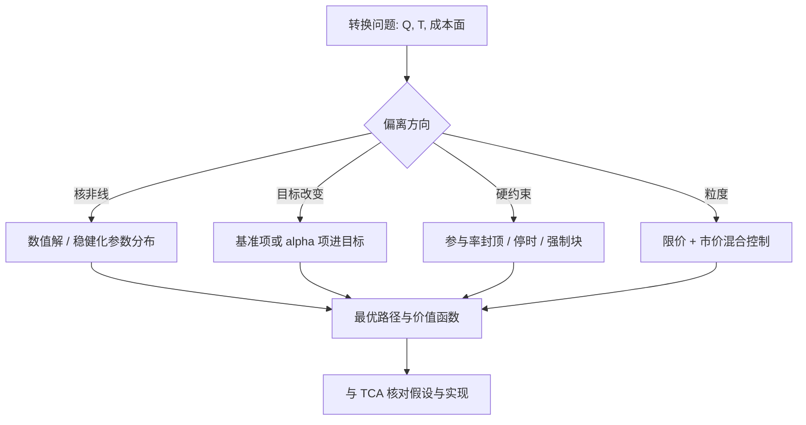

# 最优转换的深化

线性冲击给闭式解，闭式解给直觉；真实问题在其上做三件事：换核、换目标、加约束——每做一件，确定性等价就失效一分。

<footer>—— 据 Gatheral and Schied 对执行问题的动态规划论述；Obizhaeva and Wang, Journal of Finance, 2013；Guilbaud and Pham, 2012 整理</footer>

[上一课](/quant/ex-cost-forecast)给了成本的条件分布；最优转换问题问：给定成本结构，路径怎么选。主干已有 [Almgren–Chriss 最优执行](/quant/almgren-chriss)的线性闭式解、[Gatheral–Schied 无漂移](/quant/gatheral-schied)的一般核与动态规划、[Obizhaeva–Wang](/quant/obizhaeva-wang) 的供给曲线与 [Bertsimas-Lo 动态执行](/quant/bertsimas-lo) 的递推。本课写真实约束放进去之后：什么解还在，什么直觉要扔。

## 问题

现实转换问题在四个方向上偏离闭式设定。核：临时冲击是平方根，成本 $\int \sigma |v|^{\delta+1}$ 对速率非线性。目标：除均值–方差，还有基准跟踪、带 alpha 漂移的执行、与稳健化。约束：参与率封顶、涨跌停、不得交易的竞价段、整手与最小申报。粒度：连续速率 $v_t$ 之外，还要决定每步用限价还是市价——与 [Cont–Kukanov–Stoikov 最优挂单](/quant/cks-optimal-placement) 的放置问题在此接上。四个方向可组合，闭式解逐个失效；问题是失效后还剩什么结构。

### 换核之后

[Gatheral–Schied 无漂移](/quant/gatheral-schied) 的关键定性结果：无漂移、指数效用下，最优执行是**确定性**的——观察价格路径不改善期望，自适应只在条件状态（波动、流动性、alpha）而非已实现价格上有价值。这为 [子单调度的深化](/quant/ex-slice-scheduling-deep) 的反馈划定边界：反馈状态变量，不反馈价格噪声。平方根核下 LQ 结构消失，价值函数不再是二次的，双曲正弦让位给数值解；确定性等价随之失效——「平均参数下的最优」不同于「参数平均下的最优」，须带参数分布求稳健解，衔接 [成本预测模型](/quant/ex-cost-forecast) 的不确定度。

OW 的解呈期初与期末两大块加中间流：块交易来自簿的弹性——等簿恢复比持续吃簿便宜。块要放在簿最厚的时刻，而不是最后时刻。

## 方法

按偏离方向选工具。换核：时间离散化后数值优化——平方根成本对速率为凹，最优解趋向端点，常与参与率上限共同定形；连续设定用 HJB。换目标：基准项进入目标泛函，如跟踪惩罚 $\mathbb{E}\int v_t (B_t - M_t)\,\mathrm{d}t$；alpha 漂移等价于给余量加机会成本，轨迹更前倾。加约束：参与率封顶是状态约束，数值上用罚函数或投影；涨跌停是吸收态——触板即停，变成带停时的转换；竞价段是强制块，接 [竞价执行](/quant/ex-auction-execution) 的申报问题。换粒度：Guilbaud 与 Pham 把限价与市价同时作为控制——限价单是写出的期权（省价差、担逆向选择），市价单是脉冲控制（付价差、锁数量），最优策略呈双障碍：库存偏离区间用限价，触界用市价。

## 机制

为什么确定性等价失效是机制核心：非线性核使成本泛函对参数凸或凹，$\mathbb{E}[C(\hat\eta)]\neq C(\mathbb{E}[\eta])$，误差符号总不利于点估计使用者——与 [成本预测模型](/quant/ex-cost-forecast) 的保守分位逻辑同源。为什么 OW 有块而 AC 没有：AC 的临时冲击不衰减，摊得越匀越好；OW 的簿在指数时间尺度上恢复，等待本身产生价值，块是「买一次性深度」的执行。两个模型可能给出不同最优——不是矛盾，是冲击机制假设的分歧。

限价—市价混合的机制：挂限价等于向市场卖出成交期权，期权费是省下的半价差，行权概率由队列动力学决定；逆向选择使期权公允价随信息流变化。CKS 的静态分割是单期版本；动态版本在库存约束下生成「先限价、超时转市价」——工程上的超时转单是这个控制的粗化。

## 边界

最优化的精度经常是幻觉：解对 $\eta$ 与 $\delta$ 的敏感度往往超过它与简单日程（匀速加封顶）的差距——稳健次优优于精确最优，参数不确定度大时尤甚。模型选择是风险：OW 与 AC 的分歧要在自己数据上裁决，见 [瞬时冲击与永久冲击](/quant/temp-perm-impact)。强化学习能逼近这些控制解，但样本与稳健性代价高。任何「最优」只对声明的目标与约束成立。

## 小结

- 真实转换问题沿四个方向偏离闭式解：核、目标、约束、粒度；失效后靠数值与结构。
- 无漂移下最优是确定性的：反馈状态变量，不反馈价格噪声。
- 平方根核使确定性等价失效；参数不确定度用稳健化处理，与成本模型的分位逻辑同源。
- OW 的端点块来自簿的弹性；AC 与 OW 的分歧是冲击机制假设的分歧，用数据裁决。
- 限价—市价混合控制给出「先限价、超时转市价」的根据，CKS 是其单期版本。
- 稳健次优优于精确最优；最优只对声明的目标与约束成立。
- 出处：Gatheral and Schied 的执行问题论述；Obizhaeva and Wang, *Journal of Finance*, 2013；Guilbaud and Pham, *SIAM J. Financial Mathematics*, 2012；Cont and Kukanov, *Quantitative Finance*, 2017。
